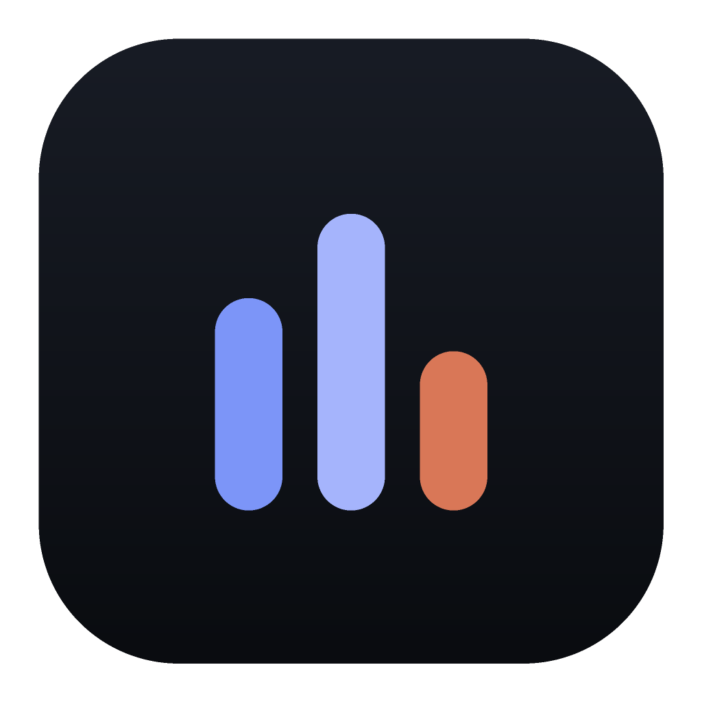
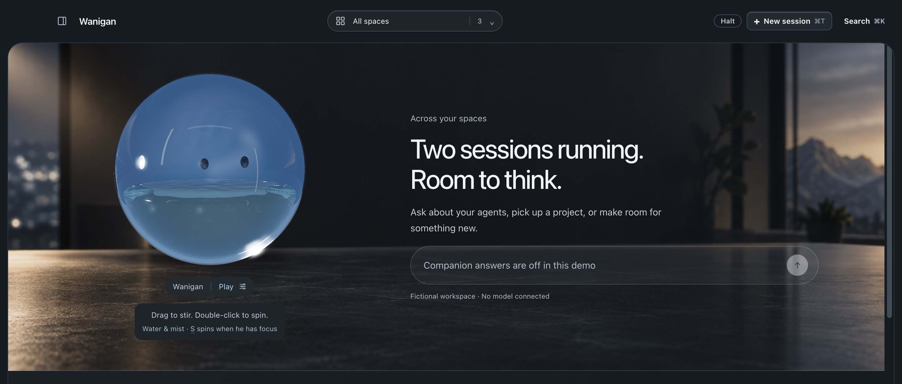
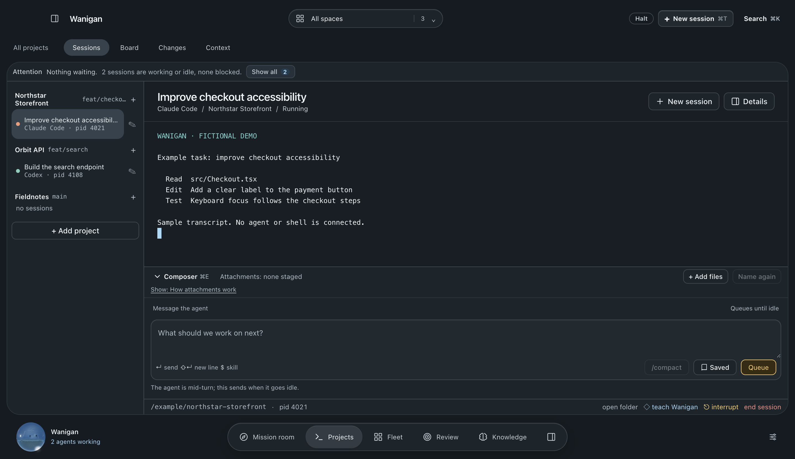
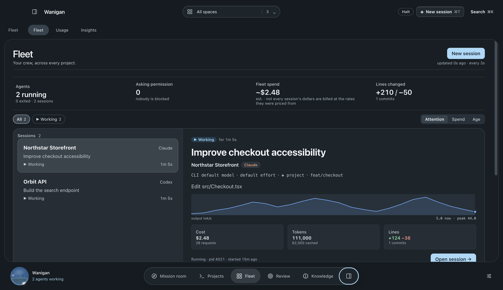
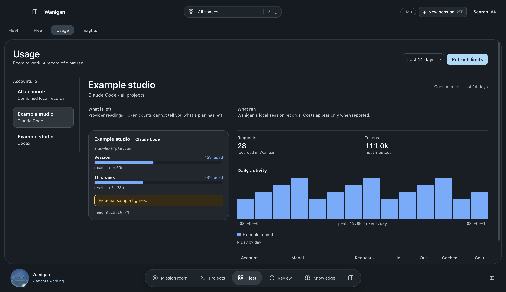

<div align="center">



# Wanigan

**A little company for the work ahead.**

Run Claude Code and Codex across every repository from one desktop app.<br>
See which session needs you, review what it actually did, and keep what you learn —
on your own Mac.

[Website](https://wanigan.com) ·
[Quick start](#quick-start) ·
[In-depth guide](docs/guide.md) ·
[Contributing](CONTRIBUTING.md) ·
[Security](SECURITY.md)

[](https://github.com/DanePete/wanigan/actions/workflows/ci.yml)
[](https://github.com/DanePete/wanigan/actions/workflows/codeql.yml)
[](https://scorecard.dev/viewer/?uri=github.com/DanePete/wanigan)
[](LICENSE)


</div>

<picture>
  <source media="(prefers-color-scheme: dark)" srcset="docs/readme/mission-dark.jpg">
  <source media="(prefers-color-scheme: light)" srcset="docs/readme/mission-light.jpg">
  
</picture>

<p align="center"><sub>The real app in demo mode. Every project, session and figure in these screenshots is fictional.</sub></p>

> [!NOTE]
> Wanigan is early and in active development. There is no published download
> yet — the Mac build is coming soon, and until then you [build it from source](#quick-start).
> It targets macOS; Apple silicon is what gets built and tested.

## Why Wanigan

Two or three coding agents is about where one person loses the thread. Wanigan is
built around that limit rather than around how many agents a machine can launch:

- **Real sessions, not a simulation.** Every session is the actual agent CLI in a
  real terminal. Permission prompts, slash commands and resume work exactly as
  they do in your shell.
- **One question answered first: which one needs me?** Sessions are ranked by what
  they are blocked on — a permission prompt, an error, a finished turn — not by how
  much text they printed.
- **A record of what happened.** Every tool call, denial, and reported dollar lands
  in one SQLite file on your disk. Estimates are labelled, and missing numbers stay
  missing.
- **Local, and yours.** No Wanigan account and no cloud tier. You bring your own agent
  CLIs and provider accounts, and AI requests go only to the providers you choose.

## A look inside

### Sessions

<picture>
  <source media="(prefers-color-scheme: dark)" srcset="docs/readme/sessions-dark.png">
  <source media="(prefers-color-scheme: light)" srcset="docs/readme/sessions-light.png">
  
</picture>

- **Real PTYs** for Claude Code, Codex, and Anthropic-compatible backends such as
  GLM and DeepSeek, one or more per project.
- **A composer** that queues your next message until the agent is idle, and never
  answers a permission prompt by accident.
- **Git worktrees per session**, so three agents on one repo stop overwriting each
  other. Merge or discard from the UI; discarding a dirty worktree is refused.
- **A timeline beside the terminal** showing what the agent *did* — tool calls with
  durations, permission waits, compactions — as against what it said.
- **Attachments:** drop or paste a screenshot or PDF, checked against what the API
  actually accepts before it is handed to the agent.

### Fleet

<picture>
  <source media="(prefers-color-scheme: dark)" srcset="docs/readme/fleet-dark.png">
  <source media="(prefers-color-scheme: light)" srcset="docs/readme/fleet-light.png">
  
</picture>

- **Every session across every project on one screen**, sorted by attention, spend
  or age, with interrupt and stop one click away.
- **Alerts for the three states where you are the blocker** — permission needed,
  errored, finished — as a macOS banner, an in-app card, and optionally on your
  phone through Web Push encrypted to that device.
- **An optional phone dashboard** served on loopback only, reachable through a
  private proxy such as Tailscale Serve and paired with a revocable link.

### Usage

<picture>
  <source media="(prefers-color-scheme: dark)" srcset="docs/readme/usage-dark.png">
  <source media="(prefers-color-scheme: light)" srcset="docs/readme/usage-light.png">
  
</picture>

- **What is left** on each account's session and weekly limits, read from the
  provider, beside **what ran**, from Wanigan's own session records.
- **Two meters, never blended.** Session cost comes from the CLI's own accounting;
  batch cost is computed from a local price table. Every chart says which one it
  is reading.

### And the rest

| | |
|---|---|
| **Mission room** | A home screen for all your spaces, and a companion you can ask what needs you. He is a real-time water simulation; drag to stir him. |
| **Review & Board** | Goals, session history, code changes and acceptance checks side by side, so you decide when work is actually done. |
| **Runs** | One prompt across many repos, headless, each capped with `--max-budget-usd`, optionally in its own worktree, and still trust-gated. [More](docs/guide.md#the-third-speed) |
| **Batches & Evals** | Bulk inference at half price, with a dry run first, cost priced before submit, both expiry clocks visible, and refusals rescued on a fallback model. [More](docs/guide.md#batches) |
| **Schedules** | Recurring work that survives a restart, with an optional LaunchAgent that keeps it running while the window is closed. |
| **Trust levels** | Read only, Project or Trusted per repository, enforced at `PreToolUse`, with every denial in an exportable ledger. Defence in depth, not a sandbox. [More](docs/guide.md#trust) |
| **Learning** | Turns corrections, review decisions and an explicit *Teach Wanigan* into versioned, cited knowledge, and projects it into `CLAUDE.md`, `AGENTS.md` or skills only after you approve it. [More](docs/guide.md#wanigan-compound) |
| **Scout** | Watches an allow-list of official sources and proposes evidence-linked improvements into a review queue. It cannot change anything itself. |
| **Skills & Context** | Every skill actually installed on your machine, and the resolved `CLAUDE.md` chain, rules, memory budget and settings precedence your agent will load. [More](docs/guide.md#skills-and-context) |
| **CLI** | `npm run cli -- runs`, `status`, `export`, `queue` — the same database, no window, pipe-friendly output. [More](docs/guide.md#the-cli) |

## Quick start

**You need:** macOS, [nvm](https://github.com/nvm-sh/nvm) (or Node `22.23.2` from
[`.nvmrc`](.nvmrc)), and at least one agent CLI you are already signed in to —
[Claude Code](https://docs.anthropic.com/en/docs/claude-code) or
[Codex](https://github.com/openai/codex). Wanigan finds them on your login shell's
`PATH`, or inside their VS Code extensions if that is where they live.

```bash
git clone https://github.com/DanePete/wanigan.git
cd wanigan
nvm use          # Node 22.23.2 — older Node cannot build this
npm install      # also rebuilds node-pty and better-sqlite3 for Electron
npm run app      # build and launch
```

Want a look without touching your real projects? Press **`⌘⇧D`** for the
fictional demo workspace — the one in these screenshots.

| Command | What it does |
|---|---|
| `npm run app` | Launch through `scripts/launch.mjs` (use this from a VS Code terminal) |
| `npm run dev` | Hot reload — but it skips the launcher, see [the caveat](docs/guide.md#running-it) |
| `npm test` | All eight gates: types, shared tests, style, dead code, lint, packaging, smoke. No network, no spend |
| `npm run cli -- help` | The command-line interface over the same database |
| `npm run dist:mac:arm64:install` | Build a local arm64 app and install it into `/Applications` safely |

> [!TIP]
> If the app dies at startup with `Cannot read properties of undefined (reading 'whenReady')`,
> your shell exported `ELECTRON_RUN_AS_NODE` (VS Code does). `npm run app` clears it;
> `npm run dev` does not.

## Provider packs

A provider is a **harness** (the terminal CLI), a model **backend**, and a launch
**profile**. Claude Code, Codex, GLM and DeepSeek ship as built-in packs, and a new
CLI can arrive as a local `provider-pack.json` without a Wanigan release.

A local pack stays disabled until you approve its exact SHA-256 digest after
reviewing every command, argument and environment variable it would use. Launch
values compile to an argument array and never to a shell command, and a pack that
declares no hooks gets an honest generic terminal rather than invented
integrations. The manifest format, capability vocabulary and adapter protocol are in
[docs/provider-packs.md](docs/provider-packs.md).

## Privacy and security

- **Your data stays on your Mac.** Projects, history and settings live in one local
  SQLite file. API keys are encrypted with the macOS keychain and never reach the
  renderer.
- **Prompt and response content is never collected.** Wanigan receives the CLIs'
  OpenTelemetry and hook events on `127.0.0.1` only, with a per-launch bearer token,
  and pins the content-logging variables off.
- **Nothing is written into your repositories.** Hooks and MCP config are injected
  with `--settings` and `--mcp-config` from Wanigan's own data directory.
- **Nothing is exposed to the network by default.** The phone dashboard is opt-in,
  binds to loopback, and remote control is a separate opt-in on top of it.

Vulnerability reports and the full trust boundary: [SECURITY.md](SECURITY.md).

## Documentation

| | |
|---|---|
| [In-depth guide](docs/guide.md) | Every surface, how it works, and what it refuses to do |
| [Provider packs](docs/provider-packs.md) | Manifest fields, capabilities, environment, adapters |
| [Demo privacy](docs/demo-privacy.md) | How the demo workspace is kept fictional |
| [Contributing](CONTRIBUTING.md) | Setup, the test gates, and UI change requirements |
| [Security policy](SECURITY.md) | Reporting, scope and the remote-control boundary |
| [Code of conduct](CODE_OF_CONDUCT.md) | |
| [wanigan.com](https://wanigan.com) | The website, including a playground for the companion |

## What this app believes

Five, written to settle arguments rather than to be agreed with.
[The long version](docs/guide.md#what-this-app-believes) says what each one ruled out.

1. **The operator is the constraint.** Design for what one person can review, not for what the machine can launch.
2. **Nothing happens you can't see afterward.** Every tool call, denial and dollar lands in a record on your disk.
3. **It survives a quit.** Crashes, restarts and closed laptops are normal operating conditions.
4. **Local, and yours.** No cloud tier — a permanent no, not a "not yet".
5. **Say the true thing.** No false greens, and no "done" that wasn't verified.

## The name

A wanigan is the shack that rode the old log drives. It floated downriver with
the crew, carrying the tools and the food and the paperwork, and it tied up
each evening wherever the work had got to. A window that follows a crew of
agents around your repos is near enough to the same idea that the name stuck.

It used to be called Foreman. That one is already carrying freight in this
neighbourhood — theforeman.org, and the `foreman` gem every Rails developer has
typed at some point — and a tool you can't find is a tool nobody uses.

## What you can expect

This is free, and it's one person's work out of a small studio in Minnesota.
So, plainly: I read every issue. I fix what I can. I merge what I have time
for, and I'd rather tell you something isn't going to happen than leave it open
for a year. If it breaks and you can't wait on me, the source is right here and
the licence is MIT.

Issues open when there's a build to download. Until then this is here to read.

When there's a build worth chipping in for, there'll be a way to do it on the
site. That's not a donation — Dead North is a business, not a charity — and
nothing here will ever be behind it. Same app either way.

## Licence

[MIT](LICENSE) © Dead North LLC
