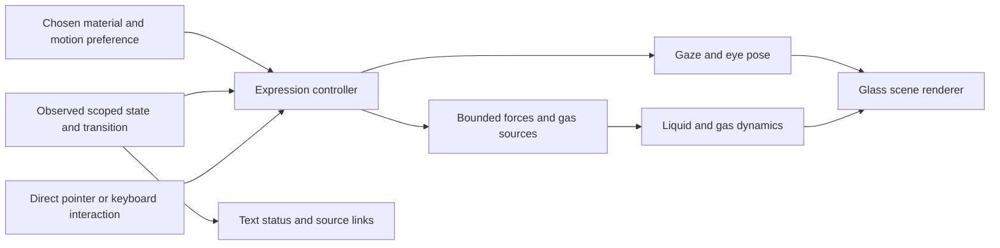

# Expressive physics for the Wanigan orb

Wanigan should have a recognizable character that can be curious, playful, attentive and quietly energetic while remaining a reliable interface to recorded work. The strongest direction is a stable glass vessel with a small expressive eye rig, real liquid inertia, and an interior gas field that can appear as cool vapor or warm fire. The material is a chosen personality; operational events determine its attention and activity. A fiery orb can be calm. An error does not need to make it burn.

The visual reference is the [approved B concept](../visuals/mission-room/concept/approved-b.png). This report extends the [live 3D physics research](2026-09-09-realtime-orb-physics.md) with perception evidence, alternative physical systems, and an expression vocabulary. Sources were checked on September 9, 2026, local time. Historical publication dates below are distinct from current repository availability. Proposed timings, modes and mappings are design judgments, not measured user preferences or achieved application performance.

## Recommended direction

Build two selectable material temperaments around the same character: **Water and mist**, closest to the approved concept, and **Ember and flame**, a warmer, livelier interpretation. Both retain the glass shell, eye placement, weight, lighting and interaction language. The first implementation can retain the lower liquid volume in both, changing the upper gas’s emission and source behavior. That coexistence is artistic staging, not a claim that water and combustion are thermodynamically coupled.

Give the character four reusable expressive behaviors: **rest**, **attend**, **engage**, and **acknowledge**. Compose them with brief gestures such as a glance, head tilt, blink, liquid recoil or curling plume. These are sufficient to convey a surprisingly broad personality when their timing is coordinated. Material selection, operational meaning and motion intensity should remain independent controls.

This recommendation is informed by Apple’s emphasis on purposeful, brief, gesture-consistent and optional motion, and by research showing that abstract movement can communicate perceived affect. It is not a conclusion that an Apple-like result follows from any particular shader or physical solver. [Apple HIG: Motion](https://developer.apple.com/design/human-interface-guidelines/motion), [UbiSwarm](https://shape.stanford.edu/research/UbiSwarm/).

The most valuable implementation order is:

1. Establish the permanent glass, lighting, liquid and eyes at the approved viewing size.
2. Add continuous, interruptible gaze and eye poses with bounded spring dynamics.
3. Choreograph one readable interaction and its physical follow-through.
4. Add coherent 3D gas circulation and the selectable ember/fire temperament.
5. Connect a small cue scheduler to actual state transitions, with textual status remaining authoritative.
6. Evaluate richer material families as optional additions after the core character is convincing.

## Evidence and its limits

### Expressiveness can help, especially in social interaction

Apple’s **ELEGNT**, published in January 2025, compares functional and expressive movement in a lamp-like robot. Its within-subject video study had 21 valid participants after filtering 30 recruited responses. Expressive behavior improved the reported experience overall, with stronger benefits in social scenarios. Some functional scenarios showed no significant improvement on engagement, perceived intelligence or willingness to interact. Qualitative responses also objected to unnecessary movement, slow task completion and gestures that implied absent capabilities. [Full paper, sections 4–6](https://arxiv.org/html/2501.12493v1).

That is useful evidence for a companion, but it is a small study of prerecorded robot videos, not a long-term test of a screen orb used while coding. It supports testing contextual expression; it does not validate a particular emotion-to-material mapping or prove improved productivity. **Design inference:** expressive responses should be richest when a person deliberately engages with Wanigan and quieter while they supervise other work.

### Timing itself changes what people infer

Zhou and colleagues’ **Expressive Robot Motion Timing** keeps a robot’s path fixed while varying its timing. Participants inferred properties including confidence, naturalness and apparent carried weight. The paper’s conference reference is HRI 2017; the inspected arXiv version was submitted February 5, 2018. [Author manuscript and metadata](https://arxiv.org/abs/1802.01536).

**Design inference:** a decisive snap, a hesitant stop or accelerating swirl may communicate more than “something is happening.” Wanigan should avoid using apparent confidence as a proxy for an unmeasured answer quality. A pending request may excite the orb slightly, but faster motion must not mean that an answer is better, that more reasoning occurred, or that completion is approaching.

### A face is not required, but coordination still matters

Stanford’s **UbiSwarm** research demonstrated different perceived affect and urgency from abstract multi-robot motion without changing the robots’ fixed form or adding faces. It varied behavior, speed and smoothness. Its setting is a visible robot group rather than one fluid volume, so transfer to Wanigan remains a hypothesis. [Author project page and 2017 papers](https://shape.stanford.edu/research/UbiSwarm/).

**Design inference:** the eye rig can stay very small. The liquid’s delayed response, a gas plume’s posture, and the interval between glance and recovery can carry expression. A larger cartoon face is not required. At the same time, random independent loops for eyes, water, smoke and glow are unlikely to read as one intentional character; coordinate them around a common event.

### Springs offer continuity, not automatic personality

Apple’s WWDC23 **Animate with springs** explains how spring animation preserves position and velocity across gesture release and retargeting. It also shows that springs can settle without visible bounce. This is implementation and design guidance, rather than an empirical test of emotional recognition. [Talk and transcript](https://developer.apple.com/videos/play/wwdc2023/10158/).

**Design inference:** use a spring to produce continuous motion, then deliberately choose its target, damping and occasion. A permanently oscillating spring is merely a loop. The expressive quality comes from a gaze landing somewhere meaningful, a short hold, and a coherent recovery.

## Physical and procedural alternatives

The distinction between a rendering representation, a dynamical simulation and a physical model matters. Metaballs can render a fluid simulated elsewhere, but metaball geometry alone is not fluid dynamics. A procedurally prescribed velocity field can move particles coherently without solving momentum or pressure. A numerical simulation is still an approximation; its existence does not establish engineering accuracy.

The following visual readings are proposed associations to test, not universal emotional meanings.

| System | What is actually computed | Potential expressive role | Fit for Wanigan |
| --- | --- | --- | --- |
| Damped springs and inertial gaze | Position and velocity evolve toward pose targets under restoring force and damping. | Attention, curiosity, a small nod, playful recoil, relaxed recovery. | Highest priority. Very small state and no extra volumetric solver. |
| Liquid slosh and surface tension | Particle/grid fluid dynamics, confinement, density or pressure treatment, and surface reconstruction. | Weight, follow-through, excitement after a nudge, gradual settling. | Core material identity. Use the existing PBF direction. |
| Resolved 3D vortices | Evolving gas velocity/density fields, transport, pressure projection and bounded forcing. | Focused circulation, gentle energy, a plume leaning toward interaction. | Strong addition using the gas solver. |
| Curl-noise particles | Particles follow a prescribed divergence-free field; that field need not solve fluid momentum. | Wisps, sparks, decorative tendrils, fine secondary motion. | Useful detail when labeled accurately; not a substitute for the selected gas solver. |
| Fire-like gas | Simulated velocity and transported heat/density fields, with temperature-dependent emission. | A warm persistent temperament, a lively response or a celebratory flourish. | Strong selectable style; combustion chemistry is separate work. |
| Ferrofluid | Fluid dynamics plus magnetic field and magnetic force/surface coupling. | Sculptural concentration, attraction, bristling, cohesive curiosity. | Distinctive future temperament, but a new solver and material treatment. |
| Metaballs with springs | An implicit scalar field extracted or ray-marched around animated control centers. | Soft gathering, joining, separation, squishy play. | A valid stylized character system; not evidence of ferrofluid or liquid physics. |
| Reaction–diffusion | Coupled concentrations diffuse and react on a grid. | Pattern formation, slow organic change, patterned interior sheen. | A subtle surface/interior accent; weak fit for fast status gestures. |
| Granular or snow material | Collisions/friction/cohesion, or a constitutive material model such as elasto-plastic MPM. | Settling, gathering, avalanche-like release, crystalline quiet. | Attractive alternate world; more expensive conceptual and engineering scope. |
| Boids or interacting particles | Local steering rules such as cohesion, alignment and separation. | Collective attention, gathering into a focal region, curious dispersal. | Good optional suspended motes; can visually imply multiple agents unless kept abstract. |
| Electricity or plasma-like filaments | Anything from procedural branching to electrical potential/discharge simulation. | Charged energy, a responsive arc, a very brief punctuation. | Strong accent or explicit temperament; not a default error language. |
| Condensation or ice growth | Surface water transfer/phase transition, or a reduced growth model; sometimes only a normal/roughness animation. | Quiet transformation, a temporary fog mark, frost retreat. | Later material detail; risks obscuring the eyes and the liquid. |

The spring guidance is grounded in Apple’s [continuity explanation](https://developer.apple.com/videos/play/wwdc2023/10158/). Fluid recommendations and inspected solver seams are in the [existing PBF/gas report](2026-09-09-realtime-orb-physics.md). Sources and limitations for the other systems follow.

### Vortices and curl noise

Bridson, Hourihan and Nordenstam’s **Curl-Noise for Procedural Fluid Flow** constructs divergence-free velocity fields from a vector potential, including boundary-aware constructions and combinations with flow primitives. It is explicitly a procedural alternative to solving fluid equations. The author provides an example implementation labeled public domain. [2007 paper](https://www.cs.ubc.ca/~rbridson/docs/bridson-siggraph2007-curlnoise.pdf), [author’s code links](https://www.cs.ubc.ca/~rbridson/).

For Wanigan, a vortex should be a structured force/source in the existing gas simulation. Make its center and axis react to an interaction, then let the field continue evolving after the input ends. A small number of stable structures gives the eye something to follow. High-frequency curl noise may enrich the result, but it should not erase the plume’s overall direction or be presented as the source of all physical behavior.

An analytic vortex is useful for art direction. If it directly prescribes particle velocities every frame, call it procedural flow. If a bounded force excites a field that then undergoes advection and pressure projection, the resulting scene includes fluid dynamics. Neither description by itself establishes two-way liquid/gas coupling.

### Fire and an ember temperament

The current official Three.js **webgpu_volume_fire** source contains 3D velocity advection, divergence, iterative pressure, projection, transported density/temperature, cooling and source injection. Its rendering adds emissive color and procedural detail. The inspected algorithm does not constitute a fuel/oxygen combustion model. The source is available under Three.js’s MIT license. [Compute and render source](https://github.com/mrdoob/three.js/blob/dev/examples/webgpu_volume_fire.html), [license](https://github.com/mrdoob/three.js/blob/dev/LICENSE).

This is a sound reference for a physically evolving fire-like volume inside glass. It can remain gentle: a small warm core, one or two slowly rising tongues, a translucent outer plume, and occasional embers advected through the local gas. Darkness and a clear silhouette around the eyes matter more than filling the sphere with orange emission. An expressive gaze can remain readable while the surrounding flame leans, divides and recovers.

**Recommended behavior:** a user-selected fire style may persist during rest, work, errors and conversation. The operational cue stays in gaze, posture and controlled activity. A question can briefly lift the source or organize the curl; an answer can produce a small upward unfurl. A direct playful interaction can create a much stronger swirl. Those are art-directed inputs to a real solver, not evidence of emotions or actual temperature in the computer.

Keep the fire’s meaning stable. Do not silently change to flames because tests failed, CPU load increased, or a project has many sessions. If fire is offered as celebration, that is a design option rather than a requirement that fire only appear after success. In either use, make bloom and projected light restrained enough that the shell, interior depth and face remain legible in both themes.

A persistent flame needs a persistent bounded source. Stopping that source should visibly cool and dissipate the plume. If water remains below it, the initial implementation should not imply boiling, evaporation or oxygen consumption unless those processes are actually modeled. A particle ember with gravity, drag and fading emission is secondary particle dynamics, not a simulated plasma particle.

### Ferrofluid and metaballs

Ni and colleagues’ **Induce-on-Boundary** method, SIGGRAPH 2024, solves magnetostatic behavior and couples it into a grid-based fluid pipeline. Its project demonstrates characteristic ferrofluid instabilities. The current 3D **SimFerrofluid** repository publishes MIT code, with Windows, Visual Studio and xmake listed as requirements; its license has a 2026 copyright notice. This is a research implementation to study, not a WebGPU package or a verified macOS runtime path. [Paper and project](https://ferrofluid-simulation.github.io/), [3D implementation](https://github.com/ferrofluid-simulation/SimFerrofluid), [license](https://github.com/ferrofluid-simulation/SimFerrofluid/blob/main/LICENSE).

Ferrofluid offers a compelling second-generation identity: dark metallic material gathering toward a gaze target, smooth mounds becoming a few rounded spikes, then relaxing. The spikes must be a chosen expressive convention, not an automatic sign of anger. A magnetic-control toy could be especially satisfying because its cause and effect are spatially obvious. Its added field solve, surface behavior and opaque material make it a separate investment from the current water/vapor scene.

The official Three.js marching-cubes demo is useful for understanding the visual alternative. It places metaball centers with trigonometric trajectories and reconstructs their field; it does not solve liquid or magnetostatic dynamics. It has a public browser example and MIT source. [Demo](https://threejs.org/examples/webgl_marchingcubes.html), [source, `updateCubes()`](https://github.com/mrdoob/three.js/blob/dev/examples/webgl_marchingcubes.html).

Metaballs driven by a spring network can be beautifully responsive. If chosen, describe them as a deformable implicit character, and test volume changes and merging artifacts. They should not replace the live liquid while retaining the claim that the orb contains simulated water.

### Reaction–diffusion

Jérémie Piellard’s WebGL project implements the Gray–Scott model; Robert Leitl supplies a WebGPU compute implementation with local-server instructions. Both projects identify MIT licensing. Piellard’s inspected license is copyright 2021. These are running pattern simulations with state feedback, rather than a simple texture translated over time. [WebGL project](https://github.com/piellardj/reaction-diffusion-webgl), [WebGL license](https://github.com/piellardj/reaction-diffusion-webgl/blob/main/LICENSE), [WebGPU project](https://github.com/robert-leitl/webgpu-reaction-diffusion).

Its strength is emerging structure: spots coalescing, labyrinths growing, or a pattern spreading from a touched point. Its weakness for this character is semantic speed. A fresh state can be hard to distinguish from an arbitrary part of the ongoing pattern. Prefer a faint texture on an interior membrane or a user-selected “living pattern” style; avoid making its complexity encode reasoning, learning or confidence.

Reaction–diffusion computes chemical-style concentration dynamics. It does not supply 3D liquid momentum, free surfaces or the appearance of a glass vessel. Mapping a 2D grid onto a sphere also needs seam/pole handling, or a different domain representation. These are substantial considerations even if the underlying two-field update is compact.

### Granular material and snow

Disney’s **A Material Point Method for Snow Simulation**, SIGGRAPH 2013, models snow using an elasto-plastic constitutive law and a hybrid particle/grid method. Disney’s Matterhorn implementation is proprietary. An independent primary research implementation, Hu and colleagues’ **taichi_mpm**, is MIT-licensed and includes the 2018 MLS-MPM work plus an educational 88-line 2D version. [Snow paper](https://www.disneyanimation.com/publications/a-material-point-method-for-snow-simulation/), [Matterhorn](https://www.disneyanimation.com/technology/matterhorn/), [MLS-MPM source](https://github.com/yuanming-hu/taichi_mpm), [license](https://github.com/yuanming-hu/taichi_mpm/blob/master/LICENSE).

A snow-globe style could give Wanigan an appealing quiet temperament: flakes settle during rest, rise in a coherent gust on interaction, and fall after a response. But freely falling decorative flakes are a particle system, not simulated cohesive snow. Piling, packing, breaking or flowing grains requires collision/friction or an appropriate continuum material model.

Do not treat “MPM supports many materials” as proof that the existing PBF water implementation can become snow by changing its color. A full granular/snow mode changes both the solver and the surface/render strategy. It is a better optional material family than an automatic transition every time work becomes idle.

### Particles and boids

Craig Reynolds’ original boids model combines local separation, alignment and cohesion to generate coordinated group motion. The WebGPU Samples project provides a current compute-boids example, with BSD 3-clause source licensing. [Reynolds’ explanation and original-paper links](https://www.red3d.com/cwr/boids/), [WebGPU example](https://webgpu.github.io/webgpu-samples/?sample=computeBoids), [source](https://github.com/webgpu/webgpu-samples/tree/main/sample/computeBoids), [license](https://github.com/webgpu/webgpu-samples/blob/main/LICENSE.txt).

Suspended motes can gather briefly behind the eye line or align with a gas curl, then disperse. Keep their behavior subordinate to the character’s main gesture. A fixed number of decorative particles avoids implying that each mote represents a real coding agent. If counts ever carry meaning, they need a defined relationship to observed counts and a textual equivalent.

Gas-advected embers, buoyant bubbles and flocking motes are three different systems. Pick the one that supports the material. A boid is a steering controller; it does not automatically obey pressure, buoyancy or fluid mass conservation.

### Electricity, plasma-like effects and ice

Kim and Lin’s **Fast Animation of Lightning Using an Adaptive Mesh**, TVCG 2007, uses a dielectric-breakdown model, a field solve and branching discharge growth. The author’s publication page links code, but the old code endpoint could not be retrieved during this review; a reuse license and runnable contemporary build were not established. This should remain an algorithm reference. [Author publication list](https://www.tkim.graphics/), [paper](https://www.mat.ucsb.edu/Publications/tkim_lightning_tvcg_2007.pdf).

A thin arc that tracks an explicitly touched point could make an excellent “charged” temperament or a short flourish. Randomly subdivided lines with glow are procedural lightning, not electrical discharge simulation. A full plasma model would need more than either of these, including the relevant charged species/field dynamics. For Wanigan, that added fidelity is unlikely to improve everyday expression enough to outrank the eye rig, liquid and gas.

Condensation is also more than a fog overlay. Hochstetter and Kolb’s 2017 method couples an air grid, SPH liquid and surface water textures with mass transfer. Kim, Henson and Lin’s 2004 ice work combines diffusion-limited aggregation, phase fields and fluid methods for growth on surfaces. [Evaporation/condensation paper](https://www.cg.informatik.uni-siegen.de/data/Publications/2017/EvaporationandCondensationofSPH-basedFluids.pdf), [ice research and primary-paper links](https://www.tkim.graphics/).

A temporary mist mark or frost retreat could be beautiful, but a blur, normal map or growing threshold mask should be called an optical/procedural effect unless the relevant process is simulated. Use these as deliberate material variation. Do not cloud the orb to represent “confusion” inferred from a model answer, and do not frost it simply because a session has been quiet.

## A coherent expression vocabulary

Treat the character as one body with several response speeds. Its gaze establishes attention first; eye aperture and posture clarify the gesture; liquid and gas follow through. The shell stays a visually rigid vessel. Squash/stretch belongs mainly in eye shape, a soft internal form, or the plume. If the glass body itself deforms, the cavity collision and optical geometry must agree with that deformation.

All values below are proposed starting points to tune at the actual display size. They are not physiological constants or validated recognition thresholds.

| Behavior | Eyes and pose | Liquid and gas | Intended reading |
| --- | --- | --- | --- |
| Rest | Neutral, relaxed aperture; occasional small gaze change when motion is enabled. | Little net forcing; liquid settles; vapor or flame remains low-energy. | Present and available. |
| Attend | Land gaze toward an actual interaction target; hold briefly; small asymmetric aperture or tilt. | Local response follows the gesture, without filling the vessel with turbulence. | Curious, receptive, paying attention to this interaction. |
| Engage | Gaze stays anchored; a small lift or measured glance between prompt and response area. | A coherent curl or slightly stronger fire source, bounded at a stable level. | A request is active. |
| Acknowledge | One blink, small nod or slight upward recovery; then rest/attend. | A small wave or plume unfurls and naturally decays. | The action or response arrived. |
| Invite attention | Look toward the relevant source link, then back; open eyes slightly. | Motion becomes more legible, not more violent; a brief accent may occur once. | Something specific can be reviewed. |
| Play | Follow a deliberate nudge or drag with a larger reaction and recovery. | Stronger bounded impulse, slosh or flame curl; no operational side effect. | Tactile personality, directly caused by the person. |

“Curious,” “amused,” “focused” and “relaxed” are useful animation direction, not factual labels for a subjective experience. Product status should describe the work. The character can smile with its eyes without the interface claiming it feels happiness, knows the user’s emotions, or understands files it has not inspected.

For spring-controlled pose, a standard model is `x'' = ω²(target − x) − 2ζωx'`. Maintain both position and velocity when the target changes. Choose stronger damping for gaze and slightly more overshoot for a deliberate playful nudge. Use a stable integration method or an analytic solution; setting a fixed interpolation fraction per rendered frame changes behavior with frame rate. This is an implementation recommendation based on the continuity property described in [Apple’s spring guidance](https://developer.apple.com/videos/play/wwdc2023/10158/).

An initial choreography to test is a gaze response in roughly 100–220 ms, a small posture response over 180–350 ms, and material follow-through over 400–1200 ms. Keep the user action immediate: these intervals describe overlapping visual behavior, not a delay before a click or answer works. Continuous physical settling can take longer at low energy. The exact durations belong in Wanigan’s existing motion tokens if implemented.

## Mapping to observed Wanigan state

At review time, `CompanionSnapshot` exposes projects, sessions, process status, attention kind, counts, availability and a snapshot read time. `CompanionTurn` exposes `pending`, `answered`, `failed` and `cancelled`. The current orb receives only a `thinking` boolean from the conversation’s pending state. Richer mappings below are a proposal, not already integrated behavior. [Shared companion types](../../src/shared/companion.ts), [Mission Room](../../src/renderer/src/views/MissionRoom.tsx), [orb component](../../src/renderer/src/components/Orb.tsx).

The main-process companion explicitly limits its knowledge to operational metadata and what the person supplies. It cannot inspect repositories, diffs, transcripts or shell output, and does not approve or launch work. A running process is not proof of progress; a finished turn is not a reviewed change. The visual language should uphold the same boundary as the answer text. [Companion service](../../src/main/companion.ts).

| Observed event or state | Allowed visual response | Text/status meaning | Unsupported inference to avoid |
| --- | --- | --- | --- |
| Person focuses the text composer | Attend toward the composer, then hold a comfortable pose. | Ready for text input. | Microphone is listening, emotion is being sensed, or repository content is being read. |
| Pointer directly nudges/stirs the orb | Play; liquid/gas receives a bounded local impulse. | A physical interaction with the character. | Starting an agent, approving anything, or sending a model request. |
| A companion turn is pending | Engage; slightly stronger coherent motion within the selected material. | A response request is pending. | Percent completion, increasing confidence, successful reasoning or useful progress. |
| A turn becomes answered | Acknowledge once; direct attention toward the new answer. | An answer was received. | The answer is correct or all cited projects succeeded. |
| A request fails or is cancelled | Small recovery to attend/rest; preserve its chosen material. | The explicit recorded failure/cancellation message. | A project failed, work was rolled back, or the orb is distressed. |
| A session has `working` attention | Quiet activity, if the selected scope warrants it. | A working attention signal was recorded. | A validated test stage or completion estimate. |
| A process is merely `running` | At most a low activity cue alongside the running count. | The process is running. | It is working productively or is not stuck. |
| `permission` attention arrives | Invite attention toward the actual session; one distinct gaze gesture. | Permission needed; open that session. | The orb has approved the action or can approve through a nudge. |
| `error` attention arrives | Invite attention with the same readable grammar, differentiated by text/glyph. | A recorded error/attention signal needs inspection. | Anger, catastrophic failure, or a cause not present in evidence. |
| `finished` attention arrives | Brief acknowledgement of a finished turn, then a review invitation. | Turn finished. | Tests passed, changes were reviewed, or deployment succeeded. |
| All observed sessions are idle/exited | Settle to rest. | No recorded active work in the shown scope. | Everything succeeded, the application is sleeping, or a session can survive quitting. |
| Attention is `unknown`, snapshot failed, or data is stale | Neutral pose and explicit unavailable/unknown text. | No usable current evidence for that claim. | A confident “all clear.” |
| User explicitly celebrates or requests play | A richer wave, bright curl or fire flourish. | A user-directed expressive reaction. | Verified project success unless separate evidence supports it. |

Wanigan’s `needsYou` currently combines `permission`, `error` and `finished`; it should not be reduced to an alarm. In the all-project view, choose one stable highest-priority attention target and retain the real count in text. Do not rapidly scan among every project. Changing scope should retarget the same character, not reset the entire simulation. [Attention order](../../src/shared/types.ts), [aggregation](../../src/main/companion.ts).

`readAt` is the time the snapshot was constructed, not the age of every underlying attention event. The richer shared `Attention` type has `transitionId` and `since`, but the current `CompanionSession` projection omits them. For durable once-per-event choreography, expose a validated transition identity through the typed boundary. Until then, an in-memory previous/current comparison can suppress duplicate cues only within that mounted view; it should not be described as persistent deduplication. [Types](../../src/shared/types.ts), [projection](../../src/main/companion.ts).

## Transition choreography and control

Use an expression controller that outputs bounded physical controls, rather than having an answer model emit shader values. A deterministic scheduler is sufficient for the proposed vocabulary and does not require extra model calls. The selected material supplies its resting parameters; observed state and direct interaction select targets and impulses.

The transition has three overlapping phases: **orient**, **respond**, **recover**. For a submitted question, the eyes orient toward the composer; the gas curl tightens slightly as the request remains pending; when an answer arrives, gaze returns toward the response and the extra forcing ramps down. The liquid and gas retain their existing state, so residual motion belongs to the previous action. Do not reset particle positions or randomly reseed the volume on each status change.

For material selection, retain the character and field where possible. Gradually change source, cooling, emission and scattering controls, preserving velocity. If two solver families genuinely require different state representations, use a deliberate transition to a settled intermediate state. Crossfading two images may be a valid visual transition, but it is not a physical phase transition.

Use a small priority policy: an explicit user interaction may briefly dominate the pose; an unresolved attention event remains available in text; the current conversation request controls its own engagement cue; background activity stays quiet. Repeated polling of an unchanged state must not retrigger acknowledgement. A reply arriving while the user stirs the orb can wait for the next comfortable recovery point, but its text should appear immediately.

Do not multiply visible excitement by raw session count. Use a bounded low/medium activity envelope so twenty running processes do not produce twenty times the force or a permanent storm. Do not increase energy as elapsed pending time grows. Long waits can keep a stable engagement pose and explicit status text; uncertainty is not a reason to manufacture dramatic activity.

For physical controls, prefer changing bounded forces, source location and source strength over abruptly changing rest density, particle mass, collision geometry or solver step size. If the vessel visibly moves, its simulated boundary and inertial response must move consistently. Eye pose, material appearance and collision geometry have different responsibilities even when one expression coordinates them.

## Reduced motion, legibility and steady operation

Apple’s HIG recommends optional motion and warns against excessive animation. WCAG’s motion guidance separately addresses automatically moving parallel content and interaction-triggered animation. SC 2.2.2 is Level A; SC 2.3.3 is Level AAA. This distinction matters: honoring the operating system preference and providing a persistent stop control cover different use cases. [Apple Motion](https://developer.apple.com/design/human-interface-guidelines/motion), [W3C pause/stop/hide](https://www.w3.org/WAI/WCAG22/Understanding/pause-stop-hide.html), [W3C animation from interactions](https://www.w3.org/WAI/WCAG22/Understanding/animation-from-interactions.html).

Recommended behavior is a well-composed still orb when motion is off: open readable eyes, settled liquid and a fixed mist/ember interior. State changes update text immediately and may replace the still pose without an animated transition. Pause gaze tracking, blinking, particle motion, simulated flame and pulsing light together. Disabling only the shell’s movement while smoke continues is not a complete reduced-motion implementation.

Keep a visible, keyboard-accessible way to stop decorative animation, including sustained flame. Do not require hover or focus to keep it stopped. When resuming, display the current recorded state without replaying missed celebrations. Preserve click/keyboard affordances and accessible naming; a canvas’s appearance cannot carry permission, failure or progress information by itself.

Electrical and fiery modes need particular attention to temporal contrast. WCAG SC 2.3.1 addresses flashes above defined rate/area/luminance thresholds, including saturated-red flashing. A slow emissive flow is not automatically a flash, and simply limiting an animation’s frame rate does not prove it is safe. Prefer no strobing at all, and inspect bright caustics, bloom and fine moving highlights in the rendered result. [W3C flash guidance](https://www.w3.org/WAI/WCAG22/Understanding/three-flashes-or-below-threshold.html).

Freeze simulation when hidden or offscreen, maintain bounded catch-up, and resume from a deliberate current state. Reduced motion should avoid continuous GPU work except for a necessary static redraw. Test terminal input responsiveness with the orb visible: the companion’s character is not successful if it competes with the operator’s actual work. These are proposed implementation checks, not performance findings.

## Runnable references and reuse status

“Runnable reference” below means that the project supplies a browser demonstration or build/run instructions. These alternative projects were not executed or benchmarked in Wanigan during this review. Current branch links are mutable and should be pinned to a reviewed commit before any code is copied. A paper’s publication license, a project website’s license and an implementation’s license are separate things.

| Reference | Date/version evidence | Execution path and reuse status |
| --- | --- | --- |
| [Three.js volume fire](https://github.com/mrdoob/three.js/blob/dev/examples/webgpu_volume_fire.html) | Current `dev` example inspected in September 2026; the earlier local solver report records its own specific Three.js revision. | Official WebGPU example; MIT. Algorithm reference for gas and emission, with sphere confinement and glass composition still required. |
| [Three.js marching cubes](https://threejs.org/examples/webgl_marchingcubes.html) | Current official example; no first-release date established here. | Browser demo; MIT source. Geometric metaballs with prescribed trajectories, not a fluid solver. |
| [WebGPU Samples compute boids](https://webgpu.github.io/webgpu-samples/?sample=computeBoids) | Current `main` source; repository license copyright 2019 contributors. | Browser demo/source; BSD 3-clause. Useful compute and flocking reference. |
| [Leitl reaction–diffusion](https://github.com/robert-leitl/webgpu-reaction-diffusion) | Current `main`; no release tag/date established here. | WebGPU demo and local-server instructions; repository identifies MIT. Its standalone license endpoint was unavailable in this review, so inspect the actual license before copying. |
| [Piellard reaction–diffusion](https://github.com/piellardj/reaction-diffusion-webgl) | Current `main`; inspected license copyright 2021. | WebGL project with linked hosted application; MIT license inspected. |
| [SimFerrofluid](https://github.com/ferrofluid-simulation/SimFerrofluid) | IoB method published July 2024; current 3D code license copyright 2026. | Windows/C++/xmake research build; MIT license inspected. Dependencies and submodules need their own inventory. No WebGPU or macOS port verified. |
| [IoB Ferrofluid 2D](https://github.com/Univstar/IoB-Ferrofluid-2D) | Companion reference to the 2024 method. | Code is linked by the authors. Reuse license was not established here; do not infer it from the 3D repository. |
| [Taichi MLS-MPM](https://github.com/yuanming-hu/taichi_mpm) | SIGGRAPH 2018 research; repository notes MIT release in March 2019 and later usage updates. | Educational 2D and fuller research implementations; MIT. Instructions are historical and no current build was verified. |
| [Bridson curl-noise code](https://www.cs.ubc.ca/~rbridson/) | SIGGRAPH 2007. | Author links an example and explicitly labels it public domain. Archive was not retrieved/executed here. |
| [Kim lightning research](https://www.tkim.graphics/) | TVCG 2007. | Author links source, but old endpoint was unavailable. No current build or code license established. |
| [Condensation research](https://www.cg.informatik.uni-siegen.de/data/Publications/2017/EvaporationandCondensationofSPH-basedFluids.pdf) | 2017 author-hosted paper. | Algorithm reference; no reusable browser implementation/license verified. |

## Evaluation before choosing more modes

Compare the same three interactions across water/mist and ember/flame: a direct nudge, a pending-to-answered request, and a permission invitation. Hold camera, vessel, eye geometry, event timing and input magnitude fixed. This separates the effect of the material from the effect of the choreography. First evaluate the rendered behavior at its real Mission Room size, then in the full view with real text and project density.

Ask observers what happened and where attention should go before naming any emotion. Then ask about warmth, clarity, distraction and apparent capability. In particular, check whether “working” is being read as “making progress,” whether a nod implies correctness, and whether the fire temperament makes a routine permission request feel urgent. A small formative study can reveal confusion; it cannot establish population-wide preference.

For physical evidence, record input ending while the material continues, rebounds and settles; change viewing angle to establish depth; inspect finite fields, confinement and bounded energy; and demonstrate source shutdown/cooling in fire mode. Measure per-pass GPU time, memory, hidden/off behavior and terminal responsiveness on the actual Electron target. A compelling video of a different project is not a Wanigan benchmark.

For visual evidence, capture both themes and reduced motion. Confirm that the eyes remain readable at the brightest moment, the shell stays distinct from the material, and source links remain the clearest route to action. Verify interruption halfway through a gesture, rapid scope changes, repeated identical polling, request cancellation, device loss and a long idle period. The best additional material is the one that adds a recognizable new kind of interaction after these basics already work.

## Sources

1. Apple Machine Learning Research / Yuhan Hu, Peide Huang, Mouli Sivapurapu and Jian Zhang. [ELEGNT: Expressive and Functional Movement Design for Non-Anthropomorphic Robot](https://machinelearning.apple.com/research/elegnt-expressive-functional-movement), January 2025; [inspected full manuscript, v1](https://arxiv.org/html/2501.12493v1). Evidence on robot expression and study limitations.
2. Allan Zhou, Dylan Hadfield-Menell, Anusha Nagabandi and Anca D. Dragan. [Expressive Robot Motion Timing](https://arxiv.org/abs/1802.01536). HRI 2017 conference reference; arXiv v1 submitted February 5, 2018. Timing and perceived state.
3. Lawrence H. Kim and Sean Follmer. [UbiSwarm: Ubiquitous Robotic Interfaces and Investigation of Abstract Motion as a Display](https://shape.stanford.edu/research/UbiSwarm/), September 2017. Abstract motion and perceived affect/urgency.
4. Apple. [Human Interface Guidelines: Motion](https://developer.apple.com/design/human-interface-guidelines/motion), current documentation; first-publication date not stated. Purpose, brevity, gesture consistency and optional motion.
5. Apple. [Animate with springs](https://developer.apple.com/videos/play/wwdc2023/10158/), WWDC23, 2023. Position/velocity continuity and interrupted spring animation.
6. Robert Bridson, Jim Hourihan and Marcus Nordenstam. [Curl-Noise for Procedural Fluid Flow](https://www.cs.ubc.ca/~rbridson/docs/bridson-siggraph2007-curlnoise.pdf), SIGGRAPH 2007; [author’s implementation index](https://www.cs.ubc.ca/~rbridson/). Procedural divergence-free flow.
7. Three.js authors. [WebGPU volume fire source](https://github.com/mrdoob/three.js/blob/dev/examples/webgpu_volume_fire.html), current `dev`; [MIT license](https://github.com/mrdoob/three.js/blob/dev/LICENSE). Gas compute stages and fire appearance.
8. Three.js authors. [Marching-cubes example source](https://github.com/mrdoob/three.js/blob/dev/examples/webgl_marchingcubes.html), current `dev`; [browser example](https://threejs.org/examples/webgl_marchingcubes.html). Metaball geometry and prescribed motion.
9. Xingyu Ni, Ruicheng Wang, Bin Wang and Baoquan Chen. [An Induce-on-Boundary Magnetostatic Solver for Grid-Based Ferrofluids](https://ferrofluid-simulation.github.io/), ACM TOG 43(4), July 2024, DOI 10.1145/3658124. Magnetic-fluid coupling.
10. Ferrofluid simulation authors. [SimFerrofluid](https://github.com/ferrofluid-simulation/SimFerrofluid), current `main`; [MIT license, copyright 2026](https://github.com/ferrofluid-simulation/SimFerrofluid/blob/main/LICENSE); [2D companion implementation](https://github.com/Univstar/IoB-Ferrofluid-2D). Current build and reuse status.
11. Jérémie Piellard. [Reaction–diffusion WebGL](https://github.com/piellardj/reaction-diffusion-webgl), current `main`; [MIT license, copyright 2021](https://github.com/piellardj/reaction-diffusion-webgl/blob/main/LICENSE). Gray–Scott implementation.
12. Robert Leitl. [WebGPU Reaction-Diffusion Compute Shader Demo](https://github.com/robert-leitl/webgpu-reaction-diffusion), current `main`, publication date not established. Compute implementation and local-run instructions.
13. Alexey Stomakhin, Craig Schroeder, Lawrence Chai, Joseph Teran and Andrew Selle. [A Material Point Method for Snow Simulation](https://www.disneyanimation.com/publications/a-material-point-method-for-snow-simulation/), SIGGRAPH 2013. Snow material dynamics.
14. Walt Disney Animation Studios. [Matterhorn](https://www.disneyanimation.com/technology/matterhorn/), July 2016, updated April 2019. Proprietary simulator status.
15. Yuanming Hu and collaborators. [High-Performance MLS-MPM Solver with Cutting and Coupling](https://github.com/yuanming-hu/taichi_mpm), SIGGRAPH 2018; [MIT license](https://github.com/yuanming-hu/taichi_mpm/blob/master/LICENSE). Runnable educational/research source.
16. Craig Reynolds. [Boids: Background and Update](https://www.red3d.com/cwr/boids/), author page documenting 1986 work and the SIGGRAPH 1987 paper. Local flocking rules and simulation interpretation.
17. WebGPU Samples contributors. [Compute boids source](https://github.com/webgpu/webgpu-samples/tree/main/sample/computeBoids); [BSD 3-clause license](https://github.com/webgpu/webgpu-samples/blob/main/LICENSE.txt). Current browser compute reference.
18. Theodore Kim and Ming C. Lin. [Fast Animation of Lightning Using an Adaptive Mesh](https://www.mat.ucsb.edu/Publications/tkim_lightning_tvcg_2007.pdf), IEEE TVCG 2007; [author’s publications](https://www.tkim.graphics/). Electrical discharge method and source availability limit.
19. Hendrik Hochstetter and Andreas Kolb. [Evaporation and Condensation of SPH-based Fluids](https://www.cg.informatik.uni-siegen.de/data/Publications/2017/EvaporationandCondensationofSPH-basedFluids.pdf), 2017. Coupled air, liquid and surface mass transfer.
20. Theodore Kim, Michael Henson and Ming C. Lin. A Hybrid Algorithm for Modeling Ice Formation, SCA 2004; [author’s primary-publication index and paper links](https://www.tkim.graphics/). Phase-field and growth-model distinction.
21. W3C WAI. [Understanding SC 2.2.2: Pause, Stop, Hide](https://www.w3.org/WAI/WCAG22/Understanding/pause-stop-hide.html), current WCAG 2.2 guidance. Automatically moving parallel content.
22. W3C WAI. [Understanding SC 2.3.3: Animation from Interactions](https://www.w3.org/WAI/WCAG22/Understanding/animation-from-interactions.html), inspected page updated September 16, 2025. Disabling nonessential interaction motion.
23. W3C WAI. [Understanding SC 2.3.1: Three Flashes or Below Threshold](https://www.w3.org/WAI/WCAG22/Understanding/three-flashes-or-below-threshold.html), current WCAG 2.2 guidance. Flash evaluation.
24. Wanigan working-tree sources inspected September 9, 2026: [companion types](../../src/shared/companion.ts), [attention types](../../src/shared/types.ts), [main companion service](../../src/main/companion.ts), [Mission Room](../../src/renderer/src/views/MissionRoom.tsx), [Orb](../../src/renderer/src/components/Orb.tsx). Current evidence boundary and unimplemented expression seams; concurrent implementation may change these files.
