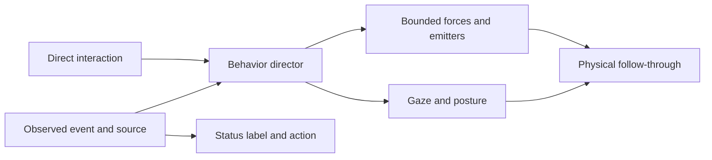

# Wanigan’s signature interactions

Wanigan can become a recognizable character through a small vocabulary of physical reactions, recurring habits, and satisfying things to do with him. The strongest direction is a quietly mischievous creature inside a glass world: attentive during conversation, expressive when work changes, and occasionally surprising during direct play. His eyes establish intent; his body reacts; the material follows with its own inertia.

The recommended first collection is **a conversational current, a fire-whirl failure and recovery, context crowding, compaction into memory pearls, and a zero-gravity water trick**. These cover everyday conversation, operational meaning, and a memorable interaction worth showing someone. This report proposes those behaviors; it does not describe them as shipped features. Feasibility assessments are engineering judgments, not measured performance results.

## Why this direction fits

Apple’s January 2025 ELEGNT study explored expressive movement in a lamp-like robot. Across six scenarios, expression-driven movements improved engagement and perceived robot qualities, particularly in social tasks. That supports investing in intention, gaze, and timing; it does not establish that an expressive orb improves coding productivity or guarantees lasting attachment. [Apple research](https://machinelearning.apple.com/research/elegnt-expressive-functional-movement).

Disney’s 2024 bipedal-character research combines artist-directed motions with physical control and an animation engine that blends behaviors. The relevant design lesson is to author a recognizable performance while allowing physical dynamics to determine its follow-through. Wanigan does not need that project’s robotics or reinforcement-learning machinery. [Disney Research](https://la.disneyresearch.com/publication/design-and-control-of-a-bipedal-robotic-character/).

The current water spin already has the right ingredients: the operator causes something, the character responds, and the water continues moving after the initiating gesture. Extending that relationship is more valuable than adding an unrelated particle effect for every status.

## Five signature scenes

### 1. The fire whirl: a request failed

**The scene.** His eyes snap toward the affected session, then briefly meet the operator. His globe recoils slightly. A broad flame gathers into a tall, twisting column with a visible core, outer folds, and embers caught in the circulation. He leans against the rotation; after his body steadies, the vortex continues to unwind.

A failure should produce a bounded entrance, followed by a restrained unresolved state. A confirmed retry success earns the recovery: the turbulent column tightens into a small blue core and settles back into his selected material. A timer may end the dramatic animation, but it must not announce that the failed request recovered.

The American Physical Society’s Gallery of Fluid Motion documents transitions between fire-whirl regimes, including the compact blue whirl. It is an excellent motion reference. The proposed recovery borrows that silhouette; it does not claim Wanigan simulates the combustion chemistry that produces the experimental blue whirl. [Understanding whirling flames](https://gfm.aps.org/meetings/dfd-2020/5f601b0e199e4c091e67c056).

**Trigger.** A confirmed failed request, with a known session/request identity and failure category. An ordinary tool error or user cancellation is a different event. Unknown failures get a generic “request failed” reaction, never a guessed provider outage.

**Material choice.** Offer a cinematic reaction setting that temporarily uses the whole interior for fire. Preserve the selected material as the resting identity. In a material-preserving setting, water uses a dark storm vortex, lava forms an agitated thermal plume, and plasma pulls into an unstable-looking bundle. Avoid casually layering flames above the water; the transition is an authored material change, not an existing water-to-steam phase-change simulation.

**Physics work.** Extend the existing transported gas, heat, fuel, and ember system with a vertical swirl axis, bounded radial inflow, upward transport, and a short source envelope. Preserve velocity when the source changes. A wider, readable silhouette and light transported through the volume matter more than adding spark count.

### 2. Context crowding: the globe is getting full

**The scene.** Translucent gas pockets and faint luminous threads increasingly occupy the globe’s upper chamber. They jostle, deform, and press against the glass. His eyes track a crowded patch, then he gives a small deliberate glance toward the relevant session. It should feel like a full desk becoming difficult to organize.

Context occupancy controls packing and visual complexity, not a generic red alarm. A gentle crowded state can begin at a proposed 75% and a stronger state around 90%, with hysteresis so noisy readings do not bounce between moods. Those are design starting points to tune, not provider thresholds or universal compaction rules.

**Trigger.** A fresh occupancy reading for one explicitly identified conversation and its applicable context window. The large orb follows the selected session or a conversation the operator has chosen to inspect. The mini companion can flag a context warning and open the affected-session list. It should never sum several sessions into one fictitious context window.

**Accuracy.** “Near the context limit,” “request rejected for context length,” “account quota nearly used,” and “rate limited” are distinct states. Cumulative tokens are not current context occupancy. An assumed denominator must remain labelled as an estimate; it should not drive a severe “over limit” performance. Missing or stale readings do not create pressure.

**Physics work.** Use constrained gas pockets or soft particles for visible packing. Keep the water’s mass and incompressibility model intact. Raising the water level can be an explicit meter metaphor, but squeezing liquid as if it were gas would make the physical behavior inconsistent.

### 3. Compaction: the little distillery

**The scene.** While compaction is actually underway, loose threads gather into a slow central spiral. On confirmed completion, the cloud resolves into a handful of luminous pearls. They fall through the interior, produce tiny wakes, and settle. His eyes follow the last pearl; a small nod completes the scene.

The emotional payoff is relief and order. One stubborn pearl can settle a fraction later, giving him something to notice. He should not wink during a failure to compact or pretend that a timer established completion.

**Trigger.** A paired, supported compaction lifecycle, scoped to the same session. If only a completion event is available, show the short settling gesture. If the event exists but a new occupancy measurement has not arrived, the label can say compaction finished while the numerical context display waits for fresh data.

**Accuracy.** The pearls symbolize a summary. They do not certify lossless memory, semantic correctness, permanent storage, or measured token savings. A pearl is not automatically a saved knowledge item.

**Physics work.** Reuse the existing bead collision and water coupling for the settling half. Gathering a cloud into discrete pearls requires a designed transition between representations. Describe it as choreography around simulated motion rather than literal condensation unless mass transfer is actually implemented.

### 4. Conversation: currents that take turns

**The scene.** When the composer is focused, his eyes settle toward it and the water leans gently in the same direction. Sending a question starts the existing thought current. A pending request sustains a coherent circulation; receiving the answer releases that energy into a small outward wave and a look back toward the operator.

The useful extension is continuity. If another question arrives while the water is still turning, the new motion should bend the existing flow. It should not reset to a stock starting pose. A cancellation should let the motion coast down rather than receiving an answer celebration.

Add a few occasional details: a bubble gets caught in the current; he notices it; the bubble escapes; he returns his attention to the conversation. These gestures belong in natural gaps and should yield immediately to typing, attention events, or a new question.

**Trigger.** Composer focus, submission, request pending, answered, failed, and cancelled states. Do not invent separate “searching,” “verifying,” or “deep reasoning” phases when the service supplies only pending.

**Future voice.** With an explicitly enabled voice feature, a smoothed audio envelope could create surface ripples and affect plume energy. Pauses let the surface settle. That would visualize sound intensity and timing, not infer the person’s emotions from their voice. The current text conversation does not supply this audio signal.

### 5. Zero gravity: the trick people show their friends

**The scene.** On an explicit “Float” interaction, he glances upward before the liquid lifts from the floor into a suspended globule. Bubbles remain trapped inside. A flick makes it oscillate and rotate; two small droplets meet, merge, wobble, and rejoin the main body. Releasing the interaction gradually restores gravity and lands the water with a satisfying splash.

NASA’s microgravity demonstrations are useful visual references for water behavior when surface tension is prominent. They provide a target for the silhouette and motion, not a desktop performance benchmark. [NASA surface-tension demonstration](https://www.nasa.gov/stem-content/stemonstrations-surface-tension/).

**Trigger.** Direct play, available from the companion’s play controls and an accessible keyboard action. A rare, confirmed milestone could use a shorter version, but ordinary turn completion should not repeatedly flood the screen with it.

**Physics work.** Vary gravity continuously in the existing liquid solver, retaining position and velocity. Validate cohesion, collisions with the vessel, volume drift, and recovery before describing this as stable. Small droplets may need better surface reconstruction than the current full water pool.

## More reactions with distinct meanings

| Situation | Proposed performance | Meaning and interaction |
| --- | --- | --- |
| Permission required | One large bubble rises, stops near the glass, and receives a single curious glance. A soft ring remains around the contact point. | Clicking opens the actual permission request. The bubble cannot grant approval. |
| Rate limited | Droplets form a slow queue at a narrow neck. One hangs there while his eyes calmly check the queue. | A countdown appears only when a reliable reset/retry time is available. Expiry alone does not claim access was restored. |
| Retry actually starts | A small circulation ring reforms around the core. | The attempt remains visually distinct from recovery. A successful response releases it. |
| Connection or status feed unavailable | The interior loses its active directional motion and settles; he looks toward the disconnected source. | The label says status unavailable. Quiet water alone must not imply healthy sessions. |
| One session needs attention among many | A single represented session pearl disturbs the surrounding current; he looks at that pearl. | Keep the affected session identifiable. Aggregate larger fleets instead of inventing an unreadable one-dot-per-agent universe. |
| Several observed sessions are working | A few distinct flow lanes circulate around a stable center. | Activity, not a percentage-complete gauge. Terminal output volume does not determine apparent productivity. |
| A turn finished | One bubble ring rises and dissolves; a small nod. | “Turn finished” or “session ended,” according to the actual event. |
| A verified goal or review gate succeeded | A restrained aurora unfurls behind the eyes and reflects in the glass. | A larger reward reserved for the recorded success it names. It does not convert an agent’s self-report into verification. |
| A recorded gate failed | A wave reaches the wall, rebounds, and briefly knots the current. | The gesture points toward the failed check, with a route to its evidence. |
| Explicit pause | Loose motion gradually damps and suspended particles rest. | A paused agent and a quiet animated character remain separately labelled. |
| A fresh session after a crowded one | The old cloud becomes a fading trace and a clean current opens. | Explain the session transition. Do not imply that all prior context transferred. |
| Return to an idle app | Eyes find the operator; one soft ripple moves through the water. | A welcome gesture, with no fabricated account of work while the app was closed. |

The aurora would be an illustrative model: ribbons aligned to a prescribed field, with bounded particle drift and emission. Real auroras involve charged particles interacting with magnetic fields and atmospheric gases. A desktop rendering should not be described as a full electromagnetic simulation. [NASA: The Atmosphere… After Dark!](https://science.nasa.gov/sun/the-atmosphere-after-dark/).

## Play that reveals habits

**Catch the bubble.** He follows a wandering bubble with his eyes, anticipates where it will go, and occasionally misses the pop. A small recoil sends a real impulse into the material. Vary timing and target, not the basic recognizable joke.

**Tap a rhythm.** A few taps excite surface waves. He answers with one short pattern of ripples, scaled to the energy supplied. Resonance should be bounded so repeated input cannot destabilize the simulation. Optional sound follows the contact event and is off by default.

**Hold a calm spot.** Holding a point on the glass creates a local region of reduced agitation; the rest of the material continues to flow around it. Release produces a small wake. This changes the physical toy, not the state of a failed request or the status of an agent.

**A heavy spin.** He anticipates a deliberate globe spin, then his gaze and the contents lag behind the shell by different amounts. A fast spin earns a brief unfocused blink and recovery. The existing spin is the starting point; the extension is the aftermath and the interaction with his current material.

**A magnetic handshake.** In ferrofluid mode, a deliberate touch gathers a spike cluster against the glass. Moving the point makes the cluster travel while the bulk fluid follows more slowly. On release, it falls back with a small damped overshoot. This extends the existing pointer attraction into an intentional greeting.

**Grow something luminous.** In a play-only living-pattern mode, a touch seeds a small patch of spots that split and spread around the shell. A second touch can bend or interrupt the pattern. Gray–Scott reaction–diffusion generates evolving patterns from local chemical-concentration updates, making this a tractable simulation with emergent behavior. It is not a model of intelligence or learning. [Karl Sims’s tutorial and interactive tool](https://www.karlsims.com/rd.html).

**A tiny weather story.** A requested rain burst moves through cloud formation, actual drop impacts, ripples, and clearing. The existing rain/water interaction makes a useful foundation. He watches the first impact, shelters his eyes briefly, and relaxes as the weather clears. Let the material’s aftermath complete the joke.

## A consistent personality across materials

The material is his temperament; the choreography is his identity. Keep the same gaze timing, short anticipation, bounded body response, and readable recovery across appearances.

| Behavior | Water / mist | Flame | Lava | Snow | Plasma |
| --- | --- | --- | --- | --- | --- |
| Attentive | Current leans toward the interaction | Plume inclines and steadies | Nearest wax lobe rises slightly | Nearby flakes form a gentle orbit | A small bundle favors the touched side |
| Thinking | Coherent vortex | Steady helical updraft | Slow circulating lobes | Organized circulation above the pile | A stable rotating connection pattern |
| Surprise | Short wave and splash | Brief expanding plume | One lobe wobbles and separates | A bounded flurry | One short redistribution of filaments |
| Relief | Wave energy decays | Source settles to a compact core | Lobes resume slow convection | Flakes settle | Connections become sparse and steady |
| Play | Droplets, wakes, floating liquid | Ember ring and curled plume | Stretch and merge | Shake and resettle | Gather arcs at a deliberate touch |

These are proposed mappings, not additional assertions about the completeness of each current solver. Snow preserves its accumulated pile; plasma remains dry; water and flame do not share a default simultaneous interior. A cinematic material switch is an explicit exception with a clear return to the chosen appearance.

## What Wanigan can actually observe today

The inspected working tree already has ten material choices, intentional gaze, blinks, a nudge/wink, nods, attention double-takes, globe rotation, and a thought vortex. The large and compact forms share `OrbExpression` and the WebGPU runtime. `Orb.tsx` currently aims for 30 frames per second for the large orb, 18 for the compact one, and 60 shortly after direct interaction; these are scheduling targets, not measured delivery guarantees.

| Signal | Current evidence | Work needed for the proposed reaction |
| --- | --- | --- |
| Conversation lifecycle | `companion_turns` records pending, answered, failed, and cancelled outcomes. | Pass the relevant lifecycle event into expression; retain cancellation separately from failure. |
| Session attention | Provider-neutral presence distinguishes permission, error, finished, working, quiet, and unavailable. Transition identities are already used to avoid replaying a gesture on every poll. | Preserve identity and carry the event kind instead of reducing several causes to one attention counter. |
| Failure subtype | The companion records an error string; general presence has an error state. | Normalize known provider/transport codes in main. Do not infer outage, authentication failure, or retryability from arbitrary terminal prose. |
| Claude context occupancy | The transcript reader exposes the latest usable usage record and distinguishes CLI-reported versus assumed window sizes. | Add a scoped, fresh reading to the character input. Keep estimated and unsupported states visible. |
| Codex context occupancy | The current context IPC returns unsupported outside the Claude harness. Codex consumption reads cumulative rollout counters. | Build and verify a dedicated occupancy adapter before a Codex context-pressure reaction. Cumulative consumption is not an acceptable substitute. |
| Compaction | Hook plumbing recognizes `PreCompact` and `PostCompact`; learning records compaction signals. | Verify the installed harness’s actual lifecycle and route paired events by session. A recognized event name alone is not end-to-end support. |
| Account limits | Usage exposes account windows, timestamps, and ok/stale/unsupported states. | Bind an account-level reaction explicitly to that account and freshness. Keep it separate from conversation context. |
| A verified outcome | Review and goal records can provide the relevant operational evidence. | Choose and test the exact success event; do not derive it from a generic process exit or turn boundary. |

Claude’s current status-line documentation describes separate context-window fields and account rate-limit fields, which reinforces keeping the visual metaphors distinct. It also notes that its fixed `exceeds_200k_tokens` flag is not the same as exceeding the applicable model window. These documented fields are possible integration inputs, not fields already wired into Wanigan’s character. [Claude Code status-line documentation](https://code.claude.com/docs/en/statusline).

Repository references: [expression](../../src/renderer/src/orb/expression.ts), [presence](../../src/shared/companion-presence.ts), [event reactions](../../src/renderer/src/orb/presence.ts), [orb host](../../src/renderer/src/components/Orb.tsx), [companion lifecycle](../../src/main/companion.ts), [context reader](../../src/main/transcripts.ts), [context IPC](../../src/main/index.ts), [Codex consumption](../../src/main/codex-usage.ts), and [hook handling](../../src/main/hooks.ts). Observations apply to the working tree inspected September 10, 2026.

## How to build a performance rather than a collection of loops

Use a small behavior director between operational events and physical controls. Its inputs should include the observed source, session/account/request identity, event identity, timestamp, freshness, and supported payload. Its outputs should be bounded gaze targets, posture targets, material forces, emitter envelopes, and optional words.

Give each performance an anticipation, an active phrase, an interruption rule, and a recovery condition. Starting a new phrase should preserve fluid velocity wherever the material model remains the same. A new serious event may interrupt play; an old polling snapshot must not restart it. Establish a baseline after mounting or reconnecting so a historical failure does not suddenly perform as a new incident.

Use one dominant operational performance at a time. A secondary unresolved condition stays available in the text and attention list. Deduplicate repeated failures for the same request; coalesce a burst across many sessions into one overview gesture with a real count. The character remains readable under heavy activity.

A proposed fire-whirl phrase might spend about 0.2 seconds on the glance, 0.4 seconds gathering the plume, and 1.5–2.5 seconds on its main movement before settling into a restrained unresolved pose. Recovery is a separate event-driven phrase. All timing is subject to visual testing and reduced-motion preferences.

Keep any language-model involvement small and subordinate. The default director can run from local state and timers without an extra model call. If conversational tone later selects a playful gesture, use a small validated vocabulary inside the already requested response; the model must never set session success, provider health, context percentage, or physics parameters directly.

## Physics and rendering approach

The current liquid solver, 3D gas transport, thermal field, ink, ripples, and material modules are a substantial foundation. NVIDIA’s real-time fluid work describes the useful separation between velocity simulation, transported quantities, and rendering. That supports feeding authored forces into a solver while preserving the evolving field. [GPU Gems 3, Chapter 30](https://developer.nvidia.com/gpugems/gpugems3/part-v-physics-simulation/chapter-30-real-time-simulation-and-rendering-3d-fluids).

Position Based Fluids uses positional density constraints for interactive incompressible-liquid behavior. XPBD introduces compliance handling intended to reduce dependence of apparent stiffness on timestep and iteration count. These are relevant references for cohesive droplets and soft packing, not a guarantee that a new mode will work unchanged in Wanigan. [Position Based Fluids](https://mmacklin.com/pbf_sig_preprint.pdf), [XPBD](https://matthias-research.github.io/pages/publications/XPBD.pdf).

Curl noise can supply controlled, divergence-free procedural flow, but it is not by itself a momentum solver. It can seed a bounded force or guide decorative tracers; transported smoke should still follow the actual velocity field when physical continuity is the goal. [Curl-Noise for Procedural Fluid Flow](https://www.cs.ubc.ca/~rbridson/docs/bridson-siggraph2007-curlnoise.pdf).

Keep the distinction between simulated mechanics and illustrative optics explicit in engineering notes. A cloud-to-pearl transition, aurora, and material morph can be visually coherent without being literal chemistry. Whole-globe phase changes would require new mass/energy coupling; the current thermal model explicitly does not implement water evaporation, oxygen transport, or heat feedback into the liquid.

Blender or Houdini can help author reference timing, source silhouettes, and look development. The live interaction should continue in the app’s WebGPU system. A prerecorded clip cannot respond to a new flick, preserve momentum after an interruption, or adapt to an event that ends early. No additional animation library is necessary just to introduce the behavior director.

## Quality and performance boundaries

Use the same behavior vocabulary at both character sizes, with scale-aware amplitudes and rendering quality. The miniature should retain the recognizably coiling silhouette of a storm and the same eye timing, even if it uses fewer samples. A large flare should not obscure neighboring controls.

Run only the active material work needed for the scene, keep particle and texture counts bounded, and preserve hidden-window throttling. Compare the new modes against the current orb on the actual desktop GPU. Measure frame pacing, GPU/CPU cost, memory growth, and interaction latency; do not infer performance from another project’s demo.

Honor Motion Off and the operating system’s reduced-motion setting. Provide a readable static posture and status label for every operational state. Avoid strobing error feedback and unbounded recurring alarms. W3C’s guidance supports allowing nonessential interaction animation to be disabled. [Animation from Interactions](https://www.w3.org/WAI/WCAG22/Understanding/animation-from-interactions.html).

Validation should include event replay under repeated polls, a failed request followed by cancellation, retry attempts that also fail, stale context readings, unsupported providers, several simultaneous sessions, a lost/recreated GPU device, and switching pages during a performance. Physics checks should cover finite values, particle containment, bounded energy, liquid volume drift, and settling after forcing stops. Those checks protect the very continuity that makes the interaction appealing.

## Recommended build sequence

1. **Give the existing physics a behavior director.** Distinguish conversation outcomes, attention causes, event identities, and recovery. Extend the current conversational current and permission bubble first; both can be exercised with existing signals.
2. **Make the fire whirl the first dramatic scene.** Tune silhouette and interruption/recovery before adding more error effects. Include a material-preserving alternative and a clear unresolved label.
3. **Add context crowding and compaction as one story.** Start with supported, fresh Claude readings and verified compaction events. Add Codex only after its occupancy path is implemented and tested.
4. **Build the zero-gravity interaction.** This is the strongest pure play feature because the operator can change it continuously and the result is easy to understand visually.
5. **Add small habits and milestone auroras.** Bubble watching, rhythmic taps, and rare celebrations benefit from the stable event system and should remain occasional.

A strong short demonstration would show someone asking a question, stirring the same water while it answers, floating it into a suspended droplet, then watching a clearly identified event change the character’s behavior. Any staged operational event used for a demonstration should be labelled as such. The memorable property is a coherent character whose little world keeps responding, with useful work immediately behind each operational reaction.

## Sources

1. Yuhan Hu, Peide Huang, Mouli Sivapurapu, and Jian Zhang. Apple Machine Learning Research. [ELEGNT: Expressive and Functional Movement Design for Non-Anthropomorphic Robot](https://machinelearning.apple.com/research/elegnt-expressive-functional-movement). January 2025. Expressive movement and the limits of the engagement finding.
2. Ruben Grandia and colleagues. Disney Research. [Design and Control of a Bipedal Robotic Character](https://la.disneyresearch.com/publication/design-and-control-of-a-bipedal-robotic-character/). July 15, 2024. Artist-directed performance combined with physical control.
3. Sriram Bharath Hariharan and colleagues. APS Division of Fluid Dynamics. [Understanding whirling flames](https://gfm.aps.org/meetings/dfd-2020/5f601b0e199e4c091e67c056). November 2020. Fire-whirl and blue-whirl reference; link as inspiration, not a commercially reusable stock asset.
4. NASA. [STEMonstrations: Surface Tension](https://www.nasa.gov/stem-content/stemonstrations-surface-tension/). Page updated May 2, 2023. Microgravity water demonstration.
5. NASA Science. [The Atmosphere… After Dark!](https://science.nasa.gov/sun/the-atmosphere-after-dark/). Accessed September 10, 2026. Aurora mechanism and visual inspiration.
6. Karl Sims. [Reaction-Diffusion Tutorial](https://www.karlsims.com/rd.html). Page copyright 2013–2016. Gray–Scott model, emergent patterns, and interactive references.
7. Keenan Crane, Ignacio Llamas, and Sarah Tariq. [Real-Time Simulation and Rendering of 3D Fluids](https://developer.nvidia.com/gpugems/gpugems3/part-v-physics-simulation/chapter-30-real-time-simulation-and-rendering-3d-fluids). GPU Gems 3, 2007. Simulation/rendering separation and transported fields.
8. Miles Macklin and Matthias Müller. [Position Based Fluids](https://mmacklin.com/pbf_sig_preprint.pdf). ACM TOG / SIGGRAPH, 2013. Interactive density constraints and fluid behavior.
9. Miles Macklin, Matthias Müller, and Nuttapong Chentanez. [XPBD: Position-Based Simulation of Compliant Constrained Dynamics](https://matthias-research.github.io/pages/publications/XPBD.pdf). 2016. Compliant constraints.
10. Robert Bridson, Jim Hourihan, and Marcus Nordenstam. [Curl-Noise for Procedural Fluid Flow](https://www.cs.ubc.ca/~rbridson/docs/bridson-siggraph2007-curlnoise.pdf). SIGGRAPH, 2007. Procedural divergence-free flow and boundaries.
11. Anthropic. [Customize your status line](https://code.claude.com/docs/en/statusline). Current documentation accessed September 10, 2026. Context and account-limit fields; availability is not Wanigan integration proof.
12. W3C WAI. [Understanding SC 2.3.3: Animation from Interactions](https://www.w3.org/WAI/WCAG22/Understanding/animation-from-interactions.html). Current WCAG 2.2 guidance accessed September 10, 2026. Disabling nonessential animation.

Older physics papers are foundational references, not claims of newly released 2026 libraries. The proposed character scenes and prioritization are design judgments informed by these sources and the inspected application.
