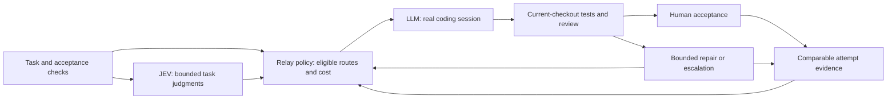

# JEV + Relay: the cheapest route to an accepted change

Research and implementation audit, 2026-09-19. The operator's objective is
**lowest total cost per accepted result, including retries**, while preserving
required tests and review. This report combines primary-source web research,
public implementation inspection, and offline probes of Wanigan. The audit
findings below describe the pre-implementation baseline. The subsequently
approved [implementation design](../superpowers/specs/2026-09-19-relay-auto-routing-design.md)
covers the initial routing choices and reliability fixes; see the implementation
note below. No paid evaluation was run.

**Prompt in, model and effort out already exists**, both in public projects and
in Relay. Relay does not yet optimize the cost of accepted work. Its present
model-choice question has no prices or measured success rates; forecasts happen
after route selection.
Several execution/accounting defects also make current outcome records unsafe
inputs to a learned cost policy. Correct those foundations before adding a more
elaborate router.

## Exact matches: prompt to model and reasoning effort

These are the closest answers to the operator's follow-up. Each has inspected
implementation code for both choices; this is stronger than a general routing
README, but is still source inspection rather than a live integration test.

| Project | Implemented decision | What Relay can reuse |
| --- | --- | --- |
| [agent-router](https://github.com/nidhi-singh02/agent-router) | Up to three JEV calls classify the task, choose an eligible agent/model, then choose an effort supported by that model. | Closest overall match to the requested behavior. Adapt the declared candidates and model-conditioned effort selection into Relay's launch contract. |
| [jev-harness-router](https://github.com/JoacoMarc/jev-harness-router) | JEV scores task difficulty and scope; deterministic policy maps their distributions to a model tier and effort. | Small, reusable policy design. Its thresholds are fitted heuristics, not universally correct settings. |
| [jev-codex-router](https://github.com/0xNatoshi/jev-codex-router) | JEV chooses a model tier and reasoning depth; the proxy writes the selected model and effort into the actual request. | Concrete execution wiring; archived September 19, 2026. Its use of conversation/tool snippets and proxy interception does not fit Relay's current boundaries. |
| [Brick](https://github.com/regolo-ai/brick-SR1) | Classifiers identify capability/difficulty; code selects a model and derives reasoning effort from difficulty, that model's capacity shortfall, and the configured cost/quality preference. | Evidence that model-sensitive effort policy is practical. More infrastructure than Relay needs; adapt the policy concept rather than replacing Wanigan's runtime. |

In agent-router's
[decision engine](https://github.com/nidhi-singh02/agent-router/blob/main/packages/router/src/semantic/decision-engine.ts),
route candidates are policy-filtered account/model identities. Its
[ranker](https://github.com/nidhi-singh02/agent-router/blob/main/packages/router/src/semantic/route-ranker.ts)
supplies capability and quota context; the
[effort selector](https://github.com/nidhi-singh02/agent-router/blob/main/packages/router/src/semantic/effort-selector.ts)
offers the selected model's supported values. The repository describes its
capability/cost/latency numbers as estimates. This solves the selection workflow,
not the proof of cheapest accepted-result cost.

jev-harness-router's
[policy](https://github.com/JoacoMarc/jev-harness-router/blob/main/src/policy.ts)
uses the 60th percentile of the difficulty/scope distributions, separate cuts
for model tier and effort, and a model-tier floor for broad scope. That pure
judgment-to-policy seam is particularly easy to adapt to shared TypeScript.
jev-codex-router's
[server](https://github.com/0xNatoshi/jev-codex-router/blob/main/server/jev_server.py)
has explicit `tier` and `depth` questions and an `apply_route` implementation;
its advertised replay repricing does not measure accepted-code savings.

Brick's pinned
[effort implementation](https://github.com/regolo-ai/brick-SR1/blob/6581c30ce959871400426b4e92ccf9d2bc3f143a/apps/router/src/spatial-router/pkg/proxy/effort.go)
maps continuous difficulty to a six-step ladder, adds one step when the chosen
model is stretched, adds a cost/quality-mode bias, then clamps to allowed
efforts. Its
[model scorer](https://github.com/regolo-ai/brick-SR1/blob/6581c30ce959871400426b4e92ccf9d2bc3f143a/apps/router/src/spatial-router/pkg/brickrouting/router.go)
combines capability distance and configured cost. These are concrete algorithms;
their constants should not become Relay defaults without task evidence.

For a recommendation-only implementation,
[model-effort-router](https://github.com/enzoo808/model-effort-router/blob/6a97bc4a179ab1d9f94ead3b490357487a7d50c1/skill/SKILL.md)
is an LLM-read skill returning Claude/Codex model and effort suggestions. Its
rules protect subscription quota rather than optimize metered dollars. It is
useful for task taxonomy and explanations, but is not an execution service.

The closest research formulation is
[RADAR (ICLR 2026)](https://arxiv.org/abs/2509.25426): learn task difficulty and
the ability of each model/budget configuration, then route to a suitable pair.
Its eight reasoning benchmarks support studying model and reasoning budget
together; they do not establish accepted repository-change costs. Deployable
source availability was not established here. By comparison,
[R2-Router's implementation](https://github.com/UCF-ML-Research/R2-Router/blob/b0b2291aeee08feb4bedbd199ab014ec60d0004f/r2_router/router.py)
returns a model and token budget, but generation expresses that budget as a
response-length instruction, without setting native reasoning effort. These
are different controls and should not be presented as interchangeable.

## Relay already selects both

When JEV routing is enabled and the stage has no operator model/effort override,
[`relayPlanRequest`](../../src/shared/suggest-questions.ts) sends at most 2,000
characters of operator intent in one batched request. For each stage it asks
for a model Choice and a deliberation Score from 0 to 3. The score becomes an
index in the selected model's declared effort ladder:

```text
effort index = round(score / 3 * (number of supported effort levels - 1))
```

Both confidence thresholds currently start at 0.8. Weak deliberation confidence
keeps the model suggestion but falls back to its legal default effort; weak
model confidence discards the suggested route. Operator choices take precedence
in [`chooseStage`](../../src/shared/relay-route.ts). The normal Relay launch
passes both selected values to the real session launcher.

JEV chooses **within the already selected provider profile**. It does not shop
across all installed providers, and its deliberation question is independent
of the chosen model's capability. The useful next improvement is to adapt
model-conditioned effort and cost evidence, then ensure the exact selection
survives every dispatch path. First-time prompt/model/effort wiring is not
missing.

## What existing projects contribute

The ranking below is usefulness to Relay, not a claim of general superiority.
Published benchmark results are the authors' observations, not reproduced here.
No inspected repository establishes savings on Wanigan's workloads.

| Reference | Useful contribution | Evidence limit and adoption decision |
| --- | --- | --- |
| [jevcal](https://github.com/abhixhek/jevcal) | Fit thresholds on labeled cases; validate on held-out cases; retain a policy/evidence lock and detect drift. | Its displayed demo is simulated. Adapt the calibration structure to actual acceptance outcomes; do not copy thresholds or export repository evidence for automatic teacher labeling. |
| [TwinRouterBench](https://github.com/CommonstackAI/TwinRouterBench) | Separate inexpensive static routing evaluation from live, full-task coding evaluation with a fixed model pool. | Authors report 75/100 cases resolved for $25.66 versus 74/100 for $54.73. This is one small held-out SWE-bench sample, not proof of equivalent quality on Relay. Best evaluation reference. |
| [RouteLLM](https://github.com/lm-sys/RouteLLM) | An established strong/weak routing baseline and offline evaluation machinery. | General preference benchmarks differ from accepted repository changes. Its threshold utility targets the share of strong-model calls, not a coding acceptance floor. Use as a comparator. |
| [Aider](https://aider.chat/docs/usage/modes.html) | Explicit architect/editor handoff, potentially using different models. | Adds another request and can increase cost. Measure direct implementation against plan-plus-editor; do not require an expensive planner for every task. |
| [mini-SWE-agent](https://github.com/SWE-agent/mini-swe-agent/blob/main/src/minisweagent/agents/default.py) | Budget checks at the call boundary, bounded failures, durable attempts, charging malformed responses. | Spend is known after each call; this is a stopping threshold, not a guaranteed invoice cap. Adapt only controls that a declared CLI harness actually exposes. |
| [OpenHands SDK](https://docs.openhands.dev/sdk/guides/metrics) | Aggregate main and auxiliary LLM spend while retaining individual usage records. | Useful accounting architecture; a critic score does not replace current-checkout tests or human acceptance. |
| [jev-router](https://github.com/gargpratyush/jev-router/blob/master/src/policy.mjs) | Conservative downgrade policy and awareness of context/switching costs. | Heuristic thresholds, no accepted-code savings study. Borrow policy concepts; retain Relay's declared launch contracts instead of adopting its private-protocol proxy. |
| [Agent-as-a-Router / ACRouter](https://github.com/LanceZPF/agent-as-a-router) | Task-specific outcome memory, verification, and bounded escalation. | Research scaffold; its coding scores and memories are not automatically total-cost estimates. Useful later, once Relay has reliable attempt records. |

TwinRouterBench's [paper](https://arxiv.org/abs/2605.18859) explains why static
routing accuracy and downstream task success need separate measurements. Relay
should borrow that separation without assuming it can intercept every internal
CLI model call. Begin at the stage/attempt boundaries Wanigan actually controls.

### Research and engineering articles worth reading

- [RouteLLM paper](https://arxiv.org/abs/2406.18665) and
  [authors' engineering article](https://www.lmsys.org/blog/2024-07-01-routellm/):
  routing from preference evidence and evaluating a cost/quality frontier.
  Source inspection matters: the current
  [controller](https://github.com/lm-sys/RouteLLM/blob/main/routellm/controller.py)
  uses the last message for its completion route, and its
  [calibration utility](https://github.com/lm-sys/RouteLLM/blob/main/routellm/calibrate_threshold.py)
  chooses a quantile for the requested strong-model fraction. Neither establishes
  acceptance probability for a long-running coding task.
- [FrugalGPT paper](https://arxiv.org/abs/2305.05176) and
  [implementation](https://github.com/stanford-futuredata/FrugalGPT): foundational
  learned cascades under a budget. Useful for considering the whole sequence of
  attempts; its benchmark/model pool is not a current Relay price recommendation.
- [RouterBench](https://github.com/withmartian/routerbench) and
  [paper](https://arxiv.org/abs/2403.12031): reusable offline cost/performance
  comparisons. A replay benchmark remains distinct from launching an agent,
  preserving its checkout, testing its patch, and accepting it.
- [LLMRouterBench](https://arxiv.org/abs/2601.07206): evaluation across 33 models
  and 21 datasets finds several sophisticated routers fail to reliably beat a
  simple baseline. Carefully selected small model pools can be competitive.
  This supports testing a simple stage policy before funding router training.
- [Aider's architect experiment](https://aider.chat/2024/09/26/architect.html):
  a concrete 2024 coding benchmark for separating solution design from edits.
  Use its experiment structure, not its old model rankings as today's defaults.

Two newer approaches deserve narrower consideration:

- [BitRouter](https://github.com/bitrouter/bitrouter) separates accumulated
  evidence from the active, explicitly published routing policy. That is a good
  pattern for reversible policy updates. Its advertised 32.8% saving uses
  zero-cache imputed cost under a modified Terminal-Bench protocol, with accuracy
  76.1% versus 77.3%. It is not measured Relay billing or a standard leaderboard
  result. Keep Wanigan policy in app-owned data, rather than adopting a
  repository-written config or replacing its runtime with a proxy.
- [CodeRescue](https://arxiv.org/abs/2607.19338), whose code now lives at
  [ARCHER](https://github.com/Qijia-He/ARCHER), poses the relevant post-failure
  choice: repair cheaply, restart cheaply, or escalate. **The arXiv paper was
  withdrawn on July 30, 2026**, with the stated reason that company internal
  review/approval was incomplete. Do not use its savings claim as validated
  support for Relay. The action taxonomy remains a useful research lead;
  code-reuse licensing was not established in this inspection.

## Why the closest-looking products are not turnkey answers

Source inspection of [llm-token-router](https://github.com/jman4162/llm-token-router)
found a useful constrained selector, but its reported expected route cost covers
the initial call rather than its attached fallback. Its calibration flag is a
sample-count threshold, not an empirical calibration test.
[CodeRouter](https://github.com/Code-Router/CodeRouter) offers a useful
request/decision/invocation/outcome schema, but its main probability estimate is
hand-authored and its generic strategy executor does not establish that a draft
passed independent verification. Details and pinned source links are in the
[cost-router assessment](2026-09-19-cost-router-projects.md).

The direct JEV ecosystem also contains worthwhile partial solutions, not a
proven cheapest-coding system. The
[six-project assessment](2026-09-19-jev-community-routing.md) covers Foreman,
jev-harness-router, jev-skillful, and typesafe-skill-router alongside the two
shortlisted projects. Some benchmark route labels or retrieval rather than
accepted work. Foreman's observation/verification policy would cross Relay's
current JEV data boundary and weaken mandatory checks if copied wholesale.

## What the Relay audit actually demonstrated

These are implementation findings, separate from the external research. Source
and probe details are in the [execution audit](2026-09-19-relay-execution-audit.md)
and [cost-evidence audit](2026-09-19-relay-cost-evidence.md).

| Finding | Reproduced consequence |
| --- | --- |
| Missing telemetry starts as reported zero | No-meter and token-only sessions can become $0 forecast samples. A genuine zero-dollar metric looks the same. |
| Outcome upsert retains only the latest session's cost | A fabricated $2 failed attempt plus $3 accepted upgrade produces a $3 accepted outcome, still attributed to the first model. The separate docket ledger correctly totals $5. |
| Autopilot supplies docket-wide routing | A pinned stage profile/model is replaced by the global profile/model at launch. |
| Resolved launch and persisted route differ | An inherited model launches but is recorded as null; an explicit high-effort launch leaves low effort on the node. |
| Implementation retry does not inherit its previous checkout | The reopened node retains a worktree, but the next launch requests a fresh isolated session without that tree or resume identity. |
| Budget checks do not protect the final dispatch boundary | An already queued node launches at a zero-dollar cap; unreported previous spend can still permit queuing. |
| Planned stages can receive model outcome credit without a session | Deterministic verification/human review can create accepted-model samples for models that never ran. |

The probes execute production functions with fabricated evidence and mocked
process/telemetry/review boundaries. They do not claim these particular dollar
amounts occurred in the operator's sessions or prove live provider behavior.

The good foundations should remain: declared model/effort validation, explicit
operator precedence, bounded JEV intent, conservative fallback, mandatory
verification/review, checkout-freshness checks, and docket spend that includes
historical sessions. The new cost policy should consume these contracts.

The [JEV contract audit](2026-09-19-jev-primary-sources.md) also identifies a
moving model alias, uncalibrated 0.8 thresholds, permissive response validation,
and a stale assumption that credential checking requires an inference request.
JEV confidence measures its answer distribution, not the probability a coding
model will produce an accepted patch. TypeSafe explicitly calls for
[domain-specific confidence evaluation](https://docs.typesafe.ai/confidence).

## Proposed division of responsibilities



This is a proposed feedback loop, not the current implementation. JEV provides
narrow semantic judgments about demands, uncertainty, and needed context.
Deterministic code owns capability/consent filters, pricing arithmetic, budget
policy, and route selection. Coding LLMs perform the work. Tests and review
establish acceptance. Operational evidence informs later choices without
exporting code, diffs, transcripts, or cross-backend semantic memory to JEV.

Start with two or three explicitly eligible routes for each real model stage.
Model, effort, harness, backend, and billing basis are part of a route. A tier
name alone is insufficient. Treat estimate arithmetic, verification commands,
and human review as their own execution types; do not buy model decisions or
credit model successes for phases that run no model.

Prefer a cheaper route only when comparable evidence supports its quality floor.
With little evidence, keep the established default and show uncertainty. A
stronger initial model can be cheaper overall when it avoids repeated repair.
Do not infer the performance of an untried route from success on another route.
Keep stage-level choices initially: changing models inside opaque CLI turns
would require a separately verified provider capability.

After failure, preserve the checkout and distinguish a repair from a deliberate
restart. Compare the expected remaining cost of bounded repair/escalation;
already-spent dollars belong in the result total and remaining budget, not in a
reason to continue an uneconomical attempt. Unknown metering cannot authorize
an automatic dollar-budget decision as if the attempt were free.

## Measuring the objective honestly

For a fixed representative workload, report:

```text
cost per accepted result = total cost of ALL attempted tasks / accepted tasks
```

The numerator includes ultimately rejected tasks, failed calls, retries,
planning, routing, implementation, and paid review. If zero tasks are accepted,
the metric is undefined, not zero. Keep a separate per-task total for explaining
an individual acceptance. Do not silently exclude unpriced attempts; report
metering coverage and withhold a definitive dollar comparison when incomplete.
Keep token/quota use, API-equivalent estimates, and account charges distinct.

Illustration only: at 100 fixed tasks, a policy spending $100 and accepting 50
costs $2 per acceptance. One spending $140 and accepting 80 costs $1.75. The
second has higher expenditure and better cost per acceptance. Relay must also
respect the operator's total budget and required acceptance quality.

Preserve one decision identity linking task/commit, acceptance recipe, eligible
routes, profile fingerprint, resolved model/effort, question/policy version,
JEV response identity, and each launched attempt. Link each paid call once:
copying a batched JEV call's usage into four stage proofs must not count it four
times. Append verdicts and route changes instead of overwriting failed history.

Compare these baselines on the same task set and starting commits: current
default; a simple deterministic stage policy; cheap-first with a bounded
fallback; and the JEV-assisted policy. Freeze other execution conditions and
document intentional route differences. Split tuning from evaluation by task,
not by individual attempts from the same task. Report acceptance rate, first
pass rate, retries, total dollars, unpriced coverage, elapsed time, and harmed
as well as rescued tasks. Record human effort separately if actually measured.

Local recommendation/replay can precede live evaluation and creates no new
model spend. It cannot reveal counterfactual outcomes for models never run.
Any live comparison needs an explicit evaluation budget; no automatic paid
exploration or model-training workload is implied by this report.

## Concrete implementation order

1. **Reliable execution and evidence.** Convert affected unconverted surfaces
   into modules first, in behavior-preserving commits as required by
   `AGENTS.md`. Then fix route persistence, autopilot pins, retry checkout
   preservation, dispatch budget checks, unknown metering, and attempt attribution.
   Put pure contracts in shared tests and process-boundary regressions in smoke.
2. **Small advisory cost policy.** Add the extension that filters eligible
   routes, consumes explicit quality/cost evidence, and explains a recommendation.
   Use append-only decisions/attempts and a conservative cold start. Maintain
   consent, provider capability, and current-checkout review boundaries.
3. **Measured calibration and controlled activation.** Borrow jevcal's held-out
   calibration and version locks, TwinRouterBench's two-stage evaluation, and
   simple baseline comparisons. Publish a reversible policy only after it meets
   the declared acceptance floor and improves complete cost per accepted result.

For the bounded execution and accounting details behind this sequence, see the
[Aider, mini-SWE-agent, and OpenHands comparison](2026-09-19-coding-agent-orchestration.md).

## Baseline verification performed

Using Node 22.23.2, `npm test` passed typecheck, shared tests (539), renderer style,
dead-code, lint, package hooks, and local installer fixtures. The sandboxed
Electron smoke launch exited before assertions; rerunning `npm run smoke`
outside that boundary passed 2,391 assertions with zero failures. These are
baseline checks, not coverage of all audit findings.

Both offline audit probes were rerun successfully against the current source:
`/private/tmp/relay-control-offline-audit.cjs` and
`/tmp/wanigan-jev-cost-audit.mjs`. They are temporary investigation fixtures,
not permanent regression tests. No external router was installed or executed,
no application behavior was modified during those probes, and no live JEV/LLM request was made.

## Implementation following approval

Relay now offers Auto or Manual, with Lower cost (default), Balanced, and Higher
quality preferences for Auto. Manual skips JEV entirely, retains the full
pipeline, and uses profile defaults or explicit stage overrides. Auto asks one
batch of model and model-specific supported-effort questions; only the selected
model's confident effort answer is used. Operator choices and all verification
and human review requirements retain precedence.

Control's migration and IPC ownership moved into a required module in a
behavior-preserving commit before the fixes. Launches record their resolved
settings, autopilot honors stage pins and rechecks meter coverage and budget,
and implementation retries adopt the existing validated checkout. Missing
meters remain unknown. Review observations append every linked attempt with
its frozen identity and nullable cost; the existing Model evidence table is a
latest-result projection including retry costs. Human-only and deterministic
stages earn no model credit. Historical rows are preserved, not retroactively
reconstructed.

These preferences are advisory objectives, **not a calibrated optimizer or a
proven cheapest-route guarantee**. No learned success-rate model, automatic
paid exploration, or controlled live comparison is introduced. Reliable outcome
records make that later comparison possible; the research's measurement and
calibration requirements still apply. Preview and creation are distinct,
explicit suggestion calls, and estimates remain separate from reported bills.

Implementation verification: Node 22.23.2 `npm test` passed all eight stages,
including 546 shared tests, 6 Control dispatch regression groups, and 2,502
Electron smoke assertions. The sandbox prevented Electron startup; the complete
suite passed outside that launch boundary. Real Electron UI checks passed 28
assertions covering all choices, create/read persistence, explicit overrides,
and navigation. [Before/after screenshots in both themes](../shots/relay-routing/README.md)
record that interface verification. These checks used isolated data and offline
fixtures; live use-case evaluation is a separate next step.
