# Attempts: best of N and the paired bench

Runs could fan one task out across repositories, once each. It could not run one
task several times in one repository and compare the results. There was no
commit to pin the runs to: a worktree was cut from wherever the branch pointed
when its slot came free. A headless run's tokens were summed per run, not per
repository. And nothing gated or recorded the tree a headless agent left.

**Runs › Attempts** runs one task several times from one pinned commit. Each
attempt is its own single-repository headless run, queued as kind `headless`. It
passes the same slots, leases, halt, trust gate, held approvals and monthly
budget gate as any other run. There is no second spawner. Two readings share one
engine:

- **Best of N** puts the attempts side by side: gate result, files changed,
  cost, duration and the weak-oracle flags. You keep one. A separate action
  removes the other attempts' worktrees. It lists them before removing anything
  and goes through git without force. A worktree holding uncommitted work is
  kept and reported. Nothing is merged.
- **Paired bench** gives k repeats to each arm (a provider, model and effort).
  Per arm it reports n, passes, pass@1, pass@k and pass^k, and cost per solved
  task with "n of K reported".

How each attempt is held to the same starting point and recorded:

| Step | What happens |
|---|---|
| Start | The set pins the project's `HEAD` and freezes each arm's profile fingerprint. It refuses a missing budget, and the refusal names the ceiling (attempts × budget). Every arm is checked before any run is queued. |
| Checkout | The worktree is cut at the pinned commit, not the branch. Its `HEAD` is read back. A mismatch, such as a post-checkout hook that commits, is refused and the checkout removed. `HEAD` is checked again before the agent spawns. |
| Run ends | Status, exit code, duration, reported cost, the run's own tokens and files changed are copied onto the attempt. A pinned run keeps its worktree even when it changed nothing. |
| Gate | The tree is snapshotted, then the project's review commands run in that worktree, one attempt at a time. With no commands the gate is `not-run`, with the reason. Any failure is `unavailable`, with its reason. Neither is ever a pass. |

What the report will and will not say:

- **pass@k and pass^k answer different questions.** At 70% per try, pass@3 is
  97.3% and pass^3 is 34.3%. Both are computed with the unbiased estimator over
  the trials an arm actually ran, and the column says so. With fewer trials than
  k, the figure says it cannot be computed and gives the reason.
- **Cost per solved task** divides every reported cost, failed trials included,
  by the passes. It is not computed from nothing reported, and never divided by
  zero passes. An unreported attempt reads "not reported", never $0.00.
- **Evidence** is `controlled` only when every trial recorded the pinned commit,
  the set's prompt, its arm's profile, model and effort, and a gate that ran.
  Otherwise it is `correlation`, with the reasons.
- **A lead** is named only when one arm's passes exceed the next arm's by more
  than √n over equal trial counts. This is the rule the batch evals use.
- **Not trials:** a canceled, blocked or never-started attempt is not counted.
  A trial someone stopped is not a measurement of its arm.
- There is no composite score.

| | Dark | Light |
|---|---|---|
| Before · Runs | 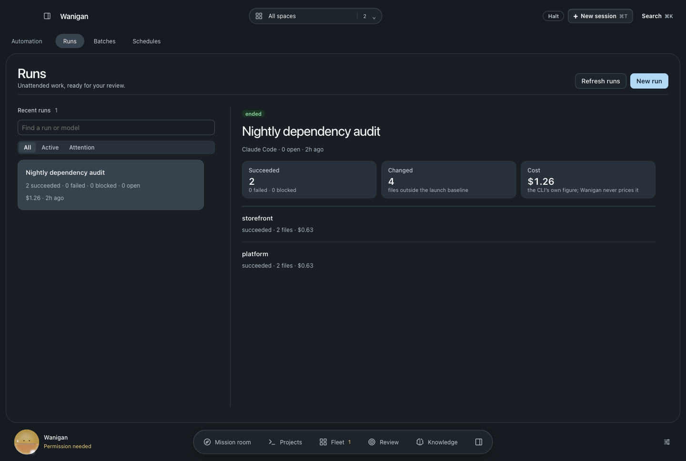 | 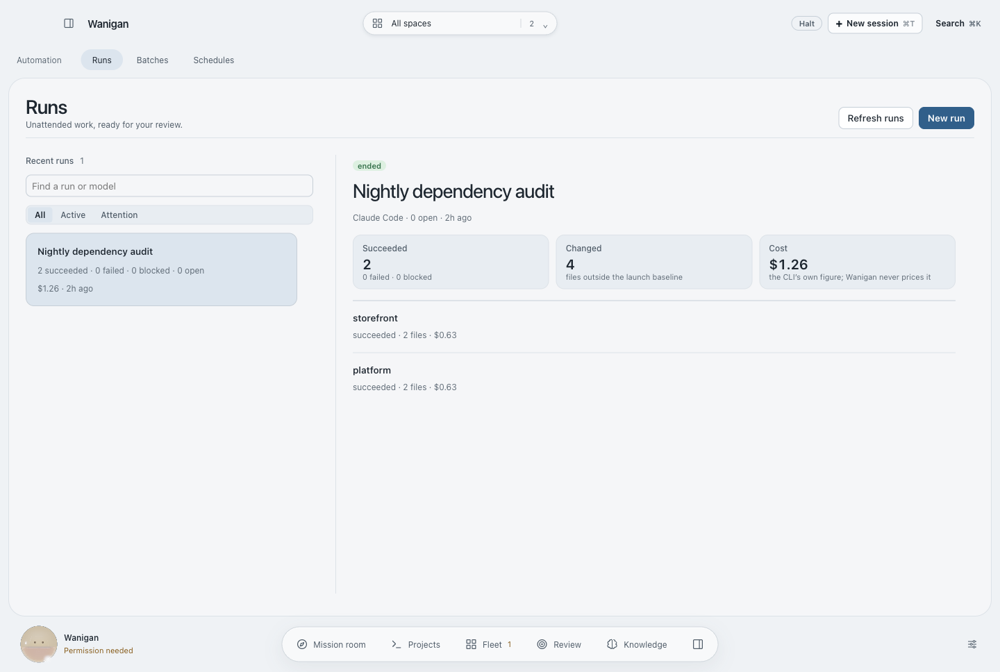 |
| After · Runs, with the switch to Attempts |  | 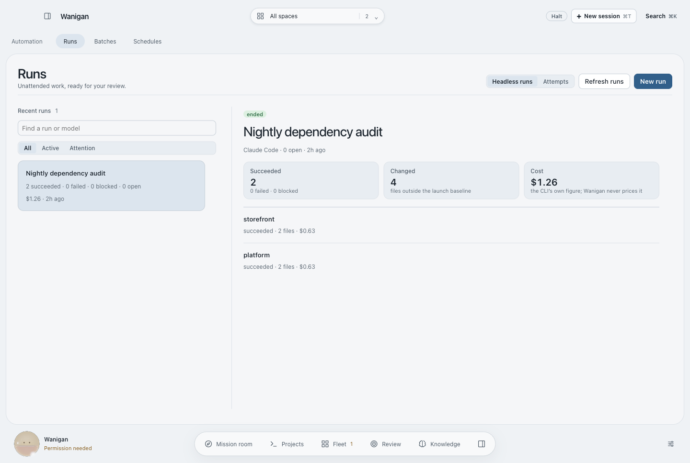 |
| After · best of N: passed, failed, unreported cost | 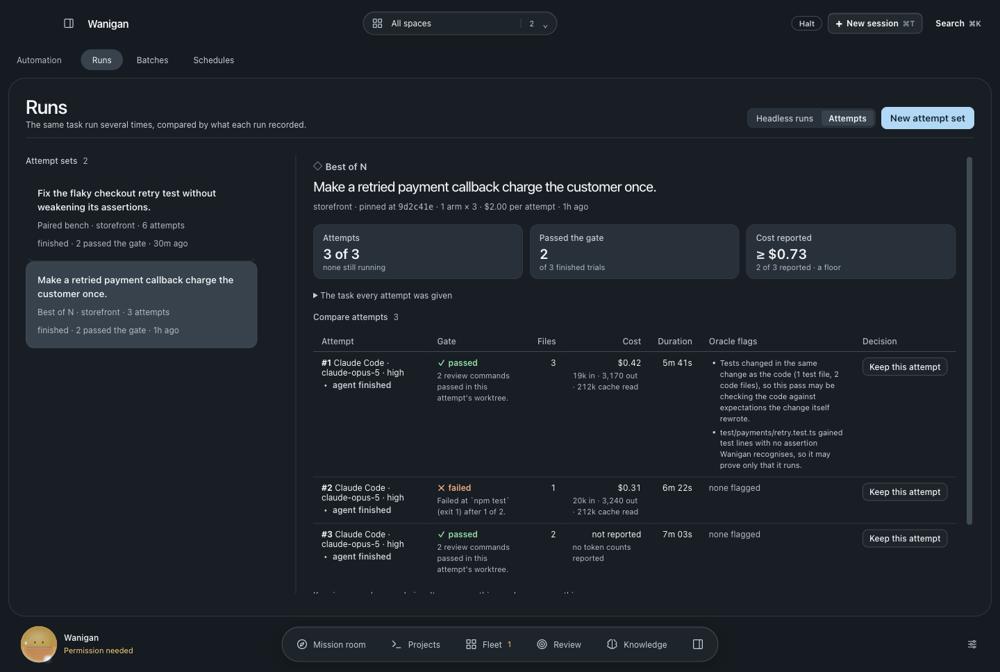 | 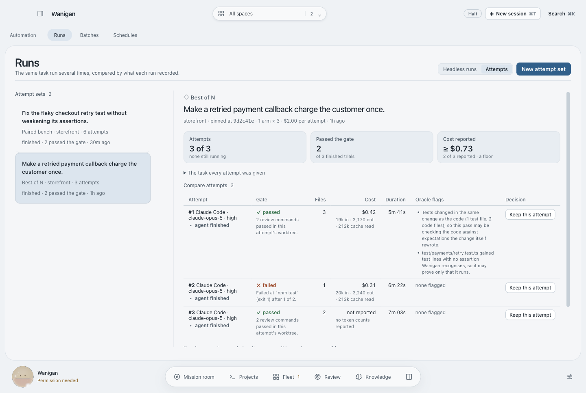 |
| After · one kept, the others cleaned up | 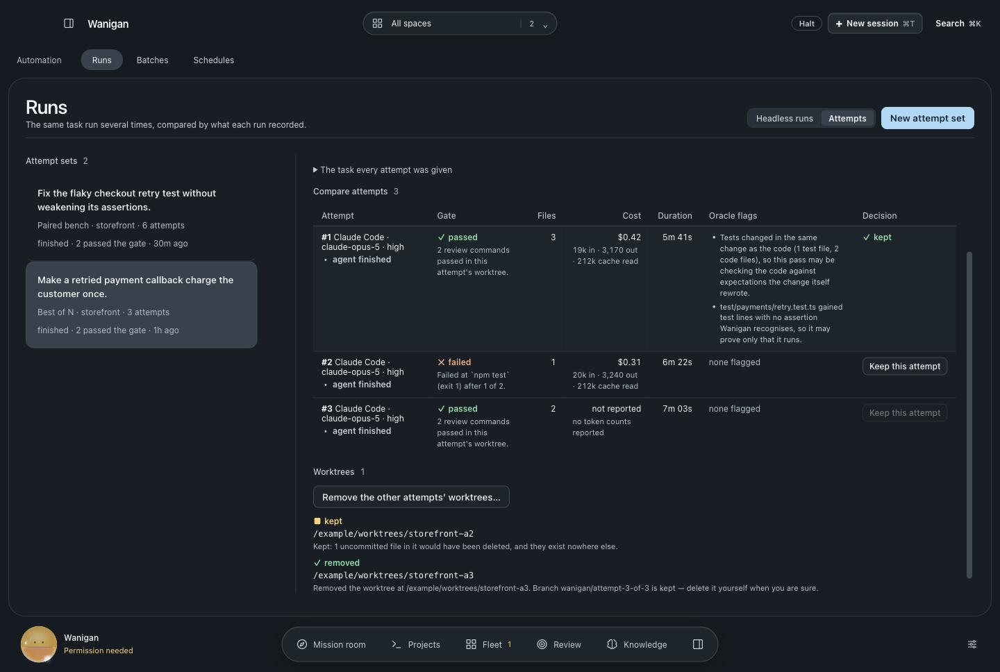 | 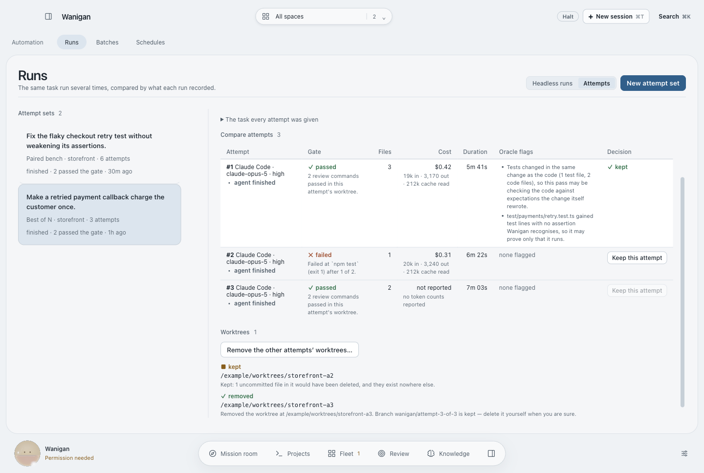 |
| After · paired bench, one arm with no passes | 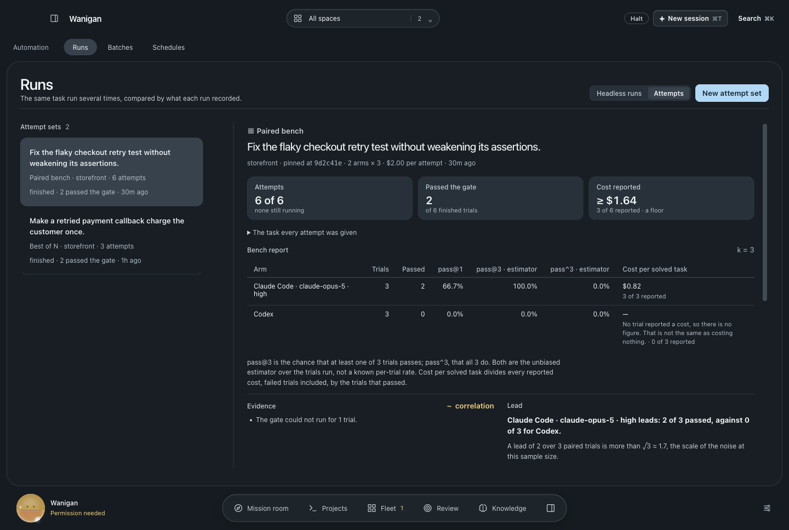 | 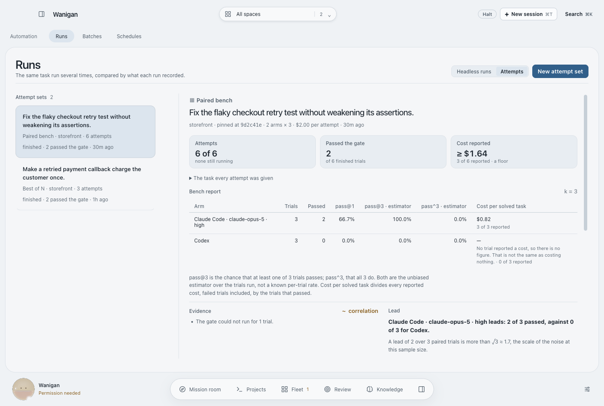 |
| After · the start form behind its confirmation | 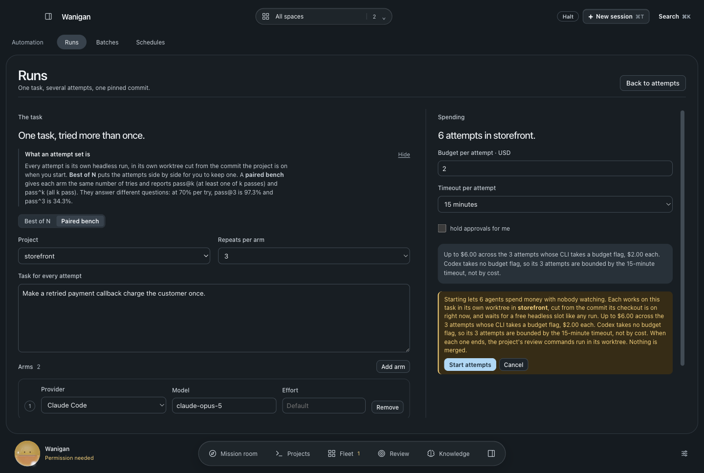 | 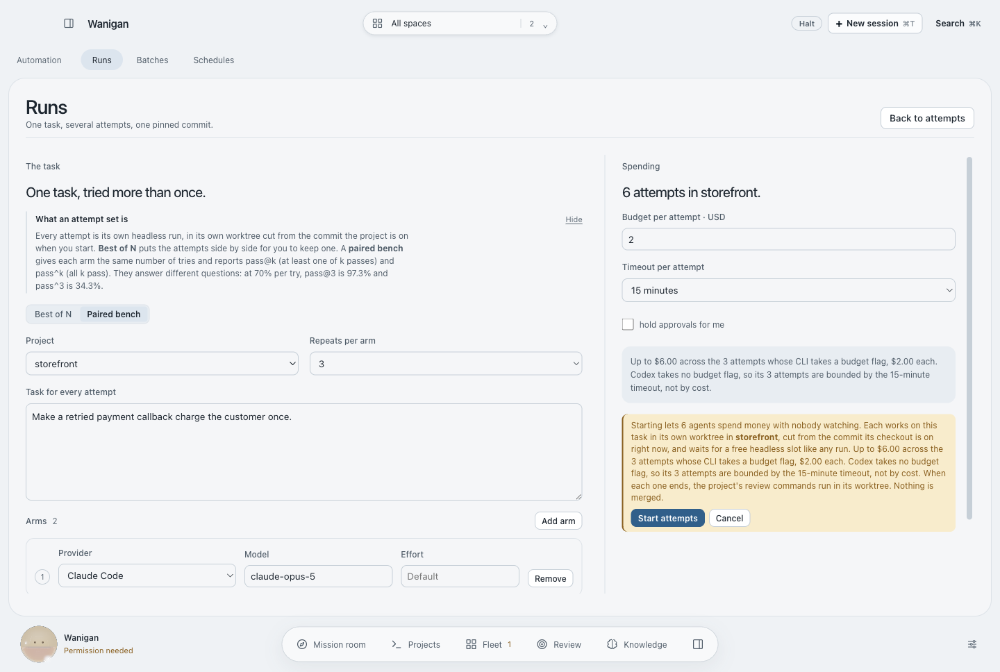 |
| After · a read that failed | 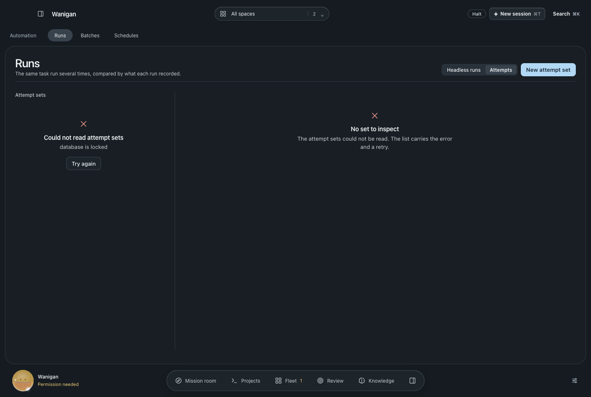 | 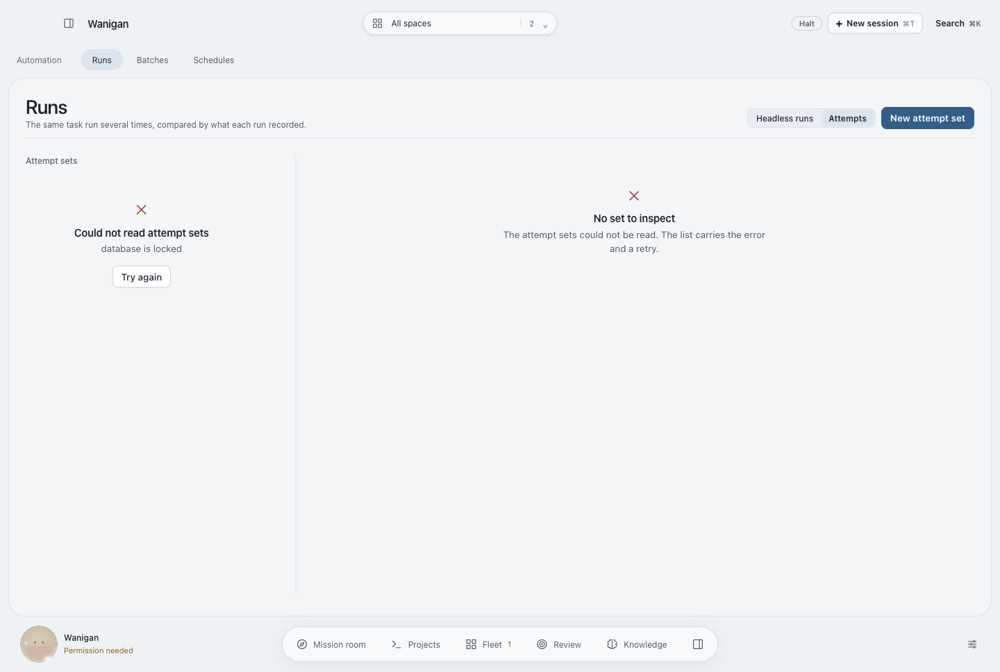 |

Rendered by `scripts/probe-attempts.mjs` with synthetic services. Its report
figures come from `src/shared/attempts.ts` itself. The main-process half is in
`src/main/smoke27.ts`, against real git repositories, real worktrees and a real
review command: refusals, the pinned commit after the branch moved, the head
mismatch, per-attempt gates, trees, oracle flags, cost and tokens, the report,
keep and cleanup. No agent CLI ran for this change. The smoke suite completes
each attempt's run the way the runner does, and no real attempt set has been run
end to end against a live provider.
