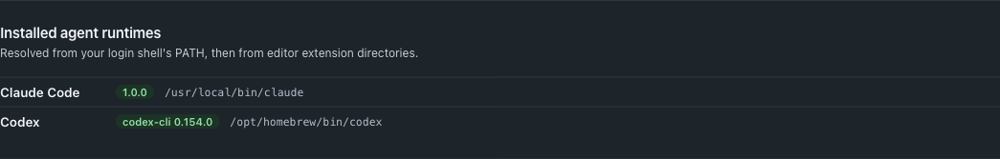
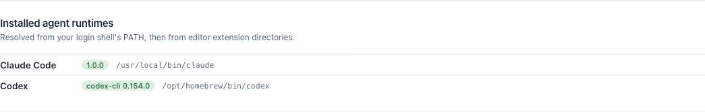
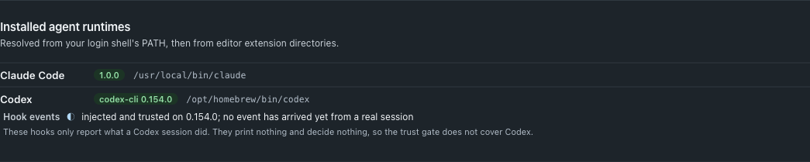
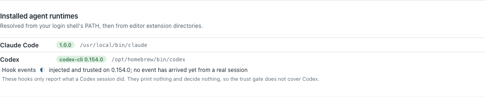
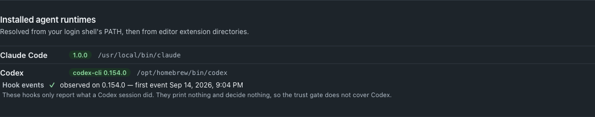
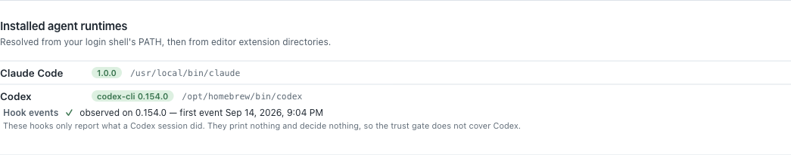
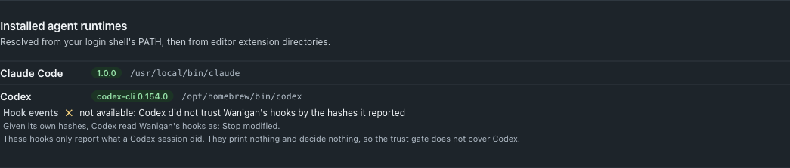
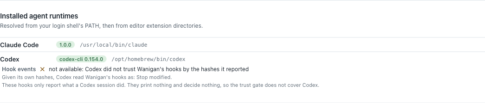
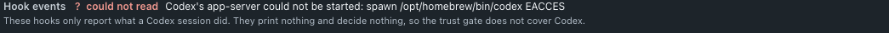

# Codex hook events, observed only

Codex sessions reported their status through two OSC 9 terminal notifications,
which Wanigan turned into a synthetic `Stop` and `PermissionRequest`. Codex
0.154.0 has a real hook system, and Wanigan now injects its own hooks into each
attended Codex session. Those sessions report session start, prompt submit,
tool calls, permission requests and stop through the same event store Claude
sessions use.

The hooks **observe only**. Their command prints nothing and always exits 0, so
they cannot allow, deny, block or rewrite anything Codex does. The trust gate
does not cover Codex, and `ProviderCapabilities.hooks` stays false for Codex, so
nothing keyed on it (the gate, briefings, checkpoints, held approvals) turns on.

## Trust, by hash

Codex runs an injected hook only once it is trusted. The flag that skips trust
skips it for every hook in the invocation, the repository's own included, so
Wanigan never passes it. Instead, the `--config` layer that defines Wanigan's
six hooks also trusts them, by the hash Codex reports for each over `hooks/list`.

The probe starts `codex app-server --listen stdio://` twice. Each run gets a
fresh `CODEX_HOME` and an empty working directory, both deleted afterwards. It
also gets the credential-free probe environment and a 10 s deadline. Each run is
sent exactly `initialize`, `initialized` and `hooks/list`:

1. The first run defines the hooks and reads back each hash.
2. The second run defines them again, trusts those hashes, and must read
   `trusted` for all six at the same hashes.

A hook counts as Wanigan's only when Codex lists it with source
`sessionFlags`, as a command, running exactly the forwarding command, and under
the key Wanigan derives. A hook from another source is never picked, even when
it shares an event and copies the command.

The answer is kept in SQLite for each binary, version and hook definition, so a
restart does not ask again. A timeout, a missing answer or an unreadable answer
is kept in memory for one minute and never stored, so it is asked again later.

The one run against the installed CLI (`scripts/probe-codex-hook-trust.mjs`,
15 Sep 2026), with temp paths and hashes shortened. The full hashes are in
`src/main/smoke28.ts`:

```
codex:   /opt/homebrew/bin/codex → /opt/homebrew/Caskroom/codex/0.154.0/bin/codex
env:     PATH, HOME, USER, LOGNAME, TMPDIR, LANG, SHELL (+ CODEX_HOME)

── run 1: no trust given
CODEX_HOME:  …/wanigan-codex-hooks-XXrd40/home (deleted afterwards: yes)
listing:     all six Wanigan hooks found; 0 other hook(s) listed and not picked
  SessionStart       /<session-flags>/config.toml:session_start:0:0       sha256:f445beea…e4eb0d75  untrusted enabled=true
  UserPromptSubmit   /<session-flags>/config.toml:user_prompt_submit:0:0  sha256:f882487e…5338d3a5  untrusted enabled=true
  PreToolUse         /<session-flags>/config.toml:pre_tool_use:0:0        sha256:a0dc7fe2…52010a0d  untrusted enabled=true
  PostToolUse        /<session-flags>/config.toml:post_tool_use:0:0       sha256:78b17fc5…a35fcb31  untrusted enabled=true
  PermissionRequest  /<session-flags>/config.toml:permission_request:0:0  sha256:f9bea5ad…909cdd4f  untrusted enabled=true
  Stop               /<session-flags>/config.toml:stop:0:0                sha256:c4bae6e5…e5d8446f  untrusted enabled=true

── run 2: trusting the hashes run 1 reported
CODEX_HOME:  …/wanigan-codex-hooks-xtirpa/home (deleted afterwards: yes)
listing:     all six Wanigan hooks found; 0 other hook(s) listed and not picked
  SessionStart       /<session-flags>/config.toml:session_start:0:0       sha256:f445beea…e4eb0d75  trusted   enabled=true
  UserPromptSubmit   /<session-flags>/config.toml:user_prompt_submit:0:0  sha256:f882487e…5338d3a5  trusted   enabled=true
  PreToolUse         /<session-flags>/config.toml:pre_tool_use:0:0        sha256:a0dc7fe2…52010a0d  trusted   enabled=true
  PostToolUse        /<session-flags>/config.toml:post_tool_use:0:0       sha256:78b17fc5…a35fcb31  trusted   enabled=true
  PermissionRequest  /<session-flags>/config.toml:permission_request:0:0  sha256:f9bea5ad…909cdd4f  trusted   enabled=true
  Stop               /<session-flags>/config.toml:stop:0:0                sha256:c4bae6e5…e5d8446f  trusted   enabled=true

answer after 0.3 s: trusted
```

## The forwarding command

Codex has no `http` hook handler, so every session gets the same command. It
reads the listener URL and a headers-file path from two variables set only on
that session's terminal:

```
/bin/sh -c '/usr/bin/curl -q -sS --noproxy "*" --max-time 5 -H @"$WANIGAN_CODEX_HOOK_HEADERS" --data-binary @- "$WANIGAN_CODEX_HOOK_URL" >/dev/null 2>&1; exit 0'
```

The bearer lives in a 0600 headers file in the hooks folder, beside the Claude
settings files. It is never in argv, never in the command, and never in an
environment value.

Two flags were added to the command the spec gave, and both close a leak:

- `--noproxy "*"`: curl 8.7.1 on this machine sent a POST for `127.0.0.1`
  through `http_proxy` from the environment. An inherited proxy would receive
  the bearer and the event.
- `-q`, first: without it curl reads `~/.curlrc`, where a `trace` or `proxy`
  line would copy the bearer to a file or to another host.

The smoke suite runs the real command against the real listener: through a
shell with a proxy set, split into argv, with nothing listening, and with the
variables unset. Each run exits 0 and prints nothing.

## One source per fact

OSC 9 stays a session's source until that session's own hooks deliver an event.
From then on:

- OSC 9's `Stop` and `PermissionRequest` are not recorded for that session;
- neither is the synthetic `UserPromptSubmit` typed on Enter;
- the moment the hooks took over is written on the session's row.

The first event from any Codex session is also recorded against its version.
That record is the only thing that lets Settings say "observed".

## Settings › Agents

Under each installed Codex runtime, the line takes one of three shapes. Each
opens with its glyph:

| | Line |
|---|---|
| ◐ | injected and trusted on 0.154.0; no event has arrived yet from a real session |
| ✓ | observed on 0.154.0 — first event *time* |
| ✕ | not available: *reason* (for example, the hook bus is off, or Codex did not trust Wanigan's hooks by the hashes it reported) |

While Codex is being asked, the line says so. A failed read says "could not
read" and is never drawn as any of the three.

| | Dark | Light |
|---|---|---|
| Before · runtimes |  |  |
| After · trusted |  |  |
| After · observed |  |  |
| After · not available |  |  |
| After · could not read |  |  |

These were rendered by `scripts/probe-codex-hooks.mjs` in isolated Electron,
with synthetic services and no Codex run. The before shots come from
`feat/verified-done` at `c6d87f1`, in a detached worktree; its renderer is
identical to this branch's base. The after shots come from this change.
`verification.json` in each directory lists the checks that ran.

## Not verified

No Codex turn has run. Until the operator's first real Codex session, these
remain unobserved:

- that the injected hooks fire;
- what each event's payload carries;
- whether the hook command inherits Codex's environment.

The Settings line stays at "trusted" until one does.

The hooks folder is refused by the trust gate to Claude sessions only. A Codex
session is not under the gate, so its agent can read another session's headers
file, as it could already read the settings files there. A bearer read that
way posts only observe-only events. It could still mark another Codex session's
hooks as its source, and after that the session's OSC 9 events are no longer
recorded.
