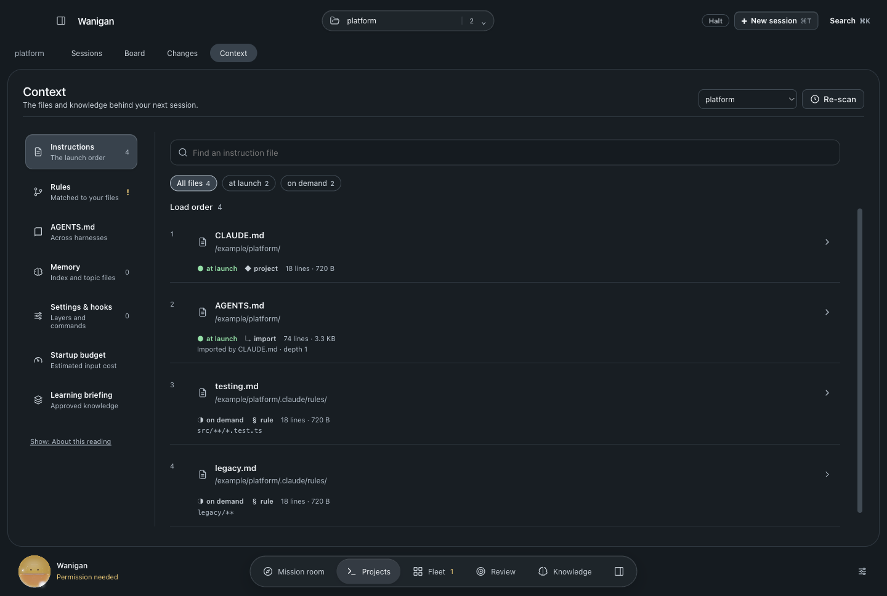
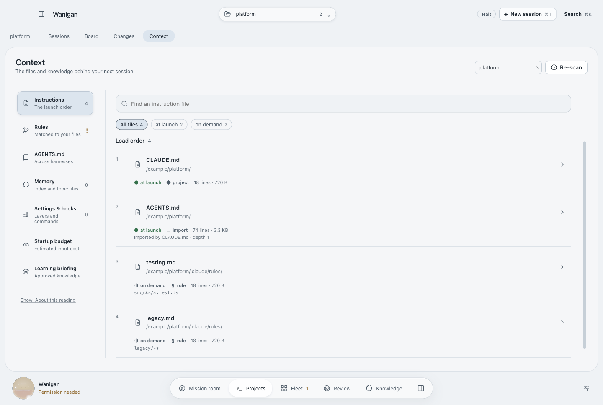
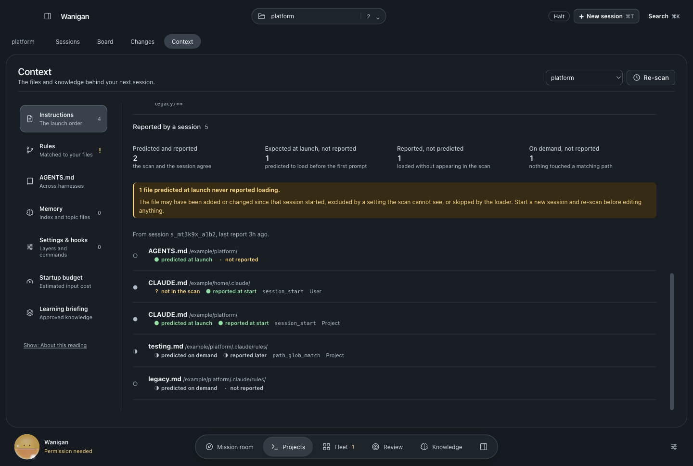
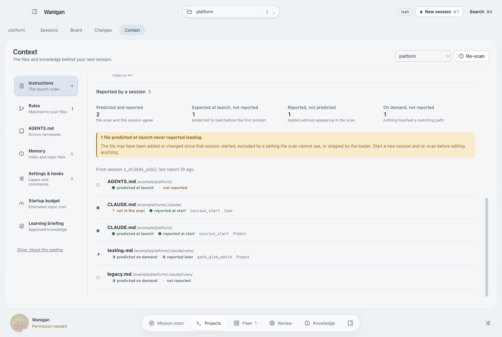
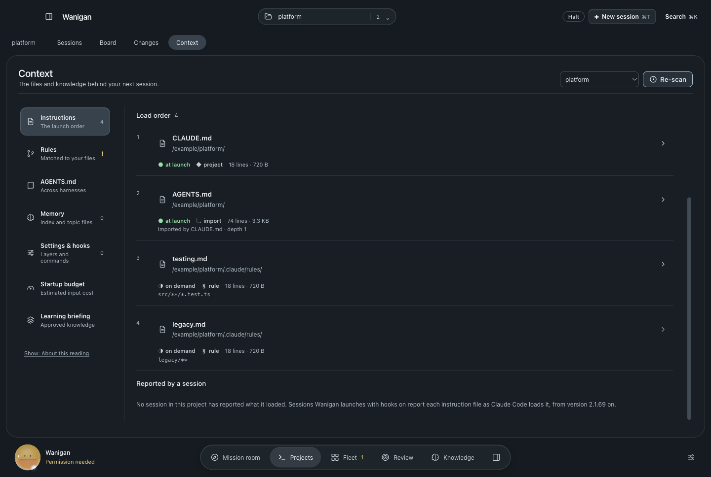
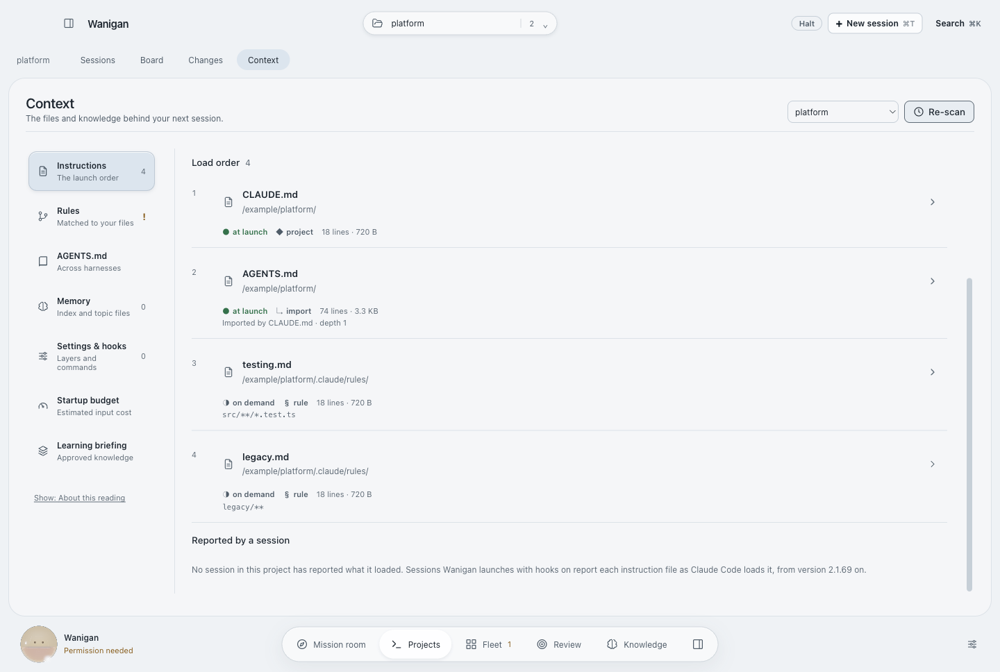

# Context · Reported by a session

The Instructions area predicts the Claude Code loader from disk. It now also
shows what the newest session in the project actually reported loading, through
Claude Code's `InstructionsLoaded` hook (2.1.69 and later), laid beside that
prediction.

Two changes made this possible, and the first is the larger one:

- **The hook settings file now names the version-gated events.** Both launch
  paths wrote it without the probed CLI version, so every real session was asked
  for the thirteen base events only. `InstructionsLoaded`, `SubagentStart`/`Stop`,
  `PostModelSwitch`, `CwdChanged`, `DirectoryAdded`, `Elicitation` and the agent
  team events were never requested, and every surface that reads them had
  nothing to read.
- **The reconciliation reaches a screen.** `reconcileInstructions()` and the two
  hook readers behind it were implemented and smoke-tested with no caller.
  `context:observed` takes a project id only and resolves the path in main.

The section does not grade the prediction. The scan reads disk now and the
report is from a launch then, so an on-demand rule that nothing touched and a
file added since that launch are both expected. The one difference worth a
reader's attention, a file predicted to load at launch that the session never
named, is counted separately and carries its own callout.

Three states, each asserted by `scripts/probe-context-observed.mjs`:

| State | What the reader sees |
|---|---|
| A session reported | Four counts, a callout when a launch file went unreported, the session id and report age, then the rows with that file first |
| No session reported | One sentence saying so, and which sessions report. No zero counts |
| The read failed | Nothing. The section hides rather than implying nothing loaded |

## Screenshots

| | Dark | Light |
|---|---|---|
| Before · end of Instructions |  |  |
| After · a session reported |  |  |
| After · no session reported |  |  |

Before was rendered from `a9e454e` in a detached worktree, after from this
change, both by the same probe with the same synthetic fixtures. No real agent
was called. Each directory's `verification.json` lists the checks that ran.
