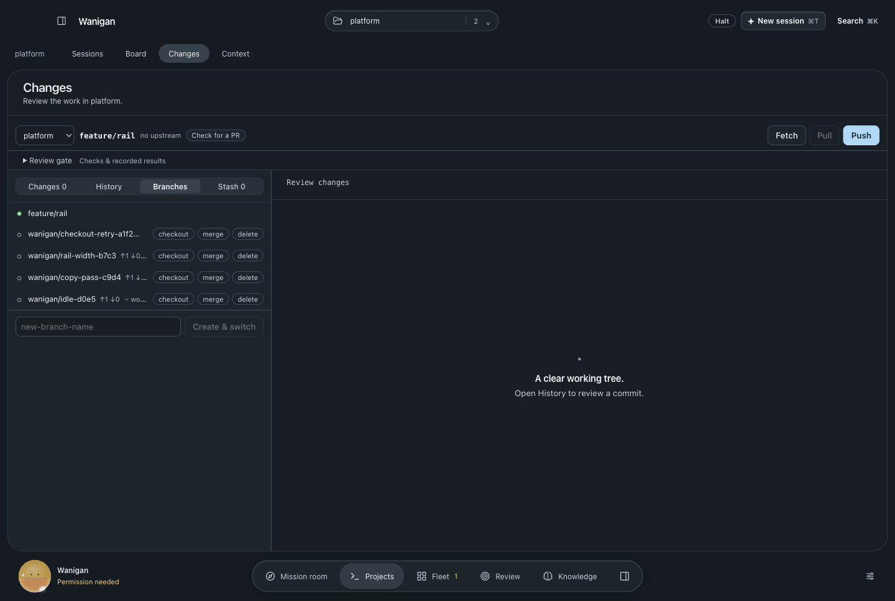
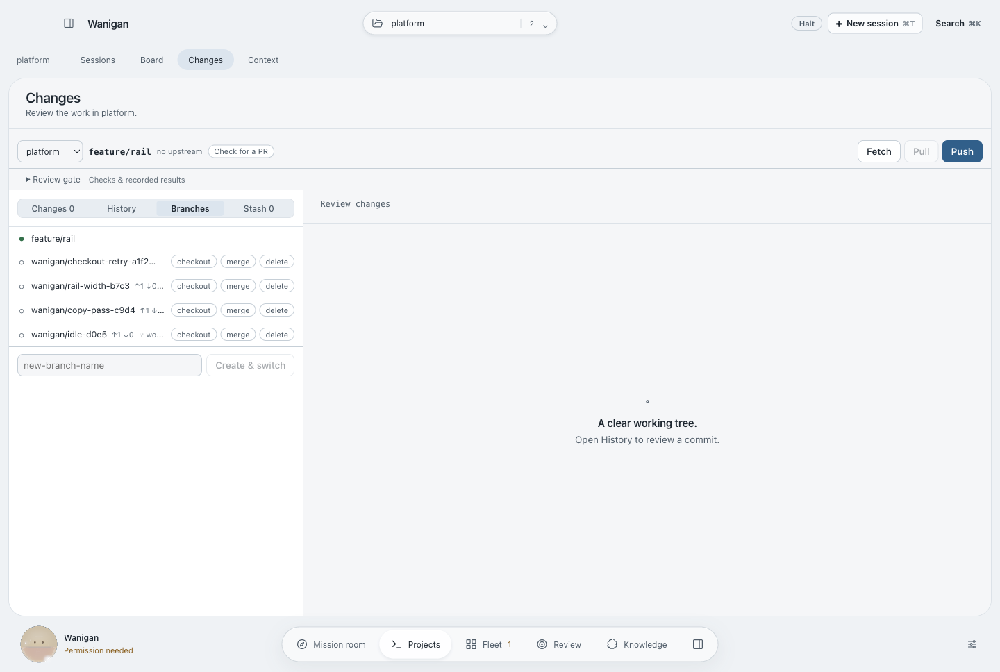
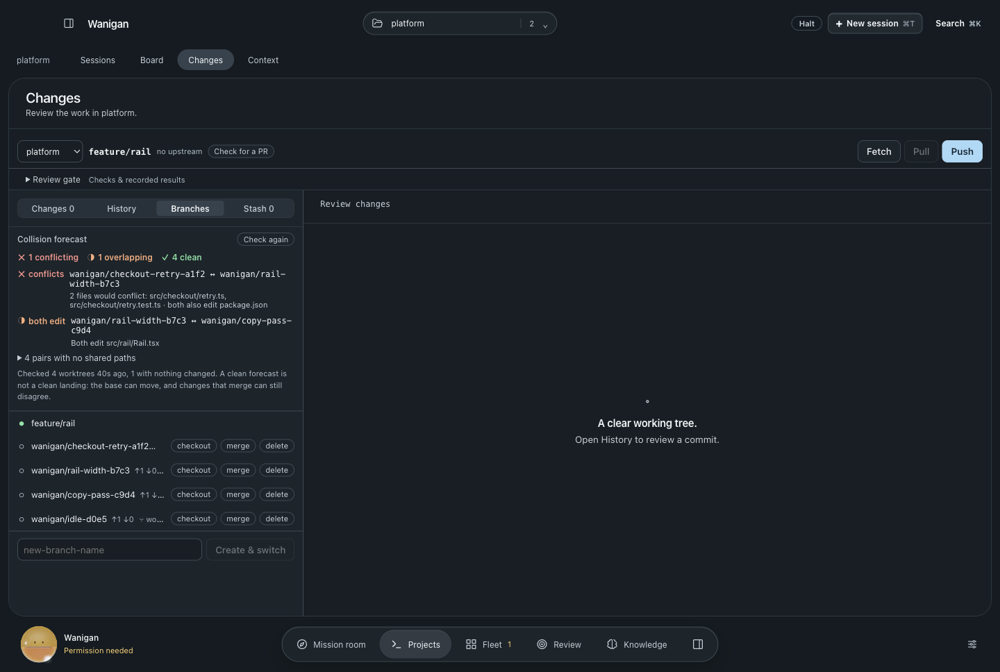
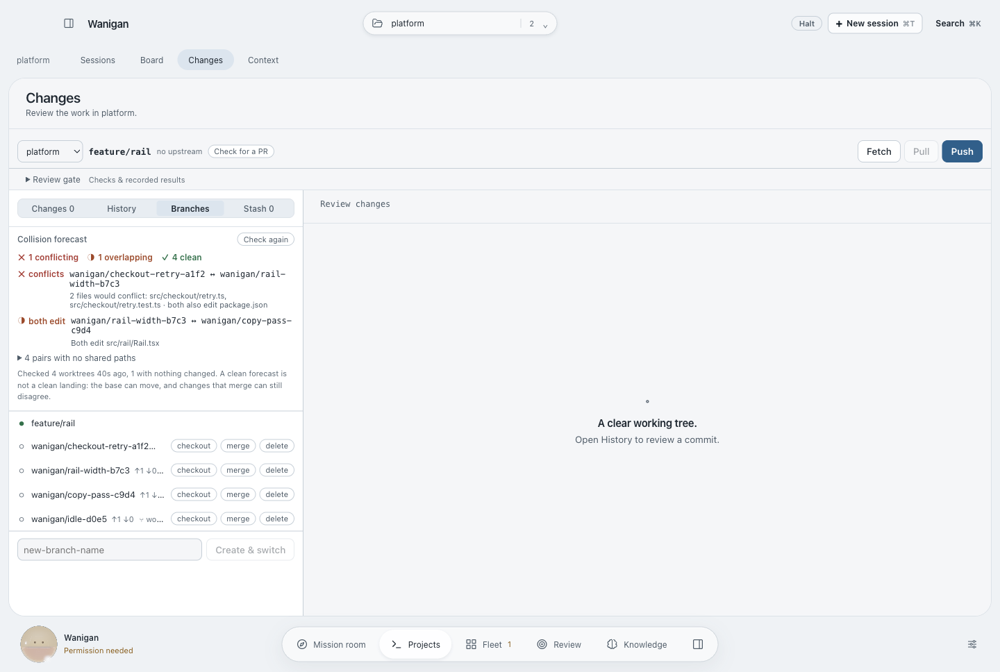
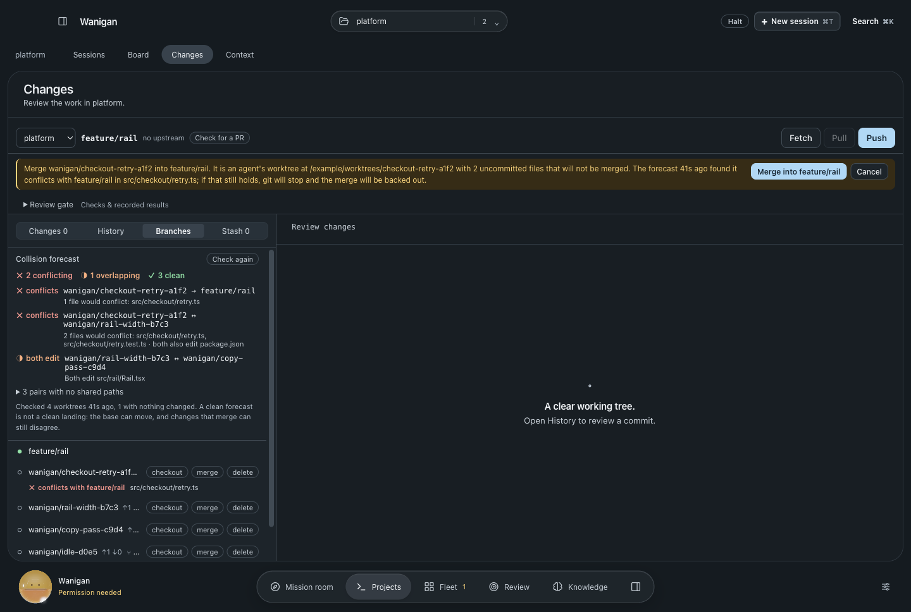
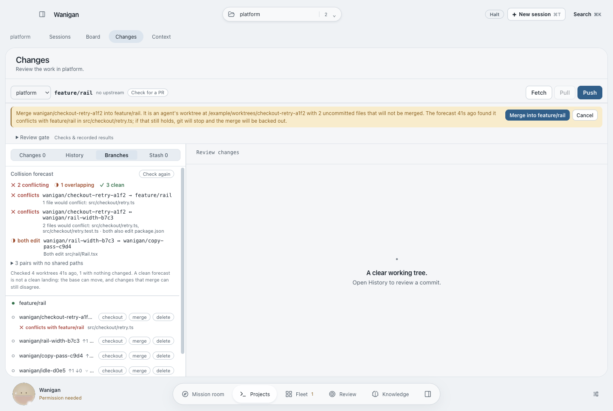
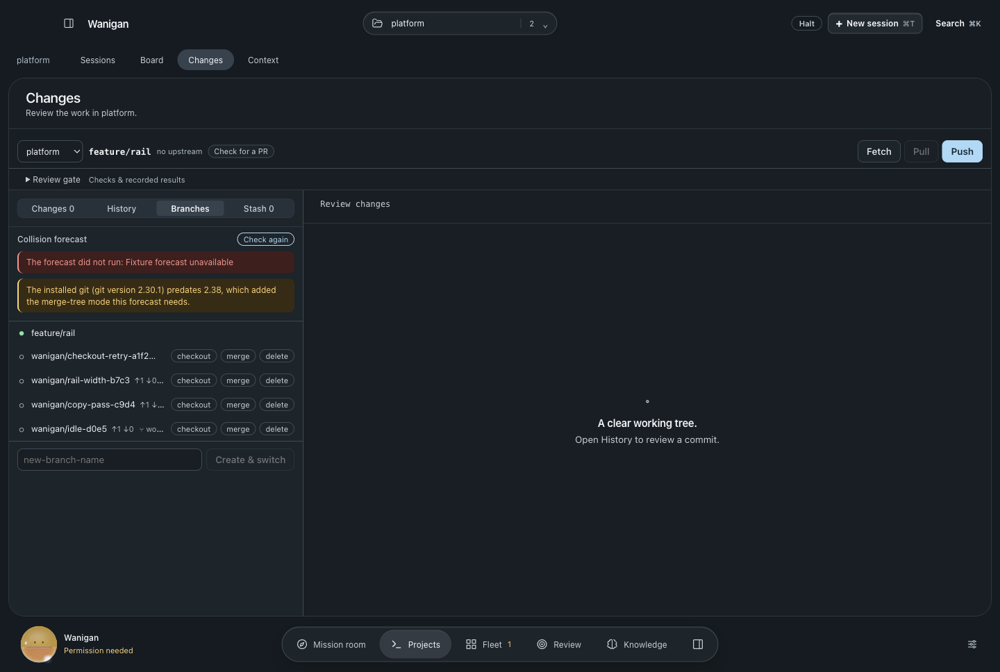
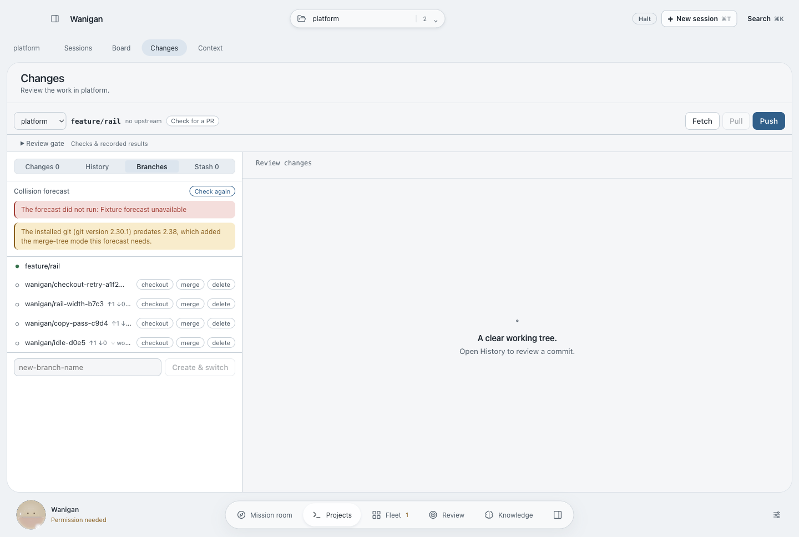

# Git · Collision forecast

Parallel sessions each work in their own worktree, and until now the first
moment anyone learned two of them had edited the same lines was the merge: after
both had been reviewed, in the tree holding the base branch, followed by
`merge --abort`. The Branches pane now asks git that question while the work is
still in flight.

For every linked worktree, its current state — uncommitted and untracked files
included, since that is where an agent's work usually sits — is read into a
scratch index and written as a tree. `git merge-tree --write-tree` then merges
it with the worktree's recorded base, and with every other worktree, entirely in
the object database. No working tree, index, branch or ref is touched, and git
runs with its filesystem monitor off so a repository config an agent wrote
cannot run a command on the operator's behalf. The smoke suite checks all of that
against real worktrees: an uncommitted and a committed edit to one line forecast
as a conflict, edits to different lines of one file as overlap, and every status,
ref and index left byte-for-byte as it was.

Four outcomes, each a glyph and a word:

| Outcome | Meaning |
|---|---|
| ✕ conflicts | git could not merge these paths; they are named |
| ◑ both edit | both change the same paths and git merges them; review them together |
| ✓ no shared paths | neither changes a path the other changes; folded under a disclosure |
| ? not checked | git did not answer for this pair; nothing is claimed |

A conflict with the base also appears on the branch row, on its own line (a mark
inside the one-line name was clipped away in a narrow pane), and in the merge
confirmation before the press. The merge itself still stops and backs out on a
conflict. An old git (before 2.38) and a failed forecast each say so, rather than
showing zero conflicts. Nobody else ships this: the one orchestrator that
specified it closed the issue as not planned.

The forecast is local git only, so it runs when the Branches pane opens over
agent worktrees and the last answer is more than a minute old, and on request.
Past twelve worktrees it stops pairing and says how many it left out.

Also fixed on the way: the merge confirmation printed a stray `$` after every
worktree path (`${wt.path}$${…}`).

## Screenshots

| | Dark | Light |
|---|---|---|
| Before · Branches |  |  |
| After · forecast |  |  |
| After · conflict stated before a merge |  |  |
| After · forecast failed |  |  |

Rendered by `scripts/probe-git-forecast.mjs` in isolated Electron with
synthetic git and services; before from `a9e454e` in a detached worktree, after
from this change, same fixtures. `verification.json` in each directory lists the
checks that ran.
