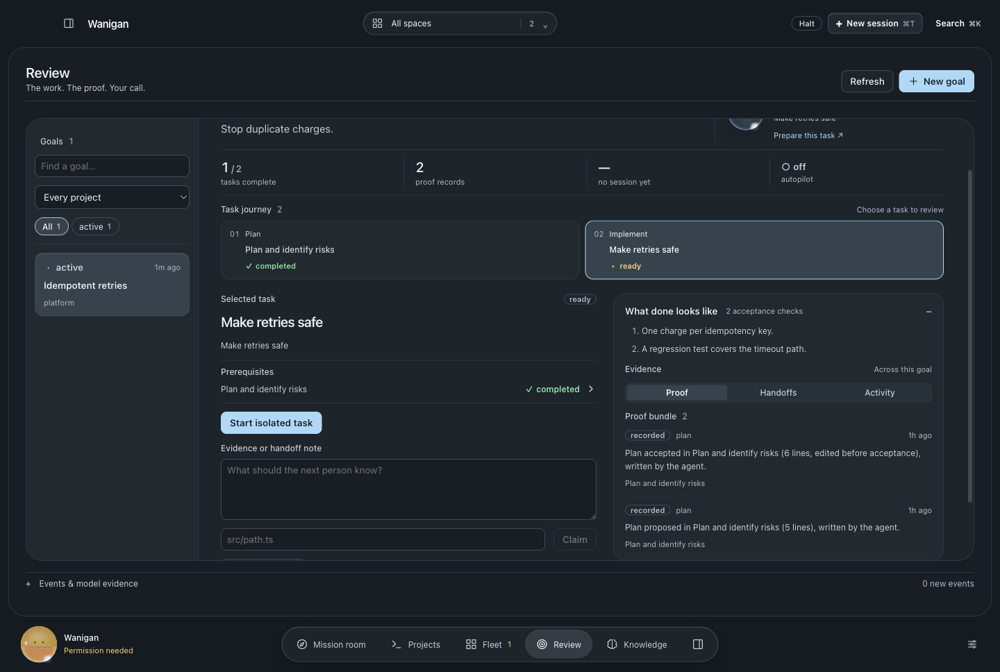
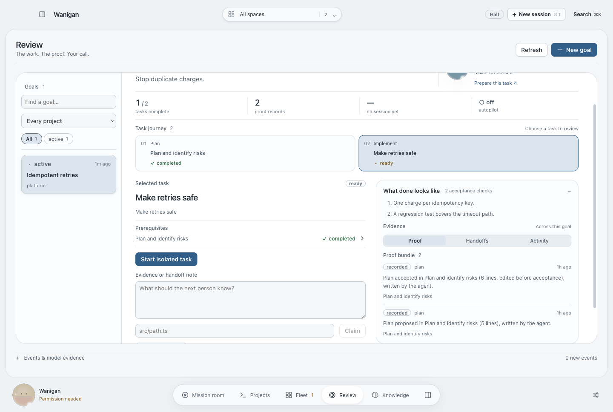
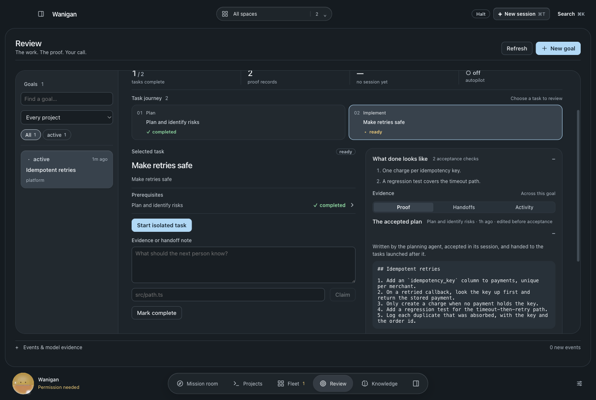
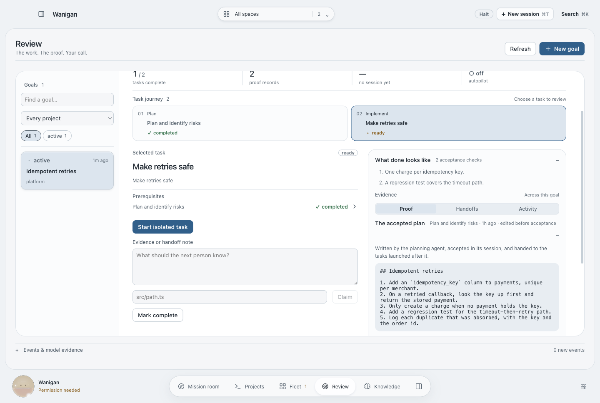

# A goal's plan, captured and handed on

A goal's plan task ran in plan mode, and the plan it produced went nowhere. The
implementation task was launched with the goal's titles and statuses, never
with what the planner decided.

Claude Code passes the plan to hooks on `ExitPlanMode` (read from the 2.1.271
binary):

- `PermissionRequest` carries `tool_input.plan`, injected from the plan file:
  the proposal the person is shown.
- `PostToolUse` carries `tool_response.plan`, the plan as accepted, with
  `planWasEdited`.

Wanigan's hook bus records both against the goal task that session is running.
The proposal and the acceptance are each recorded once. Every task launched
afterwards gets the accepted plan in its goal capsule, labelled as the planning
agent's words. If no plan has been accepted, it gets the latest proposal,
marked as only a proposal.

Approval stays in the CLI's own plan prompt in the terminal, which is already a
person deciding. Holding the hook open for an answer given elsewhere would
stall the CLI inside a hook timeout. The plan is redacted and bounded (32,000
characters kept, 12,000 handed to a capsule, with the cut stated). It stays in
the goal's local evidence; the phone sees only the proof's one-line summary.

| | Dark | Light |
|---|---|---|
| Before · goal evidence |  |  |
| After · the accepted plan |  |  |

Rendered by `scripts/probe-goal-plan.mjs` with synthetic services. Capture,
de-duplication, redaction, the capsule text and the bound are checked in
`src/main/smoke22.ts` against a real goal. No live planning session was run.
