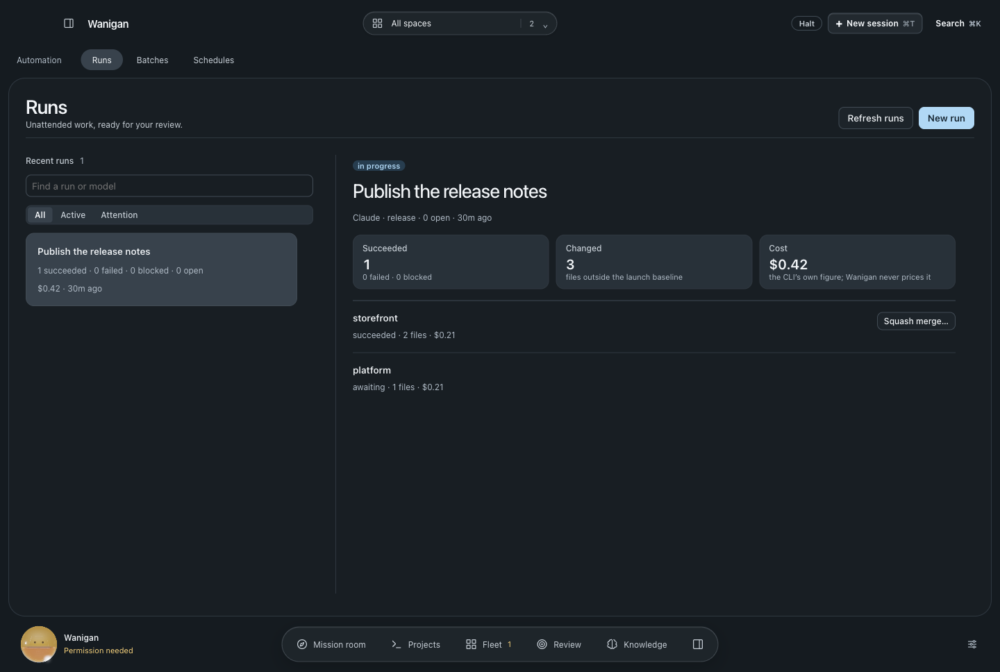
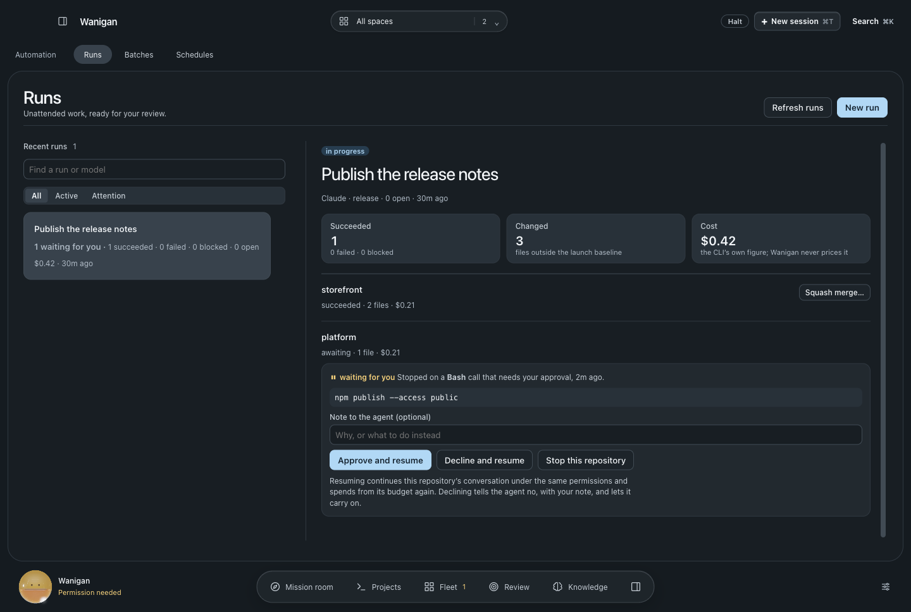
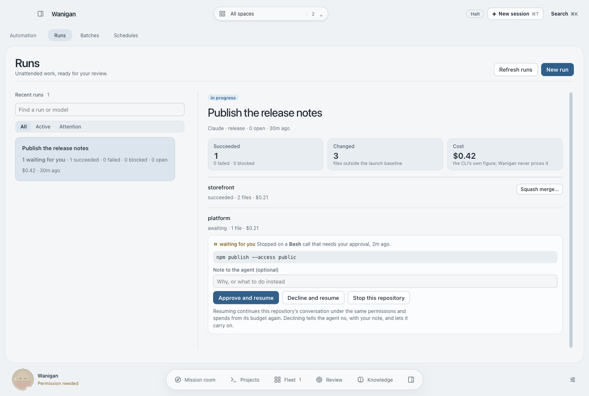
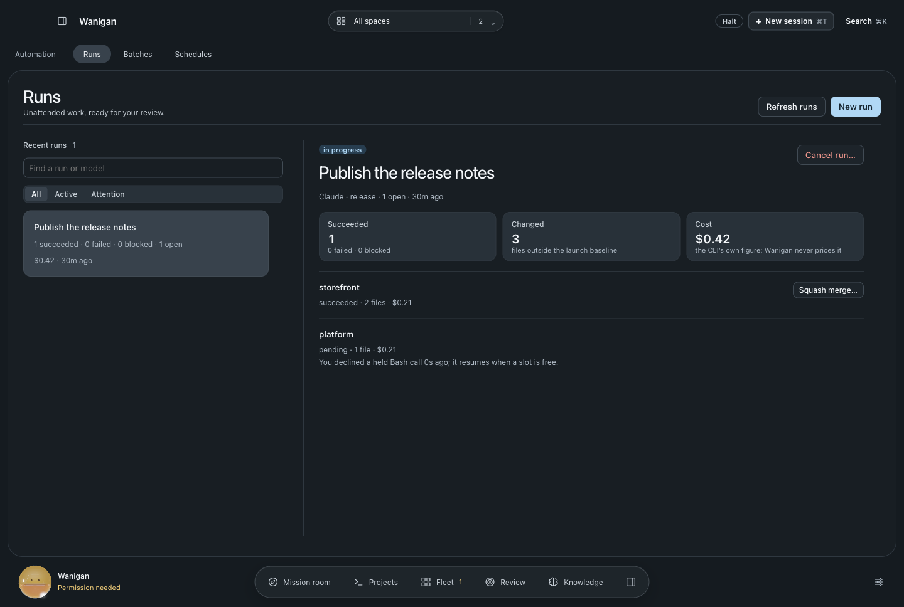
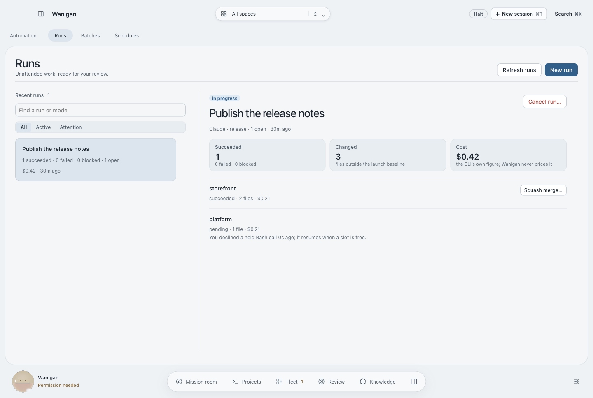
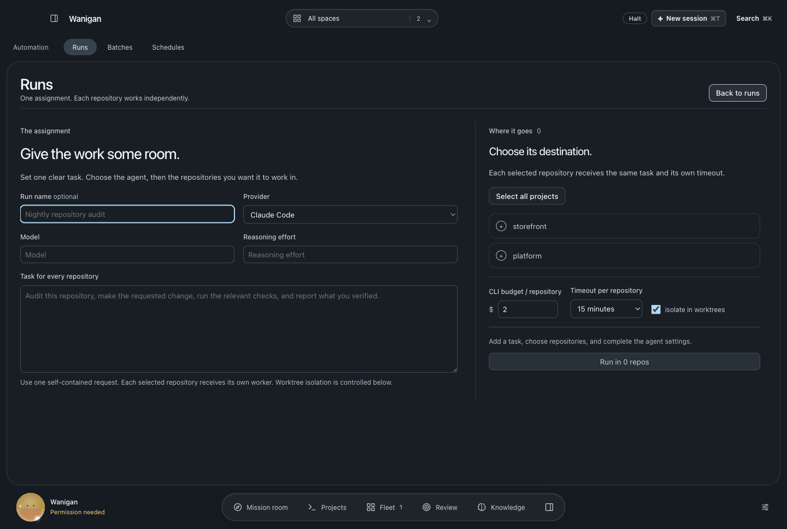
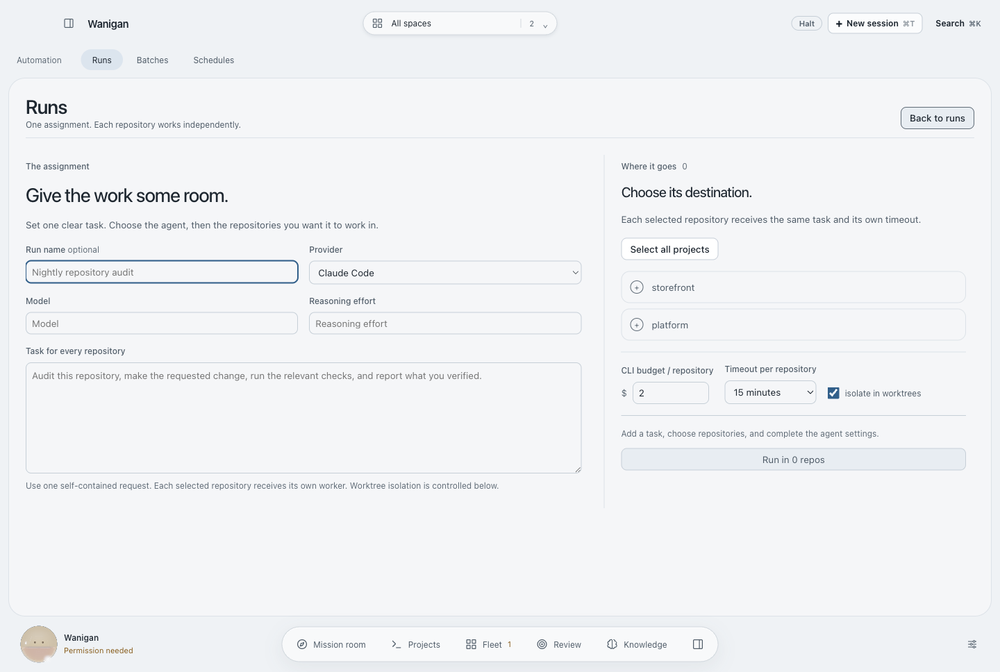
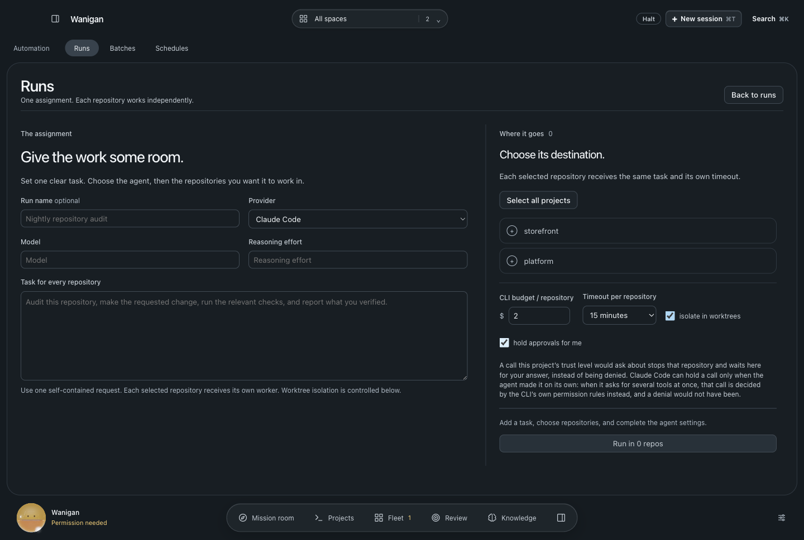
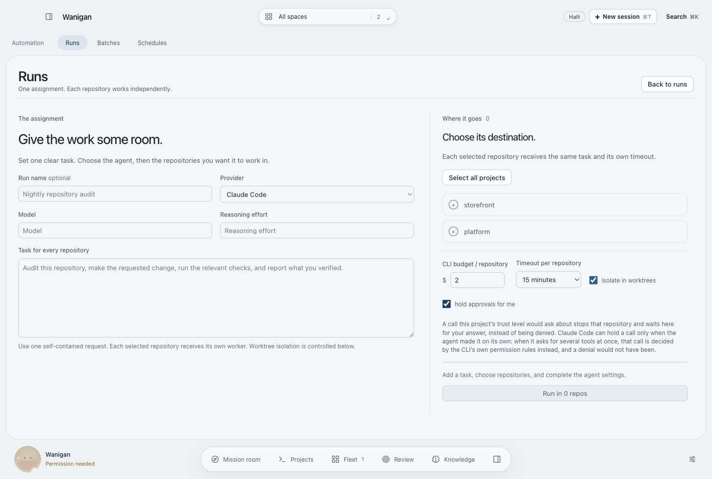

# Held approvals for headless runs

A headless run has nobody at its keyboard, so a call that its project's trust
level would ask about (a write outside the repository, a command touching
credentials) was denied. The agent carried on without it, and whether that was
the right answer was never anyone's decision.

A run can now opt into holding those calls instead. Wanigan's PreToolUse hook
answers `defer`. Claude Code then ends that repository's run with the call
recorded (`terminal_reason: "tool_deferred"`, `deferred_tool_use`). The row
waits under **Runs** with the call it stopped on, and you approve, decline or
stop it. Approving or declining resumes the same conversation with
`claude -p --resume`, and the answer is given when the CLI re-emits that exact
call. The answer counts for that call once.

What the 2.1.271 binary imposes, and what Wanigan does about each:

| Constraint | Handling |
|---|---|
| Print mode only | Only headless runs hold; attended sessions are asked as before. |
| One call at a time. A call in a batch of several is not held, and goes to the CLI's own permission rules. | Holding is **off by default** and opted into per run. The form says which calls it cannot hold, since a plain deny could not be ignored that way. |
| `--resume` does not restore the permission mode | The mode is recorded with the held call. A resume under a different mode is refused. |
| The answer can only be given through the hook | A resume with hooks unavailable is refused rather than run under the CLI's rules. |
| No changelog entry dates the feature | Holding is offered from 2.1.271, the binary it was verified in. Older CLIs keep the denial, and the run log says why. |

The notification names the repository and the tool, never the command. The
stored summary of the call is bounded and redacted.

| | Dark | Light |
|---|---|---|
| Before · a row stopped for approval |  |  |
| After · the held call and its three answers |  |  |
| After · declined, with a note |  |  |
| Before · a new run |  |  |
| After · holding chosen |  |  |

Rendered by `scripts/probe-held-approvals.mjs` with synthetic services. The
main-process half (the policy answers, the ledger, the result parsing, resume
arguments, the answer state machine and the permission-mode refusal) is in
`src/main/smoke21.ts`. No real `claude -p` run was held and resumed for this
change.
