# Git · Merge readiness

A pull request can stop being ready to land in three ways nobody is told about.
GitHub sends no webhook when the base moves and creates a conflict. A check fails
on a push an agent made and walked away from. A reviewer leaves an inline comment,
and `gh pr view --comments` does not show inline comments. The PR chip in the Git
bar gave a state and check counts, but not which checks, not the log, and not the
threads. The **Merge readiness** button beside it now opens a section that reads
all three when the operator presses **Check readiness**. Nothing is polled.

One read is three gh calls, each an argv array with a timeout, run in the
project's repository:

| Question | Asked with |
|---|---|
| Does it still merge? | `gh pr list --head=<branch> --state=all --json …,mergeable,mergeStateStatus,headRefOid,statusCheckRollup` |
| Which checks failed? | `gh pr checks <n> --json name,workflow,bucket,state,link,startedAt,completedAt,description` |
| Which threads are open? | `gh api graphql` for `reviewThreads(first: 100)`, with `totalCount` and `hasNextPage` so a cap is stated rather than silently applied |

Pressing a failing check's **Fetch failed log** runs `gh run view --job=<id>
--repo=<host/owner/repo> --log-failed`. The ids come from the check's own link,
and main fetches a log only for a link its own last read returned. The stream is
held to its last megabyte. The excerpt is the last 80 lines up to GitHub's last
`##[error]` marker, not the last 80 lines of the log, so it ends at the failure
rather than in the post-run cleanup steps a job runs after one. It says how many
lines it left out on either side. A check that is not a GitHub Actions job
says it has no log, rather than asking gh about a run id that belongs to
something else.

Everything GitHub returns is text other people wrote. Before any of it leaves
main, escape sequences, control characters and bidirectional overrides are
removed, it is redacted with `src/main/redact.ts`, and it is cut to a stated bound.
Links survive only as https without a credential.

Every state is shown as itself: gh not installed, not signed in (asked of
`gh auth status` for the remote's host, not parsed from prose), not a GitHub
repository, no branch, no pull request, gh's own first line on a failure, and a
check list or thread list that could not be read, which is never shown as empty.

Selected failing checks and unresolved threads become one message in the
review-notes register (`src/shared/pr-feedback.ts`). The header names the pull
request and the short head commit, and says so when the branch here is at a
different commit. Checks carry their link and any fetched excerpt in a fence;
threads carry path, line range, side and the quoted comments, and end with "Fix
it, or reply saying why not." The message goes into a live session's message box
through `appendToComposerDraft`, the path review notes take. The session picker
is preselected only when exactly one session is running in this repository,
including one found only through its worktree. With none, Add is disabled and
Copy message offers the same text. Nothing is posted to GitHub, and nothing is
fixed automatically.

## Screenshots

| | Dark | Light |
|---|---|---|
| Before · Changes | 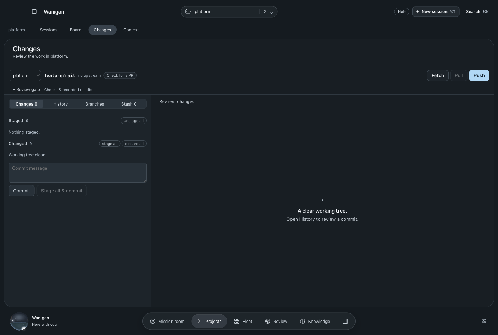 | 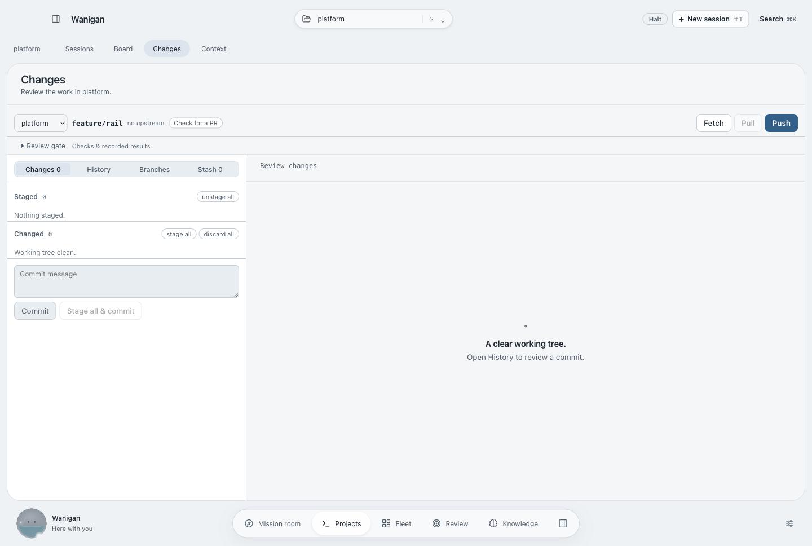 |
| After · conflicts, checks and a fetched log | 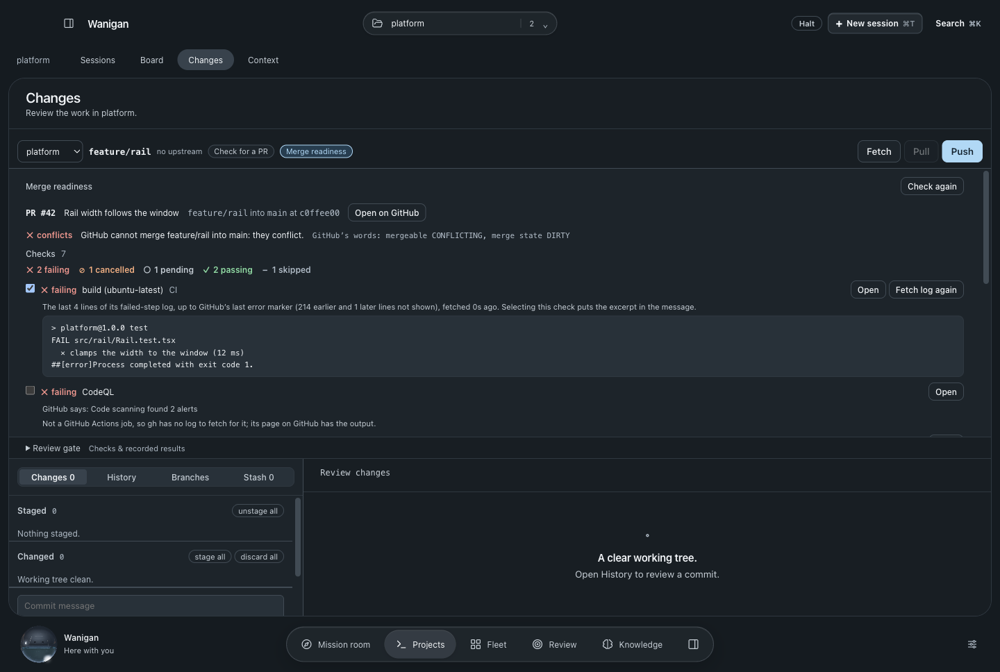 | 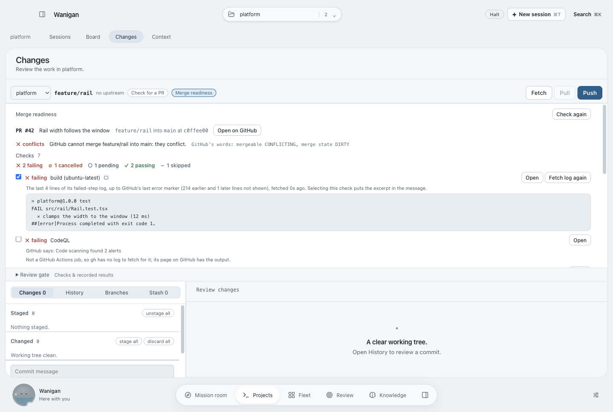 |
| After · threads, the cap, and the session picker | 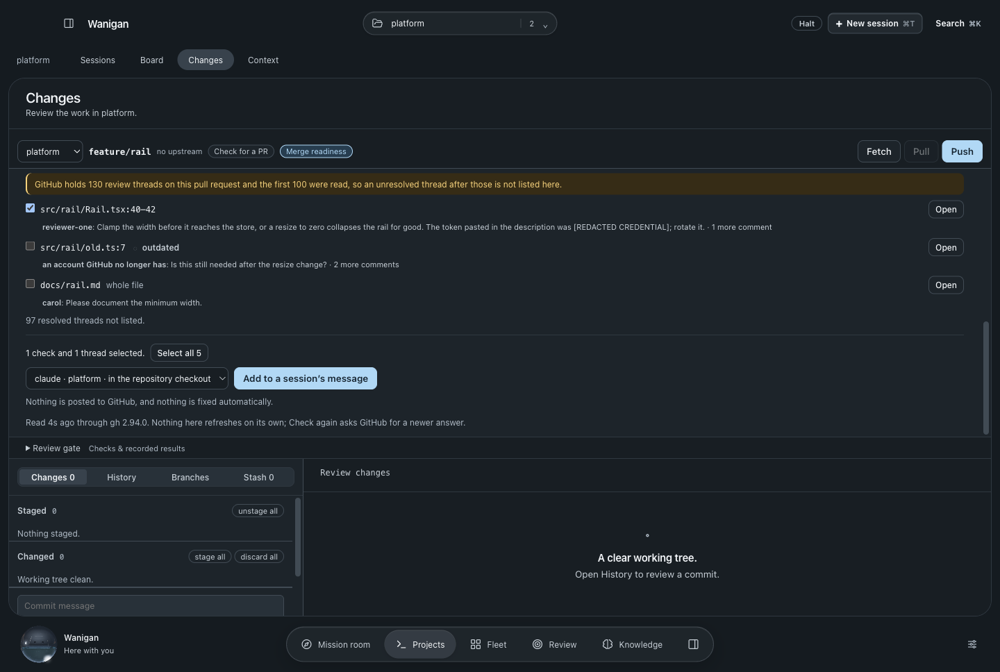 | 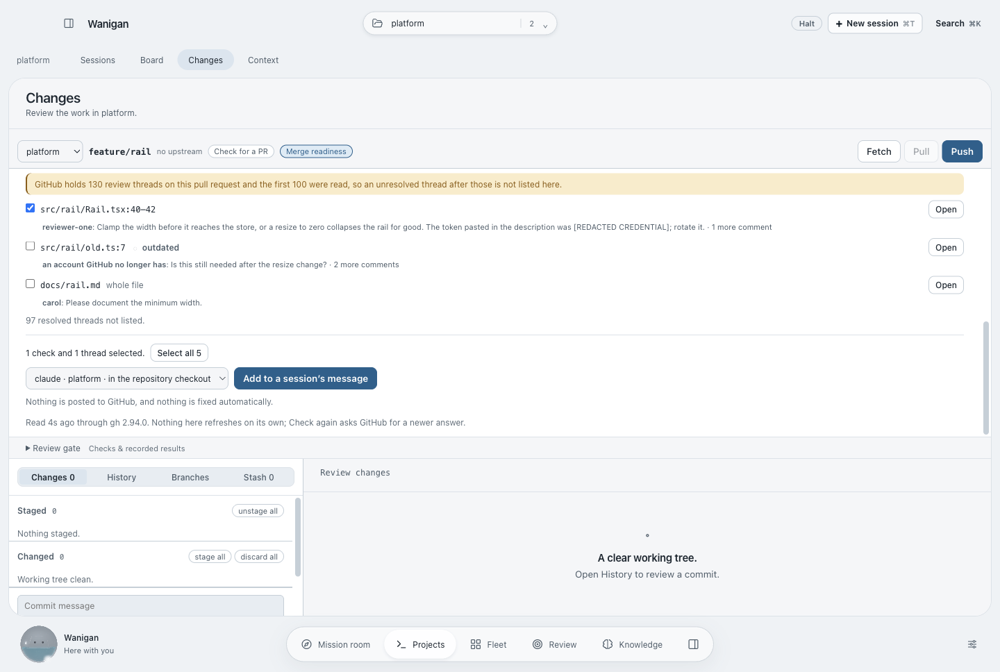 |
| After · no session running here | 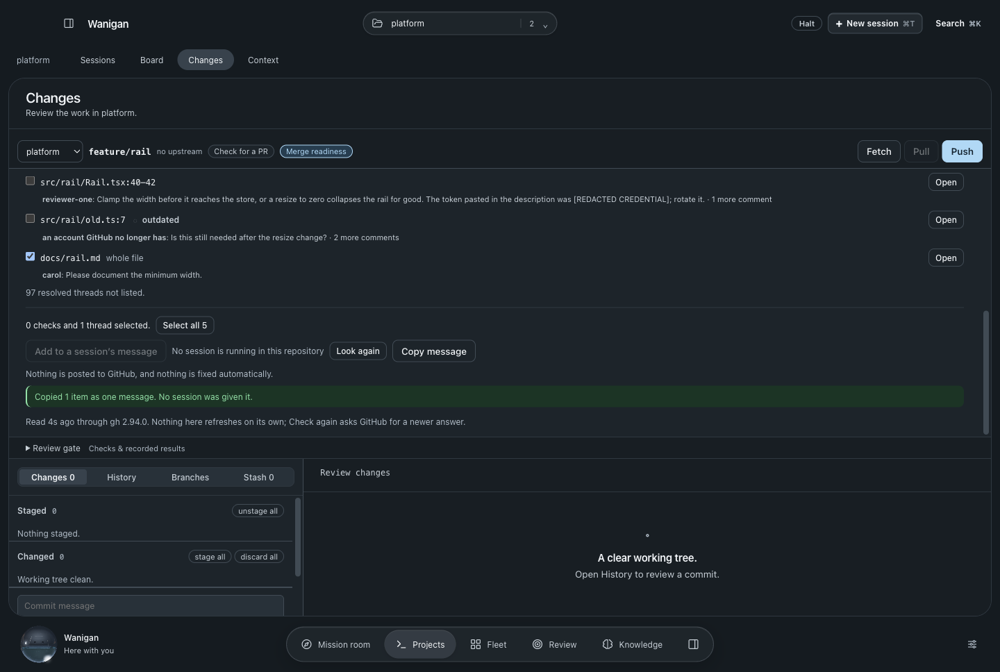 | 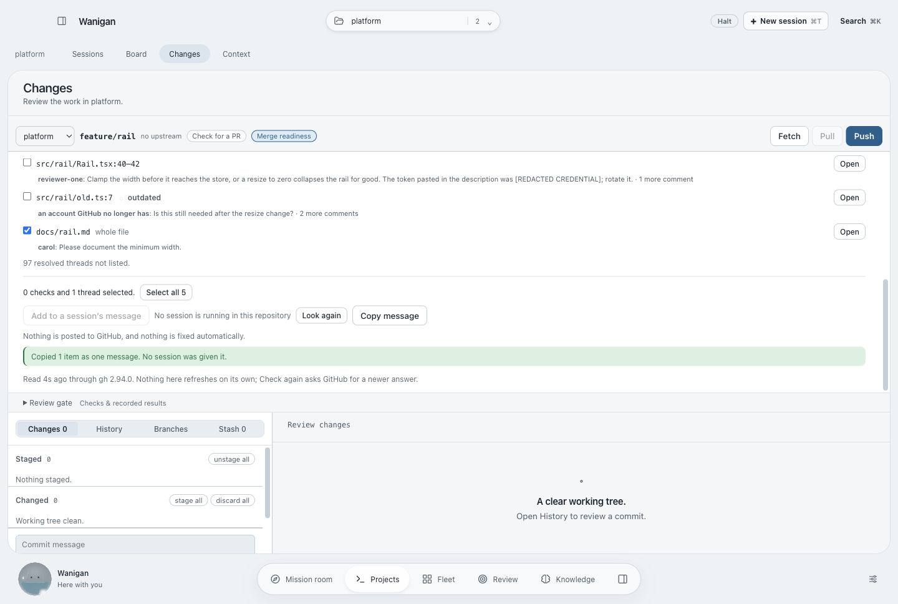 |
| After · checks and threads could not be read | 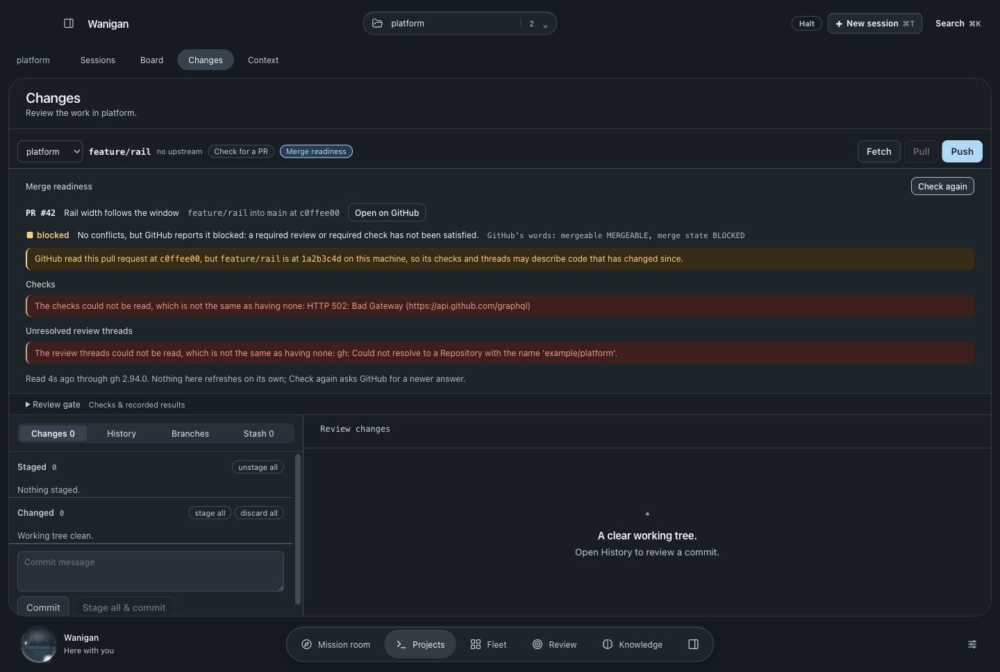 | 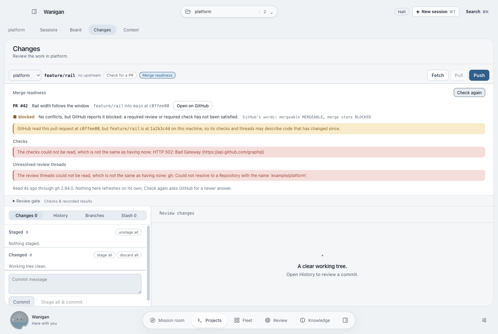 |
| After · gh not signed in | 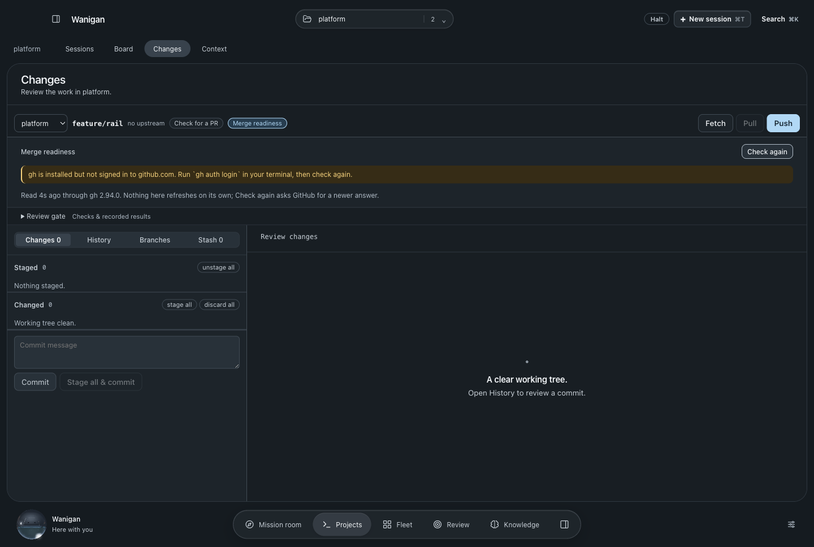 | 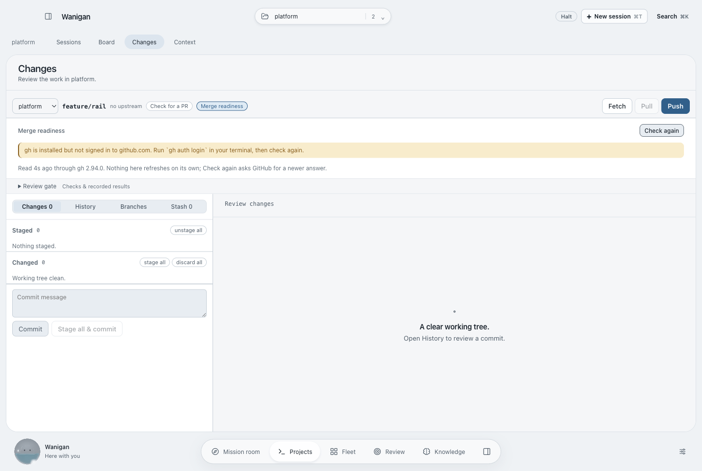 |

Rendered by `scripts/probe-merge-readiness.mjs` in isolated Electron with
synthetic gh answers, sessions and worktrees. Before is from `dba7528` in a
detached worktree; after is from this change, with the same fixtures.
`verification.json` in each directory lists the checks that ran. The main-process
read, with a fake gh on PATH against real repositories, is `src/main/smoke15.ts`.
