# Settings › App · Keyboard

Every chord Wanigan binds was a constant. The cheat sheet, the menu bar and the
key handlers all read one table, which kept them honest with each other, but
nobody could move a chord that collided with their hands, their other tools or
their keyboard layout. Settings › App now lists every binding the cheat sheet
lists, in the same groups and order, with the chord in effect: **Change**
records the next chord pressed, **Reset** puts one back, **Reset all** puts them
all back.

A rebinding is one record with three readers. `src/shared/keymap.ts` lays the
stored chords over the binding and route tables; the renderer matches key
events against that overlay, prints the cheat sheet and every chord hint from
it, and publishes it as `aria-keyshortcuts`; main rebuilds the menu bar from it
after each write, still with `registerAccelerator: false` so the PTY keeps its
keys. The keymap is one row in Wanigan's settings table, and main validates
every write with the same module before storing it. A refusal comes back as
data with a named reason and is printed under the row that asked:

| Refused as | When |
|---|---|
| unknown binding | the id names no shortcut |
| fixed | the binding cannot move (below) |
| unparseable | the chord is not one a shortcut can use — F5, a dead key, an unknown modifier |
| reserved | macOS, the standard menus or a text field own it: ⌘Q ⌘W ⌘H ⌘M ⌘C ⌘V ⌘X ⌘Z ⇧⌘Z ⌘A, zoom, full screen, Enter, ⇧Enter, ⌘Enter |
| bare key | no ⌘ or ⌃ for a binding whose default had one — a key alone, or with ⇧ or ⌥, types into whatever field has focus |
| conflict | another binding already holds it where both can be live; that binding is named |

What no rebinding can do: make a chord skip the terminal. `skipsTerminal` is
read from the default table only, so the interrupt keeps it and nothing else can
gain it. A chord moved away from is retired: pressed where nothing now claims
it, the shell stops it before any view handler that still tests it by hand can
act, so the old chord does nothing anywhere. A chord nobody ever bound still
propagates normally.

Twelve rows are listed as **fixed**, each with its reason in words: the arrow,
Home and End keys that make a list a list; Enter and ⇧Enter, which belong to the
text field; the composer's `$`, which is a character in the draft; the palette's
own navigation; the palette's close chord, which follows the palette's; and four
Sessions-view chords — side panel ⌘B, composer ⌘E, close tab ⌘⌫ and interrupt
⌘. — whose handler in `views/Sessions.tsx` tests the key itself instead of the
keymap. Rebinding those would print a chord that does nothing and leave the old
one working. That file also prints ⌘T and ⌥⌘←→ in its own labels; when New
session or session switching is rebound, the Keyboard section says so in a note.

## Screenshots

| | Dark | Light |
|---|---|---|
| Before · Settings › App | 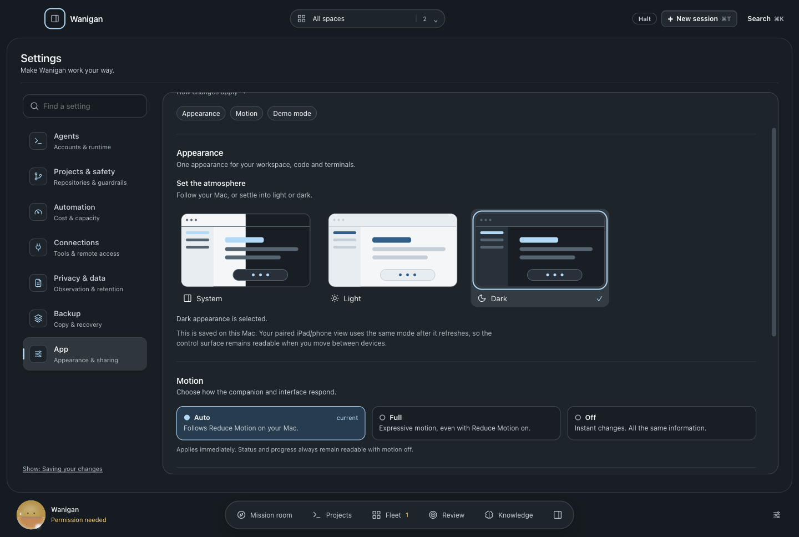 | 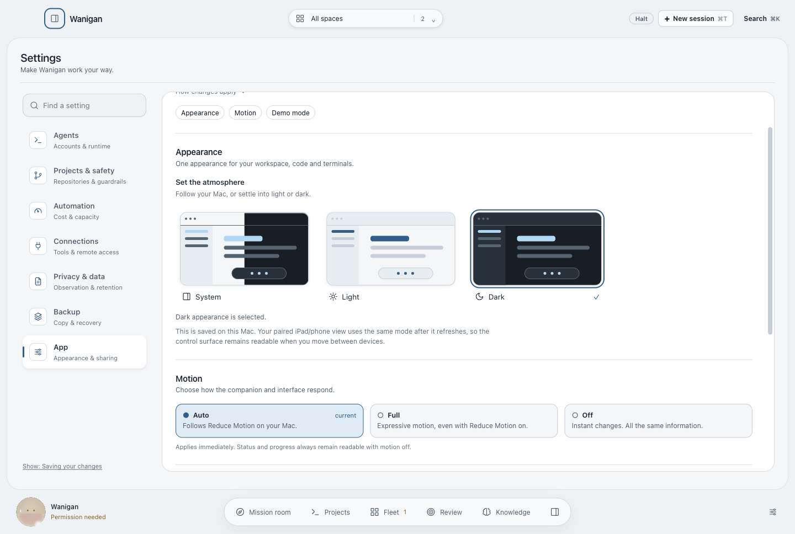 |
| Before · cheat sheet | 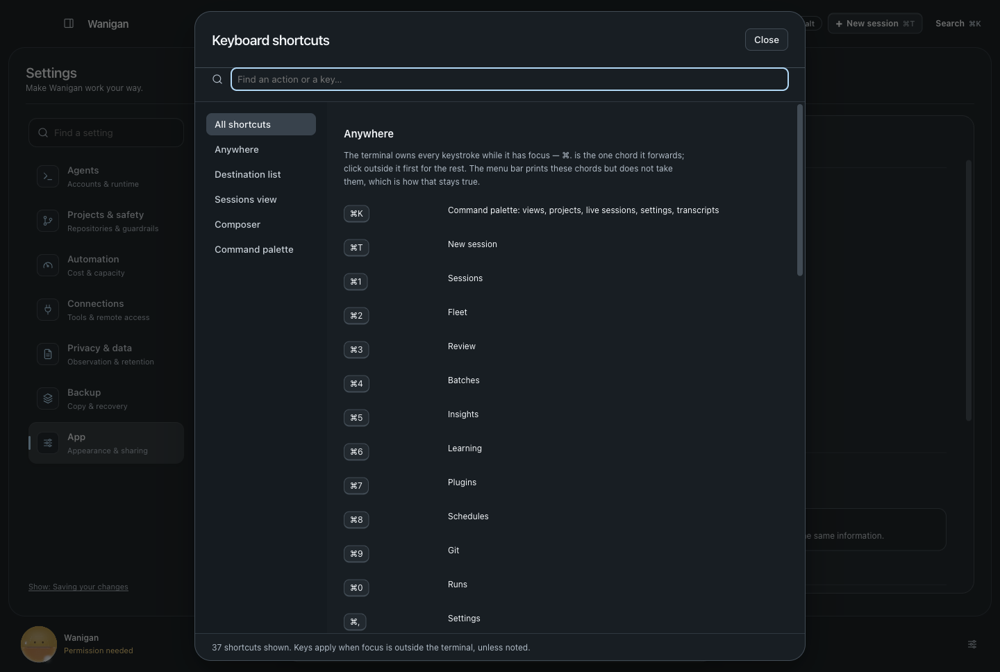 | 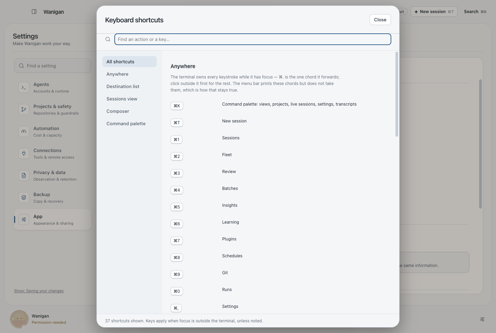 |
| After · Keyboard | 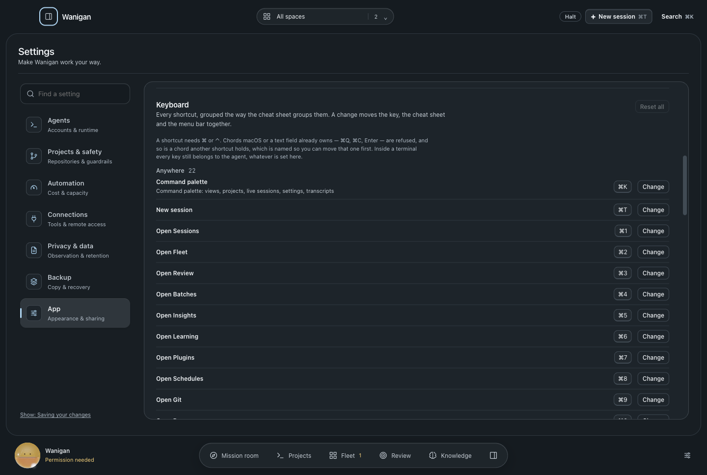 | 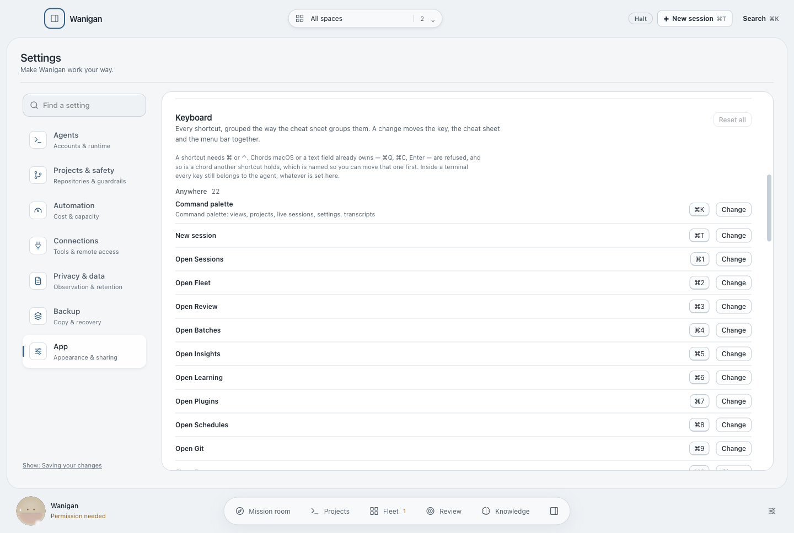 |
| After · a conflict refused, binding named | 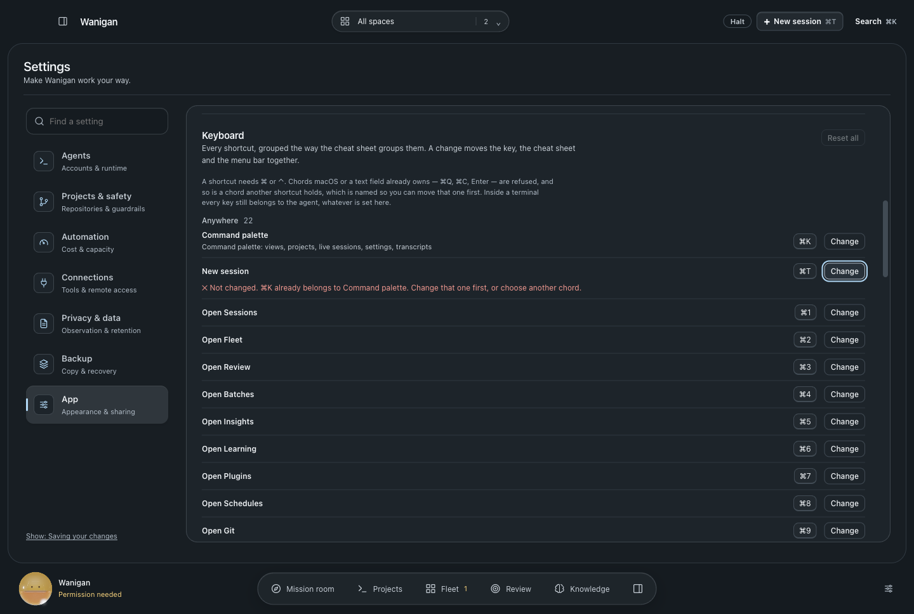 | 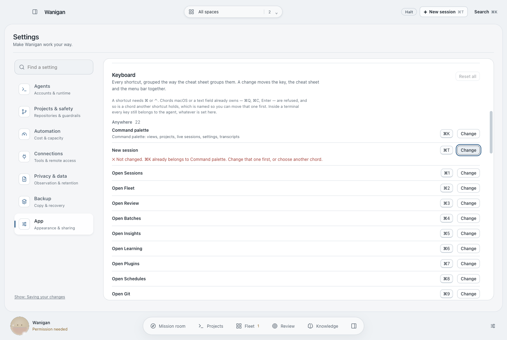 |
| After · New session on ⌘N | 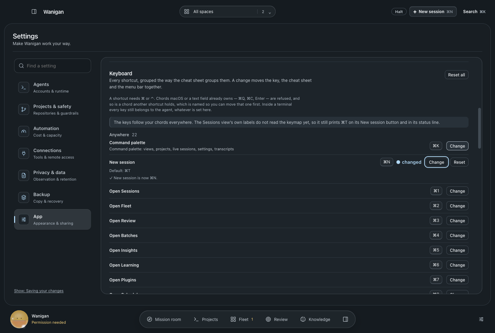 | 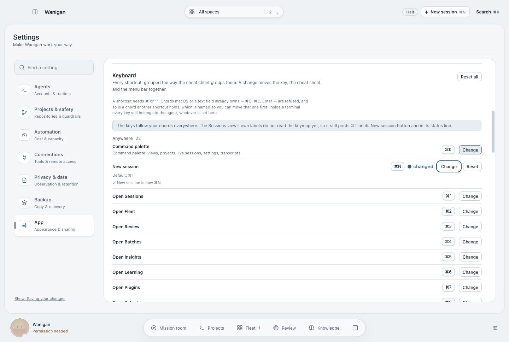 |
| After · the cheat sheet prints ⌘N | 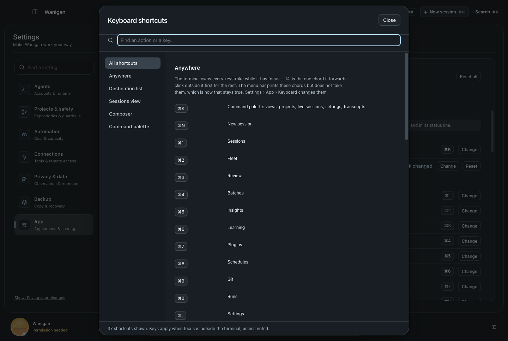 | 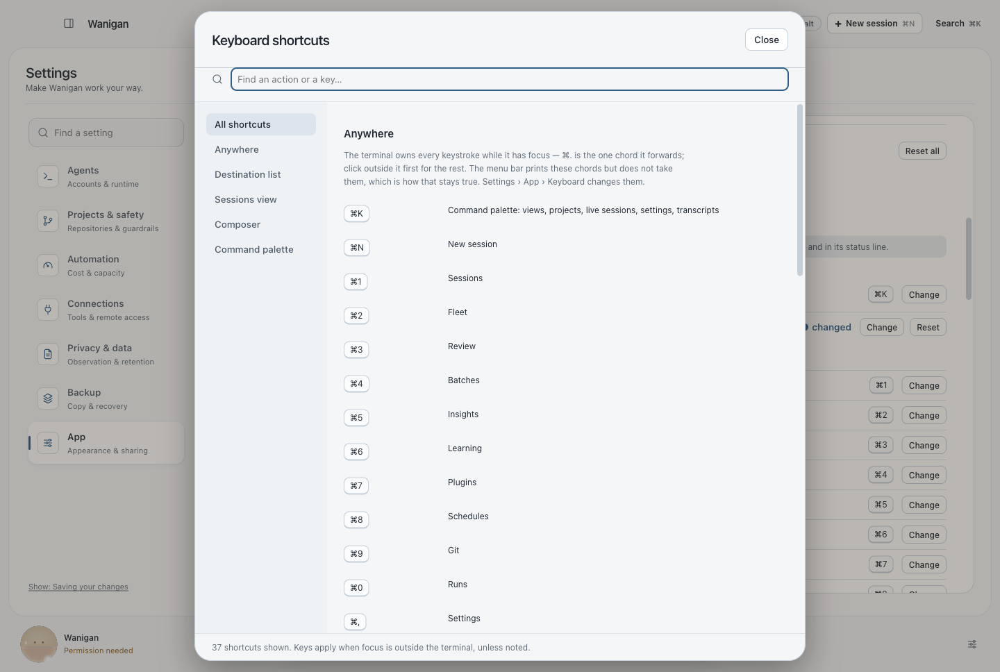 |

Rendered by `scripts/probe-rebindable-keys.mjs` in isolated Electron with
synthetic services; the keymap calls are answered in the probe process by
`src/shared/keymap.ts`, the module main validates with. The probe rebinds New
session through the Settings UI, presses ⌘N and sees the New session dialog,
presses ⌘T on Fleet and on Sessions and sees nothing, and resets. Before from
`dba7528` in a detached worktree, after from this change, same fixtures.
`verification.json` in each directory lists the checks that ran. Main's storage,
validation and menu bar are checked in the real main process by
`src/main/smoke23.ts`.
