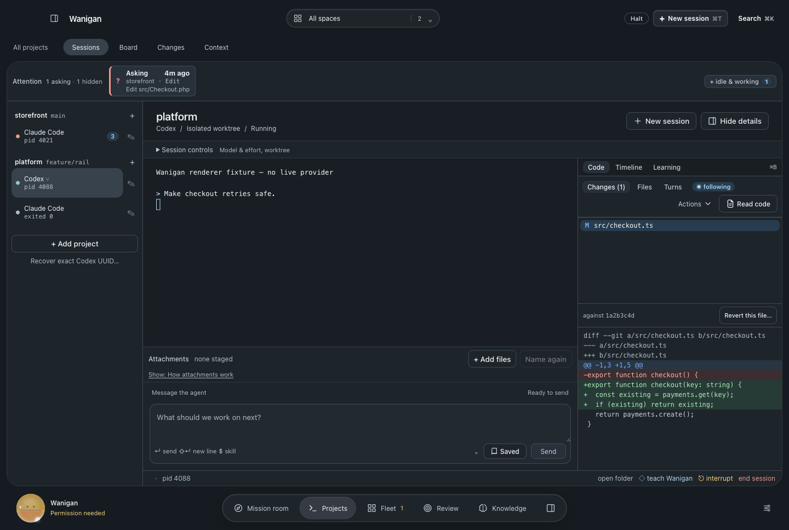
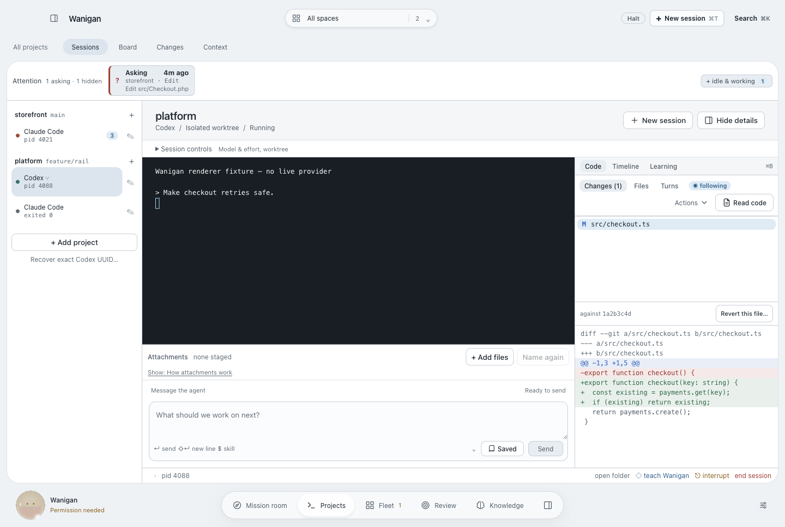
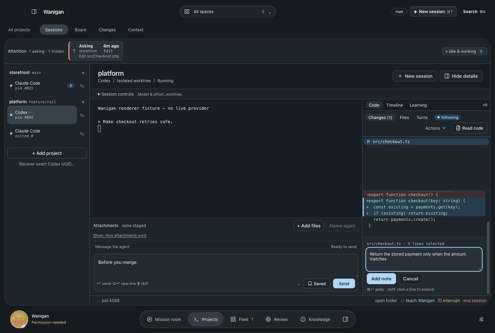
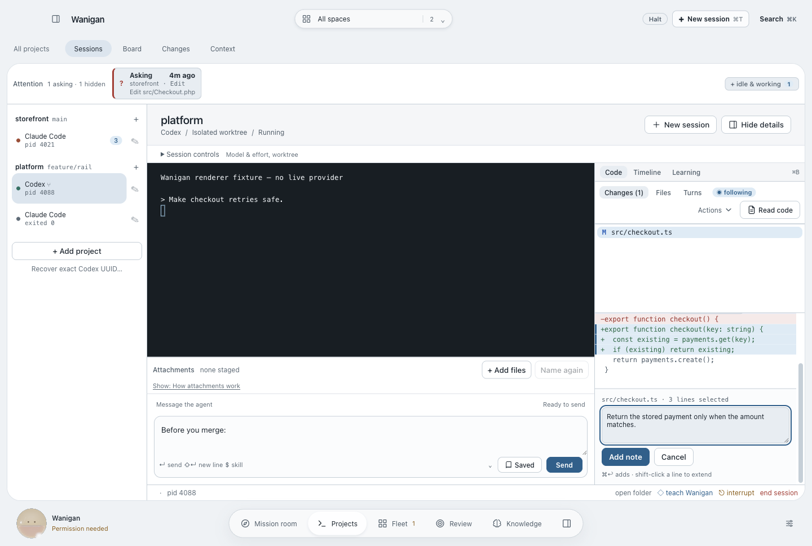
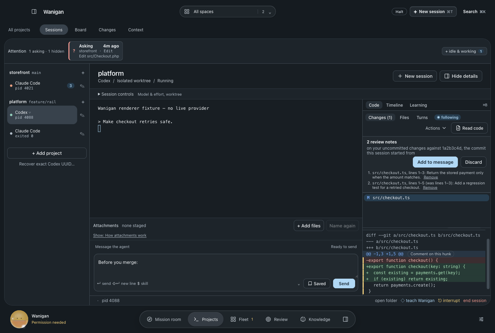
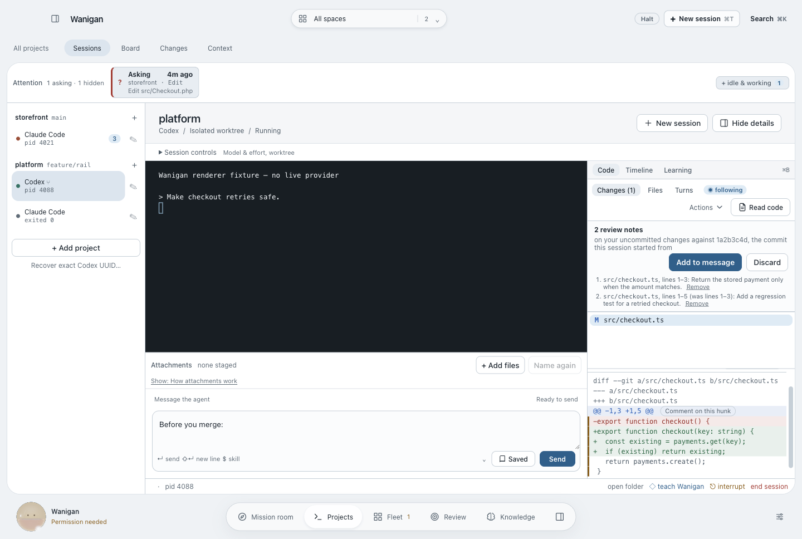
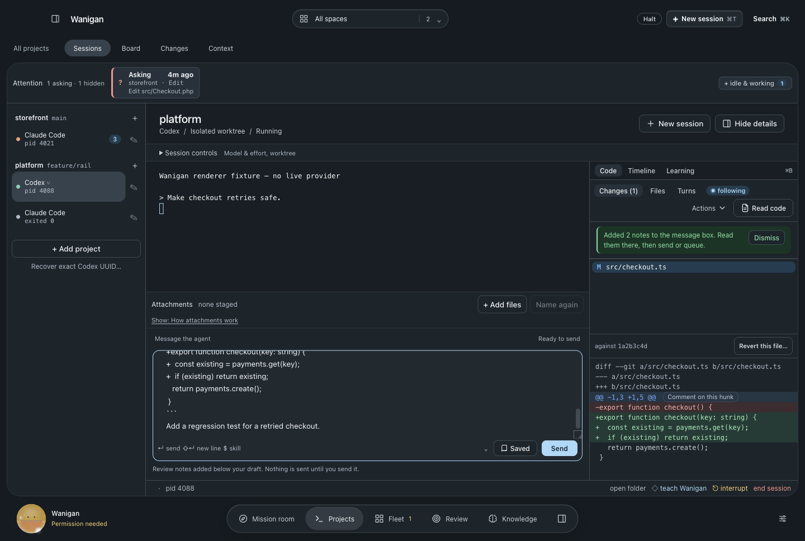
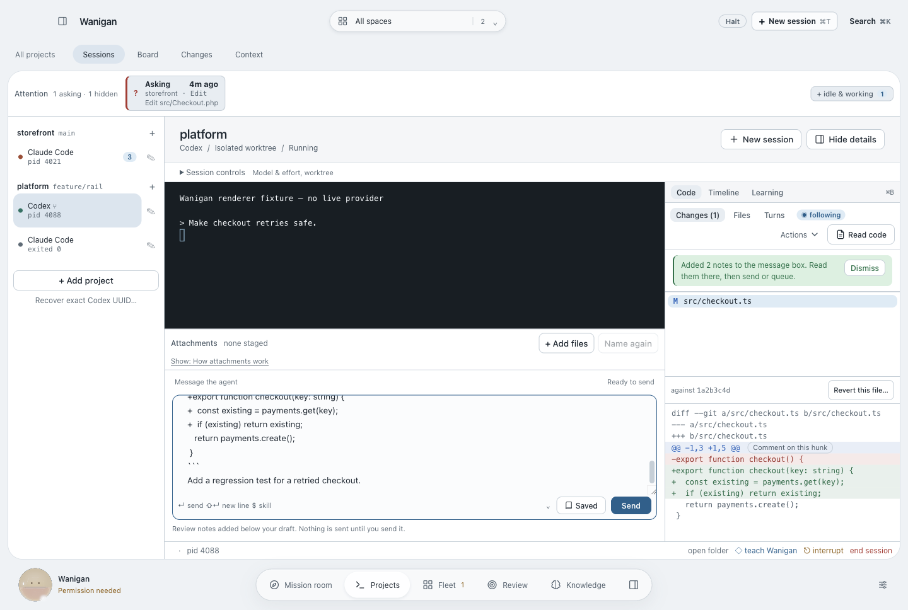

# Sessions · review notes on diff lines

The code rail showed an agent's diff and offered two responses to it: revert
the file, or type something into the terminal from memory. Commenting on the
lines themselves, with the comment handed back to the agent, is what every
review tool built around agents converged on; Wanigan had none of it.

Click a line of a diff in the Changes or Turns tab to select it and shift-click
to extend within the file; each hunk header also carries **Comment on this
hunk**, which is the keyboard route. Write the comment and **Add note** (or
⌘↩). Notes collect in a tray above the diff, and the lines they cover keep a
margin rule. **Add to message** puts them into the session's message box under
whatever draft is already there. Nothing is sent: the operator reads the notes
in the box and presses Send or Queue, so the composer's own rule — never type
into a permission prompt — still holds. With the box collapsed, the notes are
added to the session's saved draft and appear when it opens.

Each note carries its anchor. The message names the diff the notes were made
on (the working tree against the commit the session started from, or a
turn's snapshot), and every note gives the file, the line range on the new
side with the old range beside it, the quoted lines, and the comment:

```
Review notes on your uncommitted changes against 1a2b3c4d, the commit this session started from.
Address each one, or reply saying why you are leaving it as it is.

1. `src/checkout.ts`, lines 1–3:
   ```diff
   +export function checkout(key: string) {
   +  const existing = payments.get(key);
   +  if (existing) return existing;
   ```
   Return the stored payment only when the amount matches.
```

Line numbers come from the hunk headers, bounded by the counts those headers
give, so the empty string a trailing newline splits into is never mistaken for
a line of code — the probe caught exactly that on its first run. A note is
refused rather than guessed when a selection spans two files, holds no code, or
says nothing, and notes on a second diff wait until the first set is added or
discarded, so one message is never about two versions of the code.

`src/shared/review-notes.test.ts` holds the parser to the exact bytes git 2.50.1
printed for a modified file, a file with no trailing newline, a deleted file and
a new file whose name has a space (git appends a tab after that path).

## Screenshots

| | Dark | Light |
|---|---|---|
| Before · a diff in the code rail |  |  |
| After · three lines selected, a note being written |  |  |
| After · two notes waiting |  |  |
| After · added to the message box, nothing sent |  |  |

Rendered by `scripts/probe-review-notes.mjs` in isolated Electron with synthetic
code and sessions; before from `a9e454e` in a detached worktree, after from this
change, same fixtures. The probe asserts the exact message text and that nothing
was written to the terminal; `verification.json` lists its checks.
