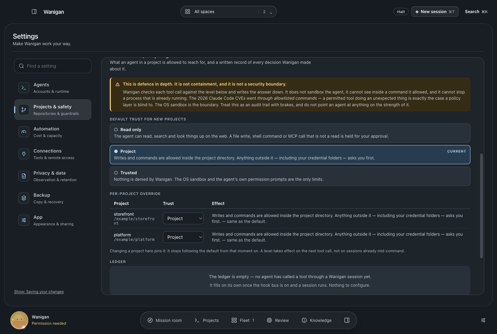
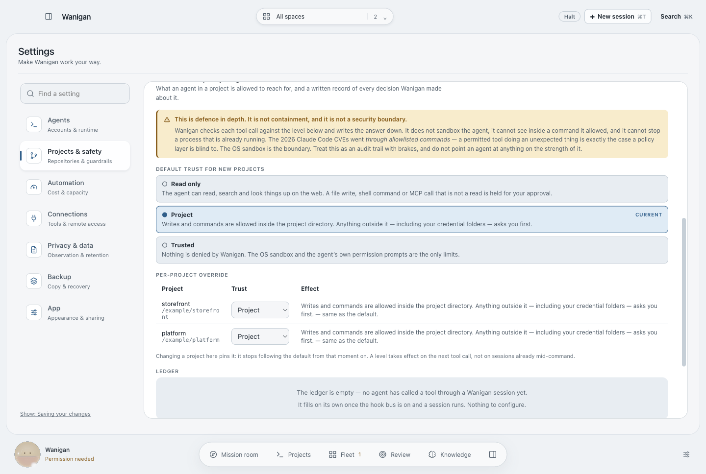
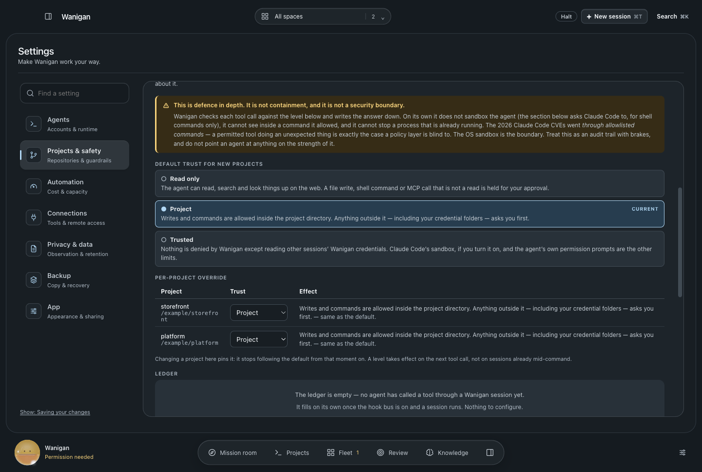
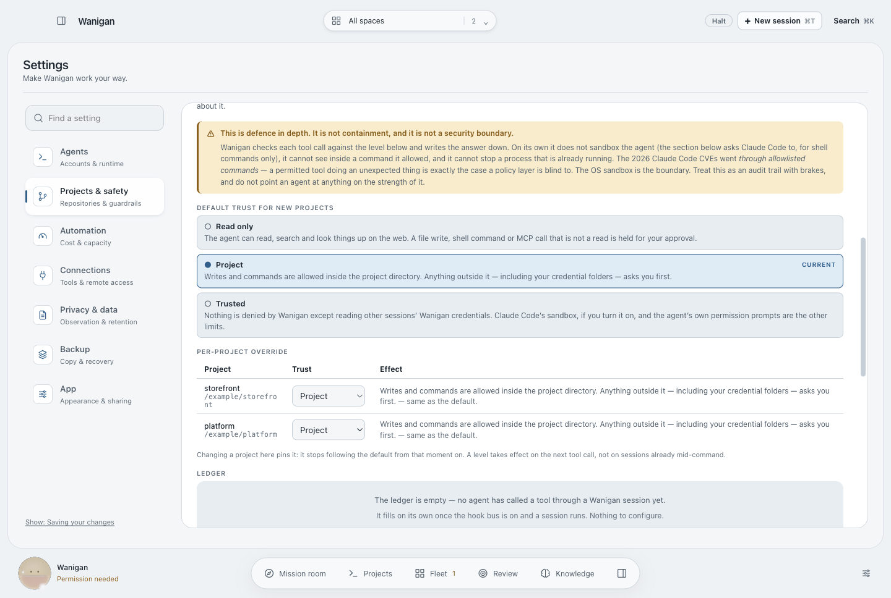
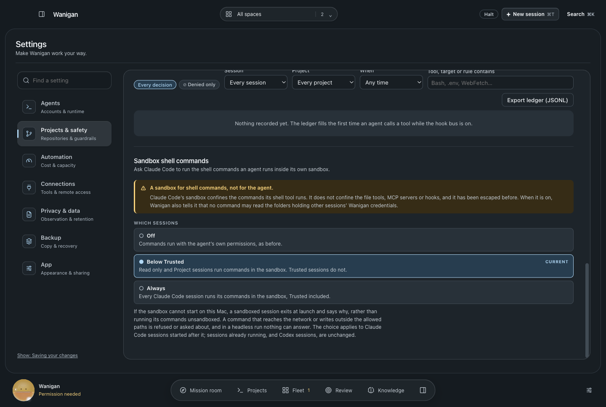
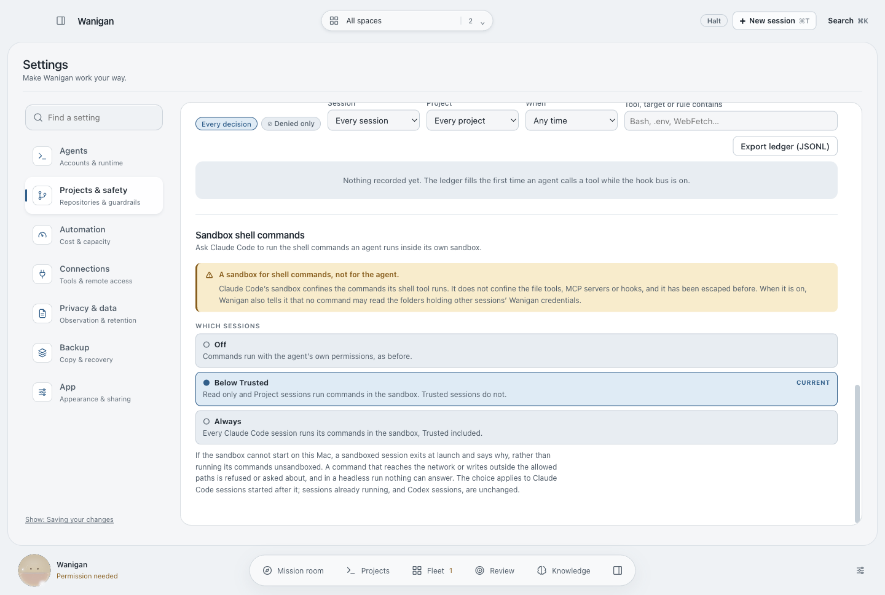

# Other sessions' credentials, and Claude Code's sandbox

Every session Wanigan starts is handed two bearer tokens, in files under its
data directory: a hook settings file and an MCP config. They are owner-only on
disk, but an agent runs as the same user, so any session could read another's.
With another session's hook token, an agent can post events as that session,
including the `SessionEnd` that revokes its gate. With its MCP token, it can
call Wanigan's tools as that session.

**The policy gate refuses it at every trust level.** A read, a search or a
shell command that names `hooks/` or `mcp/` under the data directory is denied,
including through a symlink, and the denial is recorded. It sits above trust,
like the halt, so Trusted's copy now names this one exception. `statusline/` is
refused too. The observed-telemetry change writes a curl config per session
there, holding that session's hook bearer, and the folder is on the list before
that change lands rather than after.

**Claude Code's sandbox, by trust level, off by default.** Settings › Projects
& safety offers Off, Below Trusted, or Always. When it applies, the session's
`--settings` file carries a `sandbox` block, with keys read from the 2.1.271
binary's schema:

- `failIfUnavailable: true`: a sandbox that cannot start ends the session at
  launch. Otherwise commands would run unsandboxed after only a warning.
- `allowUnsandboxedCommands: false`: the model's `dangerouslyDisableSandbox`
  parameter is ignored.
- `filesystem.denyRead` names the two credential folders, covering the command
  that reads them without naming them.

The binary honours these keys from CLI settings and ignores them from a
repository's own settings, which is how Wanigan already delivers its hooks. The
section says, before the choice, that the sandbox confines the shell tool and
not the file tools, MCP servers or hooks, and that it has been escaped before.

| | Dark | Light |
|---|---|---|
| Before · Trusted and no sandbox choice |  |  |
| After · Trusted's one exception |  |  |
| After · the sandbox choice |  |  |

Rendered by `scripts/probe-sandbox.mjs` with synthetic services. `src/main/smoke24.ts`
covers the policy at all three trust levels, the symlink, the settings file with
and without the block, and the refusal of an invalid mode. No sandboxed session
was launched.
