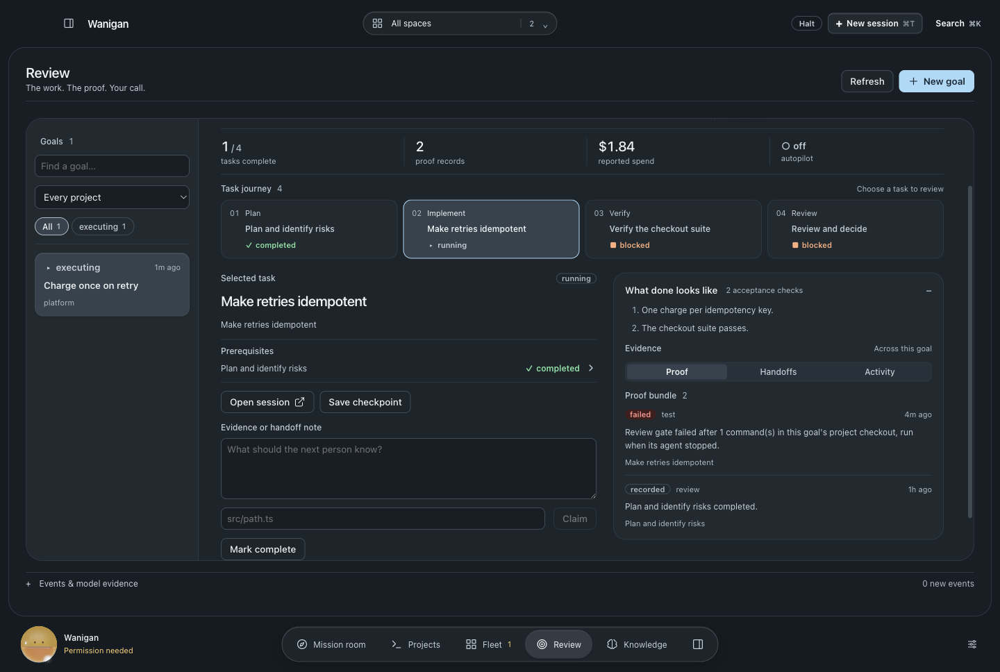
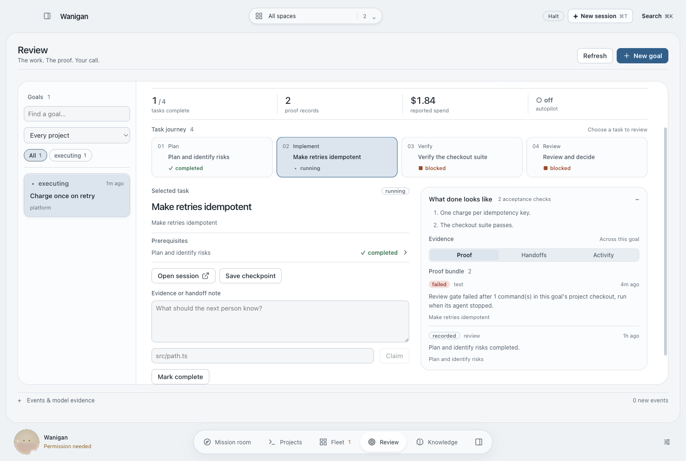
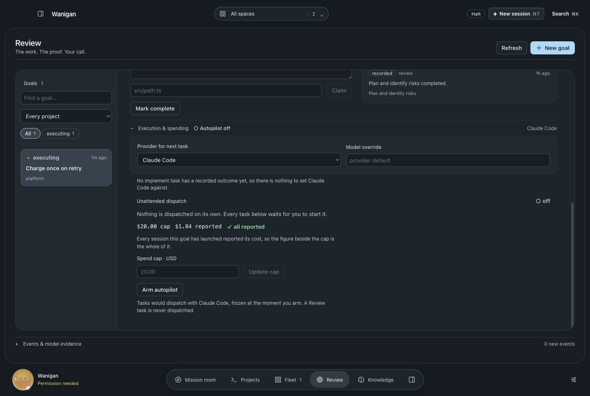
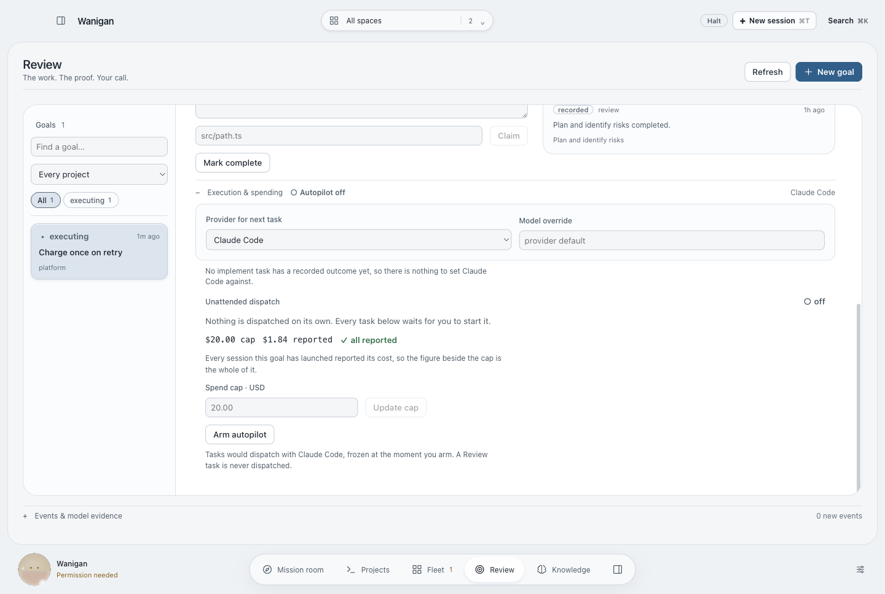
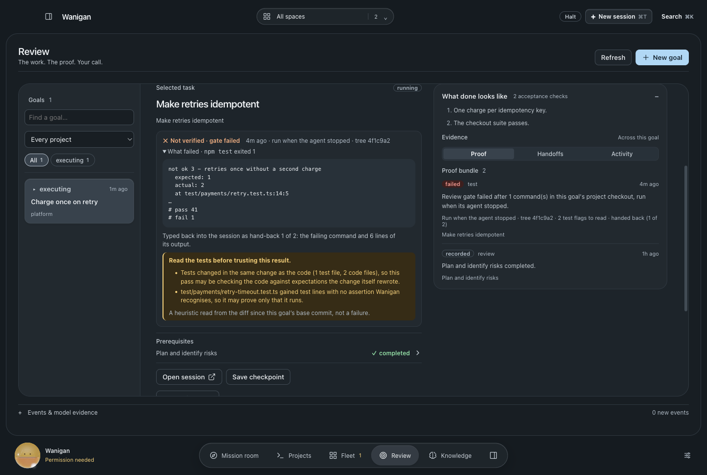
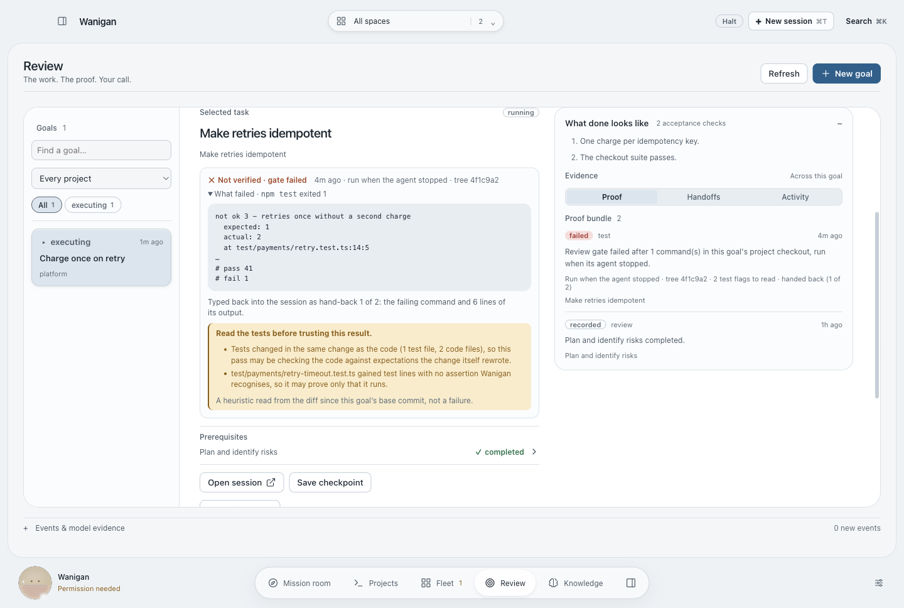
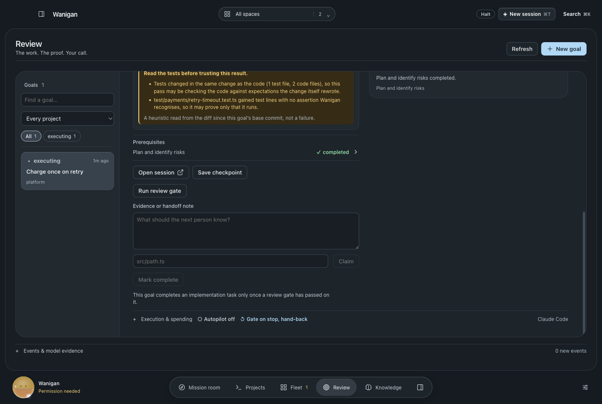
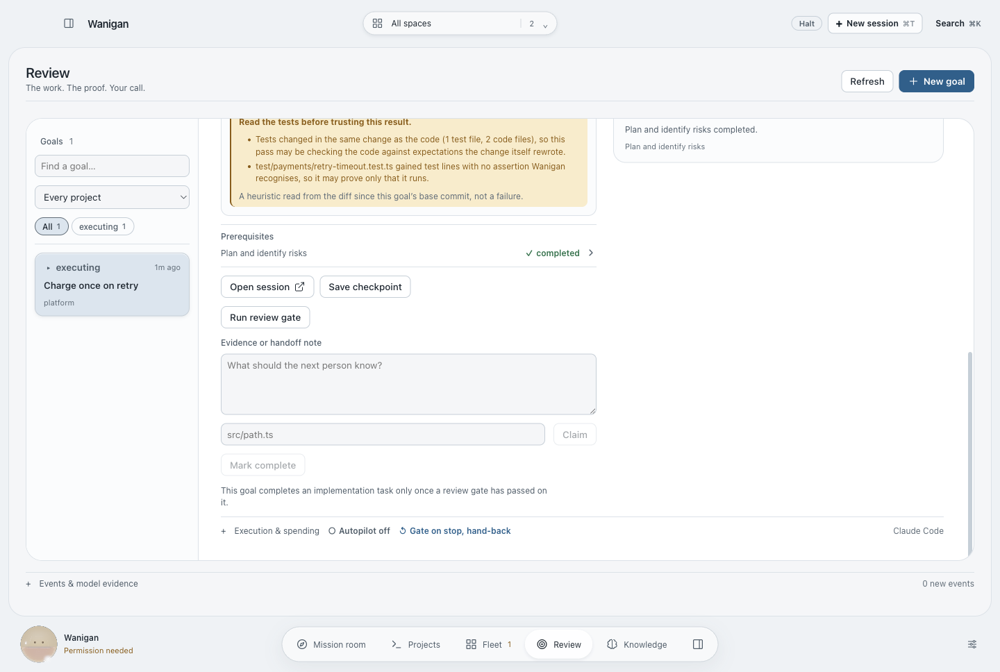
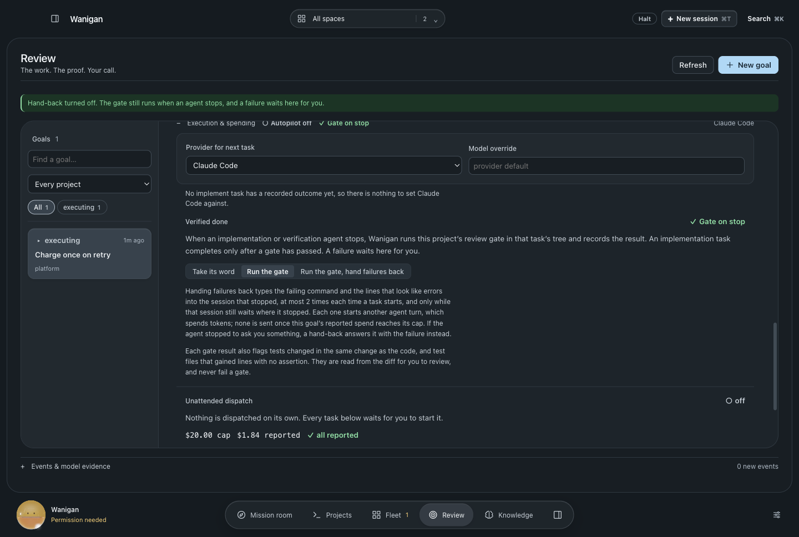
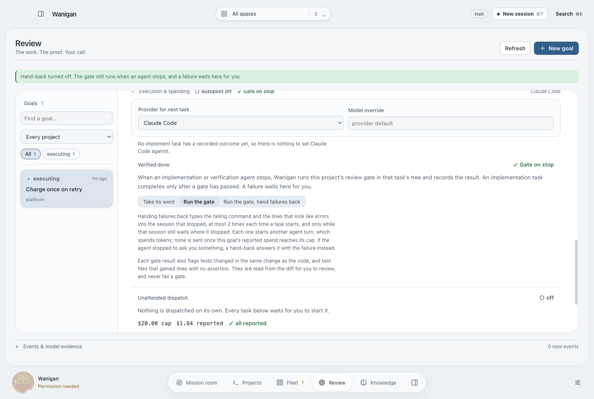

# Claimed done and verified done

A goal's implementation task could be marked complete on the agent's word. The
review gate ran only when someone pressed a button on a verification task, and
its result was a one-line summary.

**A goal can now run its gate when an agent stops.** Under Execution &
spending, **Verified done** offers three choices: take the agent's word, run the
gate, or run the gate and hand failures back. With the gate on:

- Each Stop from an implementation or verification session runs the project's
  review gate in that task's tree. The proof records who started it and the git
  tree it ran on: a content hash of the working copy, built in a scratch index
  that never touches the user's own index.
- A stop on a tree the last gate already ran against is skipped, so an agent
  that stops to ask a question does not rerun the suite.
- An implementation task stays open until a gate has passed on it. The disabled
  **Mark complete** says why beside it.

**Hand-back** types the failing command and the lines that look like errors into
the session that stopped, as one bracketed paste followed by Enter. Gate output
has every control character removed first, so output containing `ESC [201~`
cannot end the paste early and send the rest as keystrokes. A hand-back is
refused in four cases, and the proof records which one:

- the task has already had two hand-backs since it started;
- the goal's reported spend has reached its cap;
- the session is no longer running;
- the session has moved on since the Stop that started the gate. A new prompt,
  a tool call or a permission question all count, and Enter typed over a
  permission question would answer it.

What it cannot tell is why the agent stopped. If it stopped to ask the operator
a question and the gate fails before anyone answers, the hand-back answers it
with the failure. The choice says so before it is made.

**Weak-oracle flags** sit on every gate result. They mark tests changed in the
same change as the code, and test files that gained lines with no recognised
assertion. They are heuristics read from the diff since the goal's base commit,
and they never fail a gate. Research basis: arXiv 2606.18168, where 80.2% of
test patches in agent pull requests had weak or no oracle, and arXiv 2609.09133,
where tests from the same trajectory as the patch lowered the solve rate.

The gate runs after the Stop rather than inside a blocking Stop hook, because a
hook that waits minutes for a test suite would hit the CLI's hook timeout.

| | Dark | Light |
|---|---|---|
| Before · the task completes on the agent's word |  |  |
| Before · no say over what a stop does |  |  |
| After · not verified: the failure, the hand-back, the flags |  |  |
| After · Mark complete held, with the reason |  |  |
| After · the goal's choice |  |  |

Rendered by `scripts/probe-verified-done.mjs` with synthetic services.
`src/main/smoke26.ts` drives the real path: a git repository, the project's real
gate command, stops on changed and unchanged trees, every hand-back refusal, the
exact bytes a hand-back types, the completion hold, and a pass that completes
the task. `src/shared/gate-feedback.test.ts` and `src/shared/test-oracles.test.ts`
cover the rules. No agent was launched.
